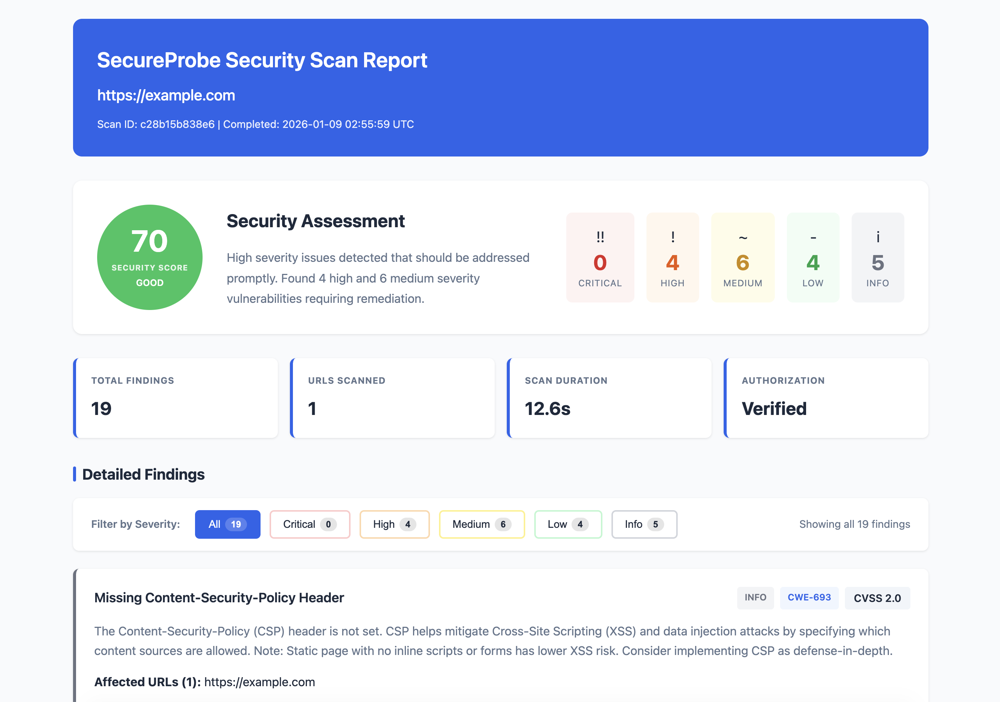
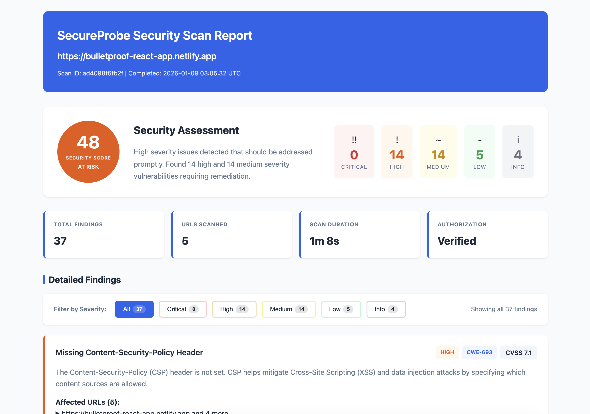

# SecureProbe

Production-ready web vulnerability scanner with 19 specialized analyzers for comprehensive security analysis. Uses browser automation via Owl Browser SDK for real-world attack simulation, CVSS-aligned severity ratings, and CWE references for every finding. Supports async/concurrent execution with rate limiting and outputs JSON/HTML reports.

**SecureProbe is open-source. Owl Browser integration requires a license. 14-day free trial at [www.owlbrowser.net](https://www.owlbrowser.net)**





## Analyzers

| Analyzer | Description |
|----------|-------------|
| `HeaderAnalyzer` | HTTP security headers (CSP, HSTS, X-Frame-Options, etc.) |
| `CookieAnalyzer` | Cookie security attributes (Secure, HttpOnly, SameSite) |
| `FormAnalyzer` | CSRF tokens, XSS vectors, autocomplete settings |
| `TLSAnalyzer` | Certificate validity, cipher suites, protocol versions |
| `InfoLeakAnalyzer` | AWS keys, JWT tokens, API keys, stack traces |
| `EndpointAnalyzer` | API discovery, technology fingerprinting, source maps |
| `SessionSecurityAnalyzer` | Session management and fixation vulnerabilities |
| `InputValidationAnalyzer` | SQL injection, command injection, path traversal |
| `AccessControlAnalyzer` | IDOR, privilege escalation, authorization bypass |
| `CryptoAnalyzer` | Weak cryptography, insecure random, hash collisions |
| `APISecurityAnalyzer` | REST/GraphQL security, rate limiting, authentication |
| `ChaosAttacksAnalyzer` | Race conditions, resource exhaustion, timing attacks |
| `APTAttacksAnalyzer` | Advanced persistent threat simulation |
| `JSLibraryCVEAnalyzer` | Known CVEs in JavaScript libraries |
| `NovelAttacksAnalyzer` | Emerging attack vectors and zero-day patterns |
| `BloodyMaryAnalyzer` | Authentication bypass and brute force detection |
| `MemoryAssaultAnalyzer` | Memory corruption and buffer overflow patterns |
| `ChaosTeenAnalyzer` | Fuzzing and malformed input testing |
| `CredentialSprayAnalyzer` | Credential stuffing and password spray detection |
| `DeepSniffAnalyzer` | Detects exposed secrets, API keys, JWT tokens, and credentials in JS bundles and API responses using entropy analysis |

## Installation

```bash
pip install -e .
```

## Quick Start

```bash
secureprobe https://example.com -o report.html --format html
```

## Requirements

- Python 3.12+
- Owl Browser SDK (license required for browser automation)

## License

MIT License - Olib AI
