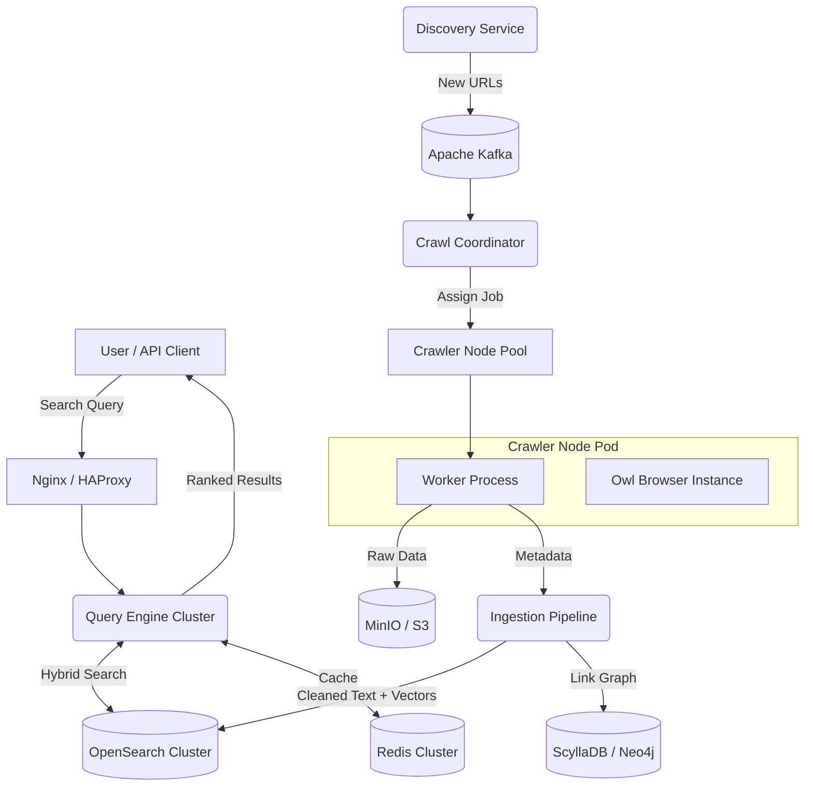

# CrawlForge: The Next-Generation Open Source AI Search Engine

## 1. Executive Summary

**CrawlForge** is an open-source, high-performance distributed search engine designed to democratize access to the world's information. Unlike traditional search engines that rely on legacy crawling stacks, CrawlForge leverages the **Owl Browser** to render modern JavaScript-heavy webs, bypass sophisticated anti-bot protections, and extract semantic meaning using on-device AI.

**Core Goals:**
*   **Scale:** Index billions of web pages.
*   **Speed:** Sub-20ms autocomplete, Sub-100ms search query latency.
*   **Intelligence:** Hybrid search (Keyword + Vector) with AI-generated snippets.
*   **Accessibility:** Fully open-source infrastructure deployable on commodity hardware or cloud clusters.

**Technology Stack:**
*   **Python 3.12+** with strict type hints for all services
*   **Owl Browser SDK** for intelligent web crawling
*   **OpenSearch** for hybrid search (BM25 + kNN)
*   **Apache Kafka** for event streaming
*   **Redis** for caching and rate limiting
*   **Kubernetes** for orchestration

## 2. System Architecture

The system is composed of four primary microservices designed for massive horizontal scaling:

1.  **Discovery Service (Golang):** Finds new URLs to crawl via CT Logs and Sitemaps.
2.  **Crawl Coordinator (Python):** High-throughput job distribution using Consistent Hashing.
3.  **Ingestion Pipeline (Python):** Process raw HTML/content into indexable documents.
4.  **Query Engine (Python/Rust):** High-performance API for search and autocomplete.



## 3. The Crawler Node (Powered by Owl Browser)

The heart of CrawlForge is the Crawler Node. Traditional crawlers (Scrapy, Nutch) fail on Single Page Applications (SPAs) and are easily blocked. CrawlForge uses **Owl Browser** to behave like a human user.

### 3.1. Browser Integration Strategy

We utilize the `owl-browser` Python SDK to manage browser contexts.

*   **Context Isolation:** Each domain is crawled in a fresh `browser.new_page()` context to prevent cookie tracking contamination.
*   **Stealth Mode:** We strictly use `ProxyType.SOCKS5H` with `timezone_override` to match the geo-location of the target website, preventing "Access Denied" errors based on location.
*   **AI-Driven Extraction:** Instead of brittle CSS selectors, we use `page.extract_text()` and `page.summarize_page()` to get core content without ads and navigation boilerplate.

### 3.2. Type Definitions and Configuration

```python
"""
crawlforge/crawler/types.py

Type definitions for the CrawlForge crawler system.
All types are strict and mypy --strict compliant.
"""
from __future__ import annotations

import enum
from dataclasses import dataclass, field
from datetime import datetime
from typing import TypedDict, NotRequired, Protocol, Self
from collections.abc import Sequence


class CrawlStatus(enum.Enum):
    """Status of a crawl operation."""
    PENDING = "pending"
    IN_PROGRESS = "in_progress"
    COMPLETED = "completed"
    FAILED = "failed"
    CAPTCHA_BLOCKED = "captcha_blocked"
    RATE_LIMITED = "rate_limited"
    ROBOTS_BLOCKED = "robots_blocked"


class ContentType(enum.Enum):
    """Detected content type of the page."""
    ARTICLE = "article"
    PRODUCT = "product"
    DOCUMENTATION = "documentation"
    FORUM = "forum"
    ECOMMERCE = "ecommerce"
    NEWS = "news"
    BLOG = "blog"
    UNKNOWN = "unknown"


@dataclass(frozen=True, slots=True)
class ProxyConfig:
    """Immutable proxy configuration."""
    host: str
    port: int
    proxy_type: str = "socks5h"  # socks5h for remote DNS resolution
    username: str | None = None
    password: str | None = None

    def to_dict(self) -> dict[str, str | int | None]:
        return {
            "type": self.proxy_type,
            "host": self.host,
            "port": self.port,
            "username": self.username,
            "password": self.password,
        }


@dataclass(frozen=True, slots=True)
class CrawlerConfig:
    """Configuration for the SmartCrawler."""
    server_url: str
    token: str
    max_retries: int = 3
    base_retry_delay: float = 1.0
    max_retry_delay: float = 60.0
    default_timeout: int = 30000  # milliseconds
    network_idle_timeout: int = 5000
    enable_video_recording: bool = False
    video_fps: int = 10
    block_trackers: bool = True
    respect_robots_txt: bool = True


class ExtractedLink(TypedDict):
    """Structure for an extracted link."""
    url: str
    text: str
    rel: NotRequired[str]
    is_external: bool


class OpenGraphData(TypedDict, total=False):
    """OpenGraph metadata structure."""
    title: str
    description: str
    image: str
    url: str
    type: str
    site_name: str
    locale: str


class JsonLdData(TypedDict, total=False):
    """JSON-LD structured data."""
    type: str
    name: str
    description: str
    author: str | dict[str, str]
    date_published: str
    date_modified: str
    publisher: dict[str, str]


class StructuredMetadata(TypedDict):
    """Complete structured metadata from a page."""
    open_graph: OpenGraphData
    json_ld: list[JsonLdData]
    meta_tags: dict[str, str]
    canonical_url: str | None
    language: str | None
    robots: str | None


@dataclass(slots=True)
class CrawlResult:
    """Result of a successful crawl operation."""
    url: str
    final_url: str  # After redirects
    title: str
    content_text: str
    content_markdown: str
    summary: str
    content_type: ContentType
    outbound_links: list[ExtractedLink]
    structured_metadata: StructuredMetadata
    crawl_timestamp: datetime
    response_time_ms: float
    page_size_bytes: int
    embedding: list[float] | None = None
    video_path: str | None = None

    def to_indexable_document(self) -> dict[str, object]:
        """Convert to a document suitable for OpenSearch indexing."""
        from urllib.parse import urlparse
        parsed = urlparse(self.final_url)
        return {
            "url": self.final_url,
            "domain": parsed.netloc,
            "title": self.title,
            "content": self.content_text,
            "content_markdown": self.content_markdown,
            "summary": self.summary,
            "content_type": self.content_type.value,
            "crawl_timestamp": self.crawl_timestamp.isoformat(),
            "response_time_ms": self.response_time_ms,
            "page_size_bytes": self.page_size_bytes,
            "outbound_links_count": len(self.outbound_links),
            "og_title": self.structured_metadata["open_graph"].get("title"),
            "og_description": self.structured_metadata["open_graph"].get("description"),
            "og_image": self.structured_metadata["open_graph"].get("image"),
            "language": self.structured_metadata.get("language"),
            "embeddings": self.embedding,
        }


@dataclass(slots=True)
class CrawlError:
    """Detailed error information for failed crawls."""
    url: str
    error_type: str
    error_message: str
    status: CrawlStatus
    timestamp: datetime
    retry_count: int
    should_retry: bool
    video_path: str | None = None  # For debugging


class CrawlerProtocol(Protocol):
    """Protocol defining the crawler interface."""

    async def crawl_url(self, url: str) -> CrawlResult | CrawlError:
        """Crawl a single URL and return the result."""
        ...

    async def crawl_batch(
        self,
        urls: Sequence[str],
        concurrency: int = 10,
    ) -> list[CrawlResult | CrawlError]:
        """Crawl multiple URLs with controlled concurrency."""
        ...

    async def close(self) -> None:
        """Clean up resources."""
        ...
```

### 3.3. Exception Hierarchy

```python
"""
crawlforge/crawler/exceptions.py

Custom exception hierarchy for the crawler.
Maps to Owl Browser SDK exceptions for proper error handling.
"""
from __future__ import annotations

from dataclasses import dataclass
from typing import Final


class CrawlerError(Exception):
    """Base exception for all crawler errors."""

    def __init__(self, message: str, url: str | None = None) -> None:
        self.url = url
        super().__init__(message)


class RetryableError(CrawlerError):
    """Base class for errors that should trigger a retry."""

    max_retries: int = 3


class NonRetryableError(CrawlerError):
    """Base class for errors that should NOT trigger a retry."""
    pass


# Retryable Errors
class NetworkTimeoutError(RetryableError):
    """Network request timed out."""
    max_retries: int = 3


class RateLimitedError(RetryableError):
    """Site returned 429 or rate limit response."""
    max_retries: int = 5

    def __init__(
        self,
        message: str,
        url: str | None = None,
        retry_after_seconds: int | None = None,
    ) -> None:
        super().__init__(message, url)
        self.retry_after_seconds = retry_after_seconds


class CaptchaBlockedError(RetryableError):
    """CAPTCHA solving failed after max attempts."""
    max_retries: int = 2


class ConnectionResetError(RetryableError):
    """Connection was reset by the server."""
    max_retries: int = 3


class ProxyError(RetryableError):
    """Proxy connection failed."""
    max_retries: int = 2


# Non-Retryable Errors
class RobotsDisallowedError(NonRetryableError):
    """URL is disallowed by robots.txt."""
    pass


class ContentNotFoundError(NonRetryableError):
    """Page returned 404 or equivalent."""
    pass


class FirewallBlockedError(NonRetryableError):
    """Request was blocked by a WAF/firewall permanently."""
    pass


class InvalidURLError(NonRetryableError):
    """URL is malformed or invalid."""
    pass


class DomainBlockedError(NonRetryableError):
    """Domain is on our blocklist (e.g., known malware sites)."""
    pass


# SDK Exception Mapping
SDK_EXCEPTION_MAP: Final[dict[str, type[CrawlerError]]] = {
    "ElementNotFoundError": NonRetryableError,
    "CaptchaDetectedError": CaptchaBlockedError,
    "FirewallError": FirewallBlockedError,
    "TimeoutError": NetworkTimeoutError,
    "ProxyConnectionError": ProxyError,
}


def map_sdk_exception(sdk_exception: Exception) -> CrawlerError:
    """Map an Owl Browser SDK exception to our exception hierarchy."""
    exception_name = type(sdk_exception).__name__
    error_class = SDK_EXCEPTION_MAP.get(exception_name, CrawlerError)
    return error_class(
        message=str(sdk_exception),
        url=getattr(sdk_exception, "url", None),
    )
```

### 3.4. Complete SmartCrawler Implementation

```python
"""
crawlforge/crawler/smart_crawler.py

Production-ready crawler implementation using Owl Browser SDK.
Implements full error handling, retries, and AI-powered extraction.
"""
from __future__ import annotations

import asyncio
import logging
import random
import time
from collections.abc import Sequence
from contextlib import asynccontextmanager
from datetime import datetime, UTC
from typing import AsyncGenerator, Final
from urllib.parse import urlparse, urljoin

from owl_browser import Browser, RemoteConfig, ProxyConfig as OwlProxyConfig
from owl_browser import NetworkRule, ExtractionTemplate
from owl_browser.exceptions import (
    ElementNotFoundError,
    CaptchaDetectedError,
    FirewallError,
)

from .types import (
    CrawlerConfig,
    CrawlResult,
    CrawlError,
    CrawlStatus,
    ContentType,
    ExtractedLink,
    StructuredMetadata,
    OpenGraphData,
    JsonLdData,
    ProxyConfig,
)
from .exceptions import (
    CrawlerError as CrawlerException,
    RetryableError,
    NonRetryableError,
    CaptchaBlockedError,
    RateLimitedError,
    NetworkTimeoutError,
    RobotsDisallowedError,
    map_sdk_exception,
)


logger = logging.getLogger(__name__)

# Network rules to block common trackers and ads
TRACKER_BLOCK_RULES: Final[list[dict[str, str]]] = [
    {"pattern": "*google-analytics.com*", "action": "block"},
    {"pattern": "*googletagmanager.com*", "action": "block"},
    {"pattern": "*facebook.net*", "action": "block"},
    {"pattern": "*doubleclick.net*", "action": "block"},
    {"pattern": "*adsense*", "action": "block"},
    {"pattern": "*adservice*", "action": "block"},
    {"pattern": "*hotjar.com*", "action": "block"},
    {"pattern": "*mixpanel.com*", "action": "block"},
    {"pattern": "*segment.io*", "action": "block"},
    {"pattern": "*amplitude.com*", "action": "block"},
]


class SmartCrawler:
    """
    Production-grade web crawler using Owl Browser.

    Features:
    - Async/await with proper context management
    - Exponential backoff with jitter for retries
    - Domain-specific politeness delays
    - JavaScript SPA handling
    - Network interception for blocking trackers
    - Video recording for debugging
    - AI-powered content extraction
    - Structured metadata extraction (OpenGraph, JSON-LD)
    """

    def __init__(
        self,
        config: CrawlerConfig,
        proxy_pool: Sequence[ProxyConfig] | None = None,
    ) -> None:
        self.config = config
        self.proxy_pool = list(proxy_pool) if proxy_pool else []
        self._remote_config = RemoteConfig(
            url=config.server_url,
            token=config.token,
        )
        self._browser: Browser | None = None
        self._domain_last_access: dict[str, float] = {}
        self._domain_delays: dict[str, float] = {}  # From robots.txt

    async def __aenter__(self) -> SmartCrawler:
        """Async context manager entry."""
        self._browser = Browser(remote=self._remote_config)
        await self._browser.__aenter__()
        return self

    async def __aexit__(
        self,
        exc_type: type[BaseException] | None,
        exc_val: BaseException | None,
        exc_tb: object,
    ) -> None:
        """Async context manager exit with cleanup."""
        if self._browser is not None:
            await self._browser.__aexit__(exc_type, exc_val, exc_tb)
            self._browser = None

    def _get_proxy(self) -> ProxyConfig | None:
        """Get a random proxy from the pool."""
        if not self.proxy_pool:
            return None
        return random.choice(self.proxy_pool)

    def _calculate_backoff(self, retry_count: int) -> float:
        """Calculate exponential backoff with jitter."""
        base_delay = self.config.base_retry_delay
        max_delay = self.config.max_retry_delay

        # Exponential backoff: base * 2^retry
        delay = min(base_delay * (2 ** retry_count), max_delay)

        # Add jitter (0.5 to 1.5 multiplier)
        jitter = 0.5 + random.random()
        return delay * jitter

    async def _enforce_politeness(self, domain: str) -> None:
        """Enforce per-domain rate limiting."""
        min_delay = self._domain_delays.get(domain, 1.0)  # Default 1 second
        last_access = self._domain_last_access.get(domain, 0.0)

        elapsed = time.monotonic() - last_access
        if elapsed < min_delay:
            wait_time = min_delay - elapsed
            logger.debug(f"Politeness delay for {domain}: {wait_time:.2f}s")
            await asyncio.sleep(wait_time)

        self._domain_last_access[domain] = time.monotonic()

    @asynccontextmanager
    async def _create_page_context(
        self,
        proxy: ProxyConfig | None = None,
        profile_path: str | None = None,
    ) -> AsyncGenerator:
        """Create an isolated page context with proper cleanup."""
        if self._browser is None:
            raise RuntimeError("Crawler not initialized. Use async with.")

        proxy_config = None
        if proxy:
            proxy_config = OwlProxyConfig(**proxy.to_dict())

        page = await self._browser.new_page(
            proxy=proxy_config,
            profile_path=profile_path,
        )

        try:
            # Block trackers if enabled
            if self.config.block_trackers:
                for rule in TRACKER_BLOCK_RULES:
                    await page.add_network_rule(
                        NetworkRule(
                            pattern=rule["pattern"],
                            action=rule["action"],
                        )
                    )

            # Start video recording if enabled (for debugging failed crawls)
            if self.config.enable_video_recording:
                await page.start_video_recording(fps=self.config.video_fps)

            yield page

        finally:
            video_path: str | None = None
            if self.config.enable_video_recording:
                try:
                    video_path = await page.stop_video_recording()
                except Exception as e:
                    logger.warning(f"Failed to stop video recording: {e}")

            await page.close()

    async def _handle_spa_content(self, page) -> None:
        """Handle JavaScript-heavy SPAs that load content dynamically."""
        # Wait for network to settle
        await page.wait_for_network_idle(
            idle_time=self.config.network_idle_timeout,
            timeout=self.config.default_timeout,
        )

        # Scroll to trigger lazy loading
        await page.scroll_to_bottom()

        # Wait again for any lazy-loaded content
        await asyncio.sleep(0.5)
        await page.wait_for_network_idle(
            idle_time=2000,
            timeout=10000,
        )

    async def _handle_captcha(self, page, max_attempts: int = 3) -> bool:
        """
        Detect and solve CAPTCHAs using Owl Browser's on-device AI.

        Returns True if CAPTCHA was solved or not present.
        Returns False if CAPTCHA could not be solved.
        """
        for attempt in range(max_attempts):
            captcha_detected = await page.detect_captcha()

            if not captcha_detected:
                return True

            logger.info(f"CAPTCHA detected, attempt {attempt + 1}/{max_attempts}")

            # Classify the CAPTCHA type for logging
            captcha_type = await page.classify_captcha()
            logger.info(f"CAPTCHA type: {captcha_type}")

            try:
                await page.solve_captcha(max_attempts=1)

                # Wait for page to reload after CAPTCHA
                await page.wait_for_network_idle(
                    idle_time=3000,
                    timeout=15000,
                )

                # Check if CAPTCHA is still present
                if not await page.detect_captcha():
                    logger.info("CAPTCHA solved successfully")
                    return True

            except Exception as e:
                logger.warning(f"CAPTCHA solve attempt {attempt + 1} failed: {e}")

        return False

    async def _extract_structured_metadata(self, page) -> StructuredMetadata:
        """Extract OpenGraph, JSON-LD, and meta tags."""
        # Use JavaScript evaluation to extract all metadata at once
        metadata_script = """
        (() => {
            const result = {
                open_graph: {},
                json_ld: [],
                meta_tags: {},
                canonical_url: null,
                language: null,
                robots: null,
            };

            // OpenGraph tags
            document.querySelectorAll('meta[property^="og:"]').forEach(el => {
                const key = el.getAttribute('property').replace('og:', '');
                result.open_graph[key] = el.getAttribute('content');
            });

            // JSON-LD
            document.querySelectorAll('script[type="application/ld+json"]').forEach(el => {
                try {
                    result.json_ld.push(JSON.parse(el.textContent));
                } catch (e) {}
            });

            // Standard meta tags
            document.querySelectorAll('meta[name]').forEach(el => {
                result.meta_tags[el.getAttribute('name')] = el.getAttribute('content');
            });

            // Canonical URL
            const canonical = document.querySelector('link[rel="canonical"]');
            result.canonical_url = canonical ? canonical.getAttribute('href') : null;

            // Language
            result.language = document.documentElement.lang || null;

            // Robots
            const robots = document.querySelector('meta[name="robots"]');
            result.robots = robots ? robots.getAttribute('content') : null;

            return result;
        })()
        """

        raw_metadata = await page.evaluate(metadata_script, return_value=True)

        return StructuredMetadata(
            open_graph=OpenGraphData(**raw_metadata.get("open_graph", {})),
            json_ld=[JsonLdData(**item) for item in raw_metadata.get("json_ld", [])],
            meta_tags=raw_metadata.get("meta_tags", {}),
            canonical_url=raw_metadata.get("canonical_url"),
            language=raw_metadata.get("language"),
            robots=raw_metadata.get("robots"),
        )

    async def _extract_links(self, page, base_url: str) -> list[ExtractedLink]:
        """Extract and normalize all links from the page."""
        links_script = """
        Array.from(document.querySelectorAll('a[href]')).map(a => ({
            url: a.href,
            text: a.textContent.trim().substring(0, 200),
            rel: a.getAttribute('rel') || '',
        }))
        """

        raw_links = await page.evaluate(links_script, return_value=True)
        parsed_base = urlparse(base_url)

        extracted_links: list[ExtractedLink] = []
        seen_urls: set[str] = set()

        for link in raw_links:
            url = link.get("url", "")

            # Skip invalid URLs
            if not url or not url.startswith(("http://", "https://")):
                continue

            # Skip duplicates
            if url in seen_urls:
                continue
            seen_urls.add(url)

            # Skip common non-content URLs
            if any(
                skip in url.lower()
                for skip in ["javascript:", "mailto:", "tel:", "#", "void(0)"]
            ):
                continue

            parsed_link = urlparse(url)
            is_external = parsed_link.netloc != parsed_base.netloc

            extracted_links.append(ExtractedLink(
                url=url,
                text=link.get("text", ""),
                rel=link.get("rel"),
                is_external=is_external,
            ))

        return extracted_links

    async def _detect_content_type(self, page) -> ContentType:
        """Use Owl Browser's AI to detect the type of content."""
        try:
            website_type = await page.detect_website_type()

            type_mapping: dict[str, ContentType] = {
                "article": ContentType.ARTICLE,
                "product": ContentType.PRODUCT,
                "documentation": ContentType.DOCUMENTATION,
                "forum": ContentType.FORUM,
                "ecommerce": ContentType.ECOMMERCE,
                "news": ContentType.NEWS,
                "blog": ContentType.BLOG,
            }

            return type_mapping.get(
                website_type.lower() if website_type else "",
                ContentType.UNKNOWN,
            )
        except Exception:
            return ContentType.UNKNOWN

    async def crawl_url(
        self,
        url: str,
        profile_path: str | None = None,
    ) -> CrawlResult | CrawlError:
        """
        Crawl a single URL with full error handling and retries.

        Args:
            url: The URL to crawl
            profile_path: Optional path to a browser profile for auth

        Returns:
            CrawlResult on success, CrawlError on failure
        """
        parsed_url = urlparse(url)
        domain = parsed_url.netloc

        # Enforce politeness delay
        await self._enforce_politeness(domain)

        retry_count = 0
        last_error: CrawlerException | None = None
        video_path: str | None = None

        while retry_count <= self.config.max_retries:
            proxy = self._get_proxy()
            start_time = time.monotonic()

            try:
                async with self._create_page_context(
                    proxy=proxy,
                    profile_path=profile_path,
                ) as page:
                    # Navigate with network idle wait
                    await page.goto(
                        url,
                        wait_until="networkidle",
                        timeout=self.config.default_timeout,
                    )

                    # Get final URL after redirects
                    final_url = await page.get_current_url()

                    # Handle CAPTCHA if detected
                    if not await self._handle_captcha(page):
                        raise CaptchaBlockedError(
                            "Failed to solve CAPTCHA after max attempts",
                            url=url,
                        )

                    # Handle SPA content loading
                    await self._handle_spa_content(page)

                    # Extract all data
                    title = await page.get_title()

                    # Get clean text content
                    content_text = await page.extract_text()

                    # Get markdown for richer content
                    content_markdown = await page.get_markdown(
                        include_links=True,
                        include_images=True,
                        max_length=100000,
                    )

                    # AI-powered summarization
                    summary_response = await page.summarize_page(force_refresh=False)
                    summary = summary_response.get("summary", "") if isinstance(
                        summary_response, dict
                    ) else str(summary_response)

                    # Detect content type
                    content_type = await self._detect_content_type(page)

                    # Extract structured metadata
                    structured_metadata = await self._extract_structured_metadata(page)

                    # Extract links for crawl frontier
                    outbound_links = await self._extract_links(page, final_url)

                    # Calculate metrics
                    elapsed_ms = (time.monotonic() - start_time) * 1000
                    page_info = await page.get_page_info()

                    return CrawlResult(
                        url=url,
                        final_url=final_url,
                        title=title,
                        content_text=content_text,
                        content_markdown=content_markdown,
                        summary=summary,
                        content_type=content_type,
                        outbound_links=outbound_links,
                        structured_metadata=structured_metadata,
                        crawl_timestamp=datetime.now(UTC),
                        response_time_ms=elapsed_ms,
                        page_size_bytes=len(content_text.encode("utf-8")),
                        video_path=video_path,
                    )

            except CaptchaDetectedError as e:
                last_error = CaptchaBlockedError(str(e), url=url)
                logger.warning(f"CAPTCHA blocked on {url}: {e}")

            except FirewallError as e:
                # Non-retryable: site has blocked us permanently
                return CrawlError(
                    url=url,
                    error_type="FirewallBlocked",
                    error_message=str(e),
                    status=CrawlStatus.FAILED,
                    timestamp=datetime.now(UTC),
                    retry_count=retry_count,
                    should_retry=False,
                    video_path=video_path,
                )

            except ElementNotFoundError as e:
                last_error = map_sdk_exception(e)
                logger.warning(f"Element not found on {url}: {e}")

            except asyncio.TimeoutError:
                last_error = NetworkTimeoutError(
                    f"Timeout after {self.config.default_timeout}ms",
                    url=url,
                )
                logger.warning(f"Timeout on {url}")

            except Exception as e:
                last_error = map_sdk_exception(e)
                logger.error(f"Unexpected error crawling {url}: {e}", exc_info=True)

            # Check if we should retry
            if isinstance(last_error, RetryableError):
                retry_count += 1
                if retry_count <= last_error.max_retries:
                    backoff = self._calculate_backoff(retry_count)

                    # Handle rate limit specific delay
                    if isinstance(last_error, RateLimitedError):
                        if last_error.retry_after_seconds:
                            backoff = max(backoff, last_error.retry_after_seconds)

                    logger.info(
                        f"Retrying {url} in {backoff:.2f}s "
                        f"(attempt {retry_count}/{self.config.max_retries})"
                    )
                    await asyncio.sleep(backoff)
                    continue

            # Non-retryable or max retries exceeded
            break

        # Return error result
        return CrawlError(
            url=url,
            error_type=type(last_error).__name__ if last_error else "UnknownError",
            error_message=str(last_error) if last_error else "Unknown error",
            status=CrawlStatus.FAILED,
            timestamp=datetime.now(UTC),
            retry_count=retry_count,
            should_retry=isinstance(last_error, RetryableError),
            video_path=video_path,
        )

    async def crawl_batch(
        self,
        urls: Sequence[str],
        concurrency: int = 10,
    ) -> list[CrawlResult | CrawlError]:
        """
        Crawl multiple URLs with controlled concurrency.

        Args:
            urls: Sequence of URLs to crawl
            concurrency: Maximum concurrent crawl operations

        Returns:
            List of results in the same order as input URLs
        """
        semaphore = asyncio.Semaphore(concurrency)

        async def bounded_crawl(url: str) -> CrawlResult | CrawlError:
            async with semaphore:
                return await self.crawl_url(url)

        tasks = [bounded_crawl(url) for url in urls]
        return await asyncio.gather(*tasks)

    async def close(self) -> None:
        """Clean up resources."""
        if self._browser is not None:
            await self._browser.close()
            self._browser = None
```

### 3.5. Advanced Extraction with AI

```python
"""
crawlforge/crawler/ai_extraction.py

AI-powered extraction utilities using Owl Browser's intelligence features.
"""
from __future__ import annotations

import logging
from dataclasses import dataclass
from typing import TypedDict

logger = logging.getLogger(__name__)


class ProductData(TypedDict, total=False):
    """Structured product data."""
    name: str
    price: str
    currency: str
    description: str
    availability: str
    brand: str
    sku: str
    reviews_count: int
    average_rating: float
    images: list[str]


class ArticleData(TypedDict, total=False):
    """Structured article data."""
    title: str
    author: str
    published_date: str
    modified_date: str
    content: str
    categories: list[str]
    tags: list[str]
    reading_time_minutes: int


class ContactData(TypedDict, total=False):
    """Extracted contact information."""
    emails: list[str]
    phones: list[str]
    addresses: list[str]
    social_links: dict[str, str]


@dataclass
class AIExtractor:
    """
    AI-powered data extraction using Owl Browser's intelligence.

    Uses natural language queries and structured extraction templates.
    """

    async def extract_product(self, page) -> ProductData | None:
        """
        Extract product information from an e-commerce page.

        Uses page.ai_extract() for flexible extraction and
        page.extract_json() with templates for structured data.
        """
        try:
            # First, detect if this is actually a product page
            website_type = await page.detect_website_type()
            if website_type not in ("product", "ecommerce"):
                logger.debug("Page is not a product page")
                return None

            # Use AI extraction for flexible data gathering
            product_info = await page.ai_extract(
                what="product details including name, price, description, "
                     "availability, brand, SKU, review count, and rating"
            )

            # Also try structured extraction with template
            templates = await page.list_templates()
            if "product" in templates:
                structured = await page.extract_json(
                    template=ExtractionTemplate.PRODUCT
                )
                # Merge with AI extraction
                if isinstance(structured, dict):
                    product_info.update(structured)

            # Extract images separately
            images = await page.ai_extract(
                what="all product image URLs from the main product gallery"
            )

            return ProductData(
                name=product_info.get("name", ""),
                price=product_info.get("price", ""),
                currency=product_info.get("currency", "USD"),
                description=product_info.get("description", ""),
                availability=product_info.get("availability", ""),
                brand=product_info.get("brand", ""),
                sku=product_info.get("sku", ""),
                reviews_count=int(product_info.get("reviews_count", 0)),
                average_rating=float(product_info.get("rating", 0.0)),
                images=images if isinstance(images, list) else [],
            )

        except Exception as e:
            logger.error(f"Failed to extract product data: {e}")
            return None

    async def extract_article(self, page) -> ArticleData | None:
        """Extract article/blog content with metadata."""
        try:
            # Use summarize_page for main content analysis
            summary = await page.summarize_page()

            # Use query_page for specific metadata
            author = await page.query_page("Who is the author of this article?")
            pub_date = await page.query_page(
                "When was this article published? Return date in ISO format."
            )
            categories = await page.query_page(
                "What categories or topics does this article belong to? "
                "Return as comma-separated list."
            )

            # Get clean markdown content
            content = await page.get_markdown(
                include_links=True,
                include_images=False,
            )

            return ArticleData(
                title=await page.get_title(),
                author=author if isinstance(author, str) else "",
                published_date=pub_date if isinstance(pub_date, str) else "",
                content=content,
                categories=(
                    [c.strip() for c in categories.split(",")]
                    if isinstance(categories, str)
                    else []
                ),
            )

        except Exception as e:
            logger.error(f"Failed to extract article data: {e}")
            return None

    async def extract_contact_info(self, page) -> ContactData:
        """Extract contact information from a page."""
        try:
            # Use AI extraction for contact details
            contacts = await page.ai_extract(
                what="all contact information including email addresses, "
                     "phone numbers, physical addresses, and social media links"
            )

            # Also use specific queries for validation
            emails = await page.query_page(
                "List all email addresses on this page"
            )
            phones = await page.query_page(
                "List all phone numbers on this page"
            )

            return ContactData(
                emails=self._parse_list(emails),
                phones=self._parse_list(phones),
                addresses=contacts.get("addresses", []) if isinstance(contacts, dict) else [],
                social_links=contacts.get("social_links", {}) if isinstance(contacts, dict) else {},
            )

        except Exception as e:
            logger.error(f"Failed to extract contact info: {e}")
            return ContactData(emails=[], phones=[], addresses=[], social_links={})

    async def answer_custom_query(self, page, query: str) -> str:
        """
        Answer any custom query about the page content.

        Uses the on-device VLM for visual and textual understanding.
        """
        try:
            # Use ai_query for vision-based understanding
            answer = await page.ai_query(query)
            return answer if isinstance(answer, str) else str(answer)
        except Exception as e:
            logger.error(f"Failed to answer query '{query}': {e}")
            return ""

    async def analyze_page_comprehensively(self, page) -> dict:
        """
        Get a comprehensive AI analysis of the page.

        Returns structured insights about the page content,
        layout, and purpose.
        """
        try:
            analysis = await page.ai_analyze()
            return analysis if isinstance(analysis, dict) else {"raw": str(analysis)}
        except Exception as e:
            logger.error(f"Failed to analyze page: {e}")
            return {"error": str(e)}

    @staticmethod
    def _parse_list(value: object) -> list[str]:
        """Parse a value that might be a string or list into a list."""
        if isinstance(value, list):
            return [str(v) for v in value]
        if isinstance(value, str):
            return [v.strip() for v in value.split(",") if v.strip()]
        return []
```

### 3.6. Profile and Cookie Management

```python
"""
crawlforge/crawler/profile_manager.py

Manages browser profiles for sites requiring authentication.
"""
from __future__ import annotations

import json
import logging
from dataclasses import dataclass
from pathlib import Path
from typing import TypedDict

from owl_browser import Browser, RemoteConfig

logger = logging.getLogger(__name__)


class CookieData(TypedDict):
    """Cookie structure."""
    name: str
    value: str
    domain: str
    path: str
    expires: float | None
    httpOnly: bool
    secure: bool
    sameSite: str


@dataclass
class ProfileManager:
    """
    Manages browser profiles for authenticated crawling.

    Profiles store cookies, local storage, and fingerprint data
    to maintain session state across crawls.
    """

    profiles_dir: Path
    remote_config: RemoteConfig

    def __post_init__(self) -> None:
        self.profiles_dir.mkdir(parents=True, exist_ok=True)

    async def create_profile(
        self,
        name: str,
        login_url: str,
        credentials: dict[str, str],
        login_steps: list[dict[str, str]],
    ) -> Path:
        """
        Create a new profile by logging into a site.

        Args:
            name: Profile name for later reference
            login_url: URL of the login page
            credentials: Dict with username/password keys
            login_steps: List of actions to perform login
                         Each step: {"action": "click/type", "selector": "...", "value": "..."}

        Returns:
            Path to the saved profile
        """
        profile_path = self.profiles_dir / f"{name}.owlprofile"

        async with Browser(remote=self.remote_config) as browser:
            # Create profile with randomized fingerprint
            await browser.create_profile(name=name)

            page = await browser.new_page()

            try:
                # Navigate to login page
                await page.goto(login_url, wait_until="networkidle")

                # Execute login steps
                for step in login_steps:
                    action = step.get("action")
                    selector = step.get("selector", "")
                    value = step.get("value", "")

                    # Replace credential placeholders
                    if value == "{{username}}":
                        value = credentials.get("username", "")
                    elif value == "{{password}}":
                        value = credentials.get("password", "")

                    match action:
                        case "click":
                            await page.click(selector)
                        case "type":
                            await page.type(selector, value)
                        case "press_key":
                            await page.press_key(value)
                        case "wait":
                            await page.wait(int(value))
                        case "submit":
                            await page.submit_form()
                        case _:
                            logger.warning(f"Unknown action: {action}")

                # Wait for login to complete
                await page.wait_for_network_idle(idle_time=3000)

                # Save the profile with all cookies and state
                await page.save_profile(str(profile_path))

                logger.info(f"Profile created and saved: {profile_path}")
                return profile_path

            finally:
                await page.close()

    async def load_profile(self, name: str) -> Path | None:
        """Load an existing profile by name."""
        profile_path = self.profiles_dir / f"{name}.owlprofile"

        if not profile_path.exists():
            logger.warning(f"Profile not found: {name}")
            return None

        return profile_path

    async def update_cookies(
        self,
        name: str,
        cookies: list[CookieData],
    ) -> None:
        """Update cookies in an existing profile."""
        profile_path = self.profiles_dir / f"{name}.owlprofile"

        if not profile_path.exists():
            raise FileNotFoundError(f"Profile not found: {name}")

        async with Browser(remote=self.remote_config) as browser:
            page = await browser.new_page()

            try:
                # Load existing profile
                await page.load_profile(str(profile_path))

                # Set new cookies
                for cookie in cookies:
                    await page.set_cookie(
                        url=f"https://{cookie['domain']}",
                        name=cookie["name"],
                        value=cookie["value"],
                        domain=cookie["domain"],
                        path=cookie["path"],
                        httpOnly=cookie["httpOnly"],
                        secure=cookie["secure"],
                    )

                # Update profile with new cookies
                await page.update_profile_cookies()
                await page.save_profile(str(profile_path))

            finally:
                await page.close()

    async def get_profile_cookies(self, name: str, domain: str) -> list[CookieData]:
        """Get cookies from a profile for a specific domain."""
        profile_path = self.profiles_dir / f"{name}.owlprofile"

        if not profile_path.exists():
            return []

        async with Browser(remote=self.remote_config) as browser:
            page = await browser.new_page()

            try:
                await page.load_profile(str(profile_path))
                cookies = await page.get_cookies(f"https://{domain}")
                return [CookieData(**c) for c in cookies]
            finally:
                await page.close()

    def list_profiles(self) -> list[str]:
        """List all available profile names."""
        return [
            p.stem
            for p in self.profiles_dir.glob("*.owlprofile")
        ]
```

### 3.7. Handling "Hard" Targets at Scale

For websites that heavily obfuscate content (e.g., heavily dynamic React/Vue apps), we employ **Visual Rendering**.

*   **Screenshot Analysis:** We take a `fullpage` screenshot and use `page.ai_analyze()` to understand the visual hierarchy if the DOM is obfuscated.
*   **Interaction Simulation:** Some content only loads on scroll. We use `page.scroll_to_bottom()` before extraction.
*   **Video Recording:** Enable `start_video_recording()` to capture the entire crawl session for debugging failed crawls.

## 4. Crawl Coordinator Service

The Crawl Coordinator is responsible for distributing crawl jobs across the worker pool, managing the URL frontier, and enforcing politeness policies.

### 4.1. URL Discovery Sources

How do we find billions of pages?

1.  **Certificate Transparency (CT) Logs:** Real-time stream of newly registered SSL certificates via a dedicated Golang service (`certstream-go`).
2.  **Common Crawl Integration:** Ingesting historical WARC files to prime the index.
3.  **Recursive Crawling:** Every crawled page feeds new links back into the system.
4.  **Sitemap Discovery:** Automatic sitemap.xml parsing for structured URL discovery.

### 4.2. Crawl Job Types and Configuration

```python
"""
crawlforge/coordinator/types.py

Type definitions for the Crawl Coordinator service.
"""
from __future__ import annotations

import enum
from dataclasses import dataclass, field
from datetime import datetime
from typing import TypedDict, NotRequired


class JobPriority(enum.IntEnum):
    """Priority levels for crawl jobs (higher = more urgent)."""
    LOW = 1
    NORMAL = 5
    HIGH = 10
    CRITICAL = 20
    REALTIME = 50


class JobStatus(enum.Enum):
    """Status of a crawl job."""
    QUEUED = "queued"
    ASSIGNED = "assigned"
    IN_PROGRESS = "in_progress"
    COMPLETED = "completed"
    FAILED = "failed"
    DEAD_LETTERED = "dead_lettered"


@dataclass(frozen=True, slots=True)
class CrawlJob:
    """A single crawl job to be processed by workers."""
    job_id: str
    url: str
    domain: str
    priority: JobPriority
    created_at: datetime
    depth: int = 0  # Crawl depth from seed
    parent_url: str | None = None
    profile_name: str | None = None  # For authenticated crawls
    max_retries: int = 3
    retry_count: int = 0
    metadata: dict[str, str] = field(default_factory=dict)

    def to_dict(self) -> dict[str, object]:
        return {
            "job_id": self.job_id,
            "url": self.url,
            "domain": self.domain,
            "priority": self.priority.value,
            "created_at": self.created_at.isoformat(),
            "depth": self.depth,
            "parent_url": self.parent_url,
            "profile_name": self.profile_name,
            "max_retries": self.max_retries,
            "retry_count": self.retry_count,
            "metadata": self.metadata,
        }


class RobotsRule(TypedDict):
    """Parsed robots.txt rule."""
    user_agent: str
    disallow: list[str]
    allow: list[str]
    crawl_delay: NotRequired[float]
    sitemap: NotRequired[list[str]]


@dataclass(slots=True)
class DomainPolicy:
    """Crawl policy for a specific domain."""
    domain: str
    robots_rules: list[RobotsRule]
    crawl_delay: float  # Seconds between requests
    last_crawl_time: datetime | None
    total_pages_crawled: int
    error_rate: float  # 0.0 to 1.0
    is_blocked: bool
    block_reason: str | None = None


@dataclass(frozen=True, slots=True)
class CoordinatorConfig:
    """Configuration for the Crawl Coordinator."""
    kafka_bootstrap_servers: list[str]
    redis_url: str
    max_jobs_per_domain: int = 100
    default_crawl_delay: float = 1.0
    bloom_filter_capacity: int = 100_000_000  # 100M URLs
    bloom_filter_error_rate: float = 0.001
    dead_letter_max_retries: int = 5
    job_timeout_seconds: int = 300
```

### 4.3. robots.txt Parser

```python
"""
crawlforge/coordinator/robots_parser.py

Robust robots.txt parser with caching.
"""
from __future__ import annotations

import asyncio
import hashlib
import logging
import re
from dataclasses import dataclass
from datetime import datetime, timedelta, UTC
from typing import Final
from urllib.parse import urlparse, urljoin

import aiohttp

from .types import RobotsRule, DomainPolicy

logger = logging.getLogger(__name__)

# User agent we identify as
USER_AGENT: Final[str] = "CrawlForgeBot/1.0"
ROBOTS_CACHE_TTL: Final[timedelta] = timedelta(hours=24)


@dataclass
class RobotsParser:
    """
    Parser for robots.txt with caching and async fetching.

    Implements RFC 9309 (Robots Exclusion Protocol) compliance.
    """

    _cache: dict[str, tuple[DomainPolicy, datetime]]

    def __init__(self) -> None:
        self._cache = {}

    async def get_policy(
        self,
        url: str,
        session: aiohttp.ClientSession,
    ) -> DomainPolicy:
        """
        Get the crawl policy for a URL's domain.

        Fetches and parses robots.txt if not cached.
        """
        parsed = urlparse(url)
        domain = parsed.netloc
        base_url = f"{parsed.scheme}://{domain}"

        # Check cache
        if domain in self._cache:
            policy, cached_at = self._cache[domain]
            if datetime.now(UTC) - cached_at < ROBOTS_CACHE_TTL:
                return policy

        # Fetch robots.txt
        robots_url = f"{base_url}/robots.txt"
        robots_content = await self._fetch_robots(robots_url, session)

        # Parse rules
        rules = self._parse_robots(robots_content)

        # Extract crawl delay
        crawl_delay = self._extract_crawl_delay(rules)

        # Create policy
        policy = DomainPolicy(
            domain=domain,
            robots_rules=rules,
            crawl_delay=crawl_delay,
            last_crawl_time=None,
            total_pages_crawled=0,
            error_rate=0.0,
            is_blocked=False,
        )

        # Cache policy
        self._cache[domain] = (policy, datetime.now(UTC))

        return policy

    async def _fetch_robots(
        self,
        url: str,
        session: aiohttp.ClientSession,
    ) -> str:
        """Fetch robots.txt content."""
        try:
            async with session.get(
                url,
                timeout=aiohttp.ClientTimeout(total=10),
                headers={"User-Agent": USER_AGENT},
            ) as response:
                if response.status == 200:
                    return await response.text()
                elif response.status in (404, 410):
                    # No robots.txt means everything is allowed
                    return ""
                else:
                    logger.warning(
                        f"Unexpected status {response.status} for {url}"
                    )
                    return ""
        except asyncio.TimeoutError:
            logger.warning(f"Timeout fetching robots.txt from {url}")
            return ""
        except Exception as e:
            logger.error(f"Error fetching robots.txt from {url}: {e}")
            return ""

    def _parse_robots(self, content: str) -> list[RobotsRule]:
        """Parse robots.txt content into structured rules."""
        rules: list[RobotsRule] = []
        current_rule: RobotsRule | None = None

        for line in content.split("\n"):
            line = line.strip()

            # Skip comments and empty lines
            if not line or line.startswith("#"):
                continue

            # Remove inline comments
            if "#" in line:
                line = line[: line.index("#")].strip()

            # Parse directive
            if ":" not in line:
                continue

            directive, value = line.split(":", 1)
            directive = directive.strip().lower()
            value = value.strip()

            match directive:
                case "user-agent":
                    # Start new rule block
                    if current_rule is not None:
                        rules.append(current_rule)
                    current_rule = RobotsRule(
                        user_agent=value,
                        disallow=[],
                        allow=[],
                    )
                case "disallow" if current_rule is not None:
                    if value:  # Empty disallow means allow all
                        current_rule["disallow"].append(value)
                case "allow" if current_rule is not None:
                    current_rule["allow"].append(value)
                case "crawl-delay" if current_rule is not None:
                    try:
                        current_rule["crawl_delay"] = float(value)
                    except ValueError:
                        pass
                case "sitemap" if current_rule is not None:
                    if "sitemap" not in current_rule:
                        current_rule["sitemap"] = []
                    current_rule["sitemap"].append(value)

        # Add final rule
        if current_rule is not None:
            rules.append(current_rule)

        return rules

    def _extract_crawl_delay(self, rules: list[RobotsRule]) -> float:
        """Extract crawl delay from rules, preferring our user agent."""
        default_delay = 1.0

        for rule in rules:
            ua = rule["user_agent"].lower()
            if ua == "*" or "crawlforge" in ua or "bot" in ua:
                if "crawl_delay" in rule:
                    return rule["crawl_delay"]

        return default_delay

    def is_allowed(self, url: str, policy: DomainPolicy) -> bool:
        """Check if a URL is allowed to be crawled per robots.txt."""
        parsed = urlparse(url)
        path = parsed.path or "/"

        for rule in policy.robots_rules:
            ua = rule["user_agent"].lower()
            # Match our user agent or wildcard
            if ua != "*" and "crawlforge" not in ua:
                continue

            # Check allow rules first (more specific)
            for allow_pattern in rule.get("allow", []):
                if self._matches_pattern(path, allow_pattern):
                    return True

            # Then check disallow rules
            for disallow_pattern in rule.get("disallow", []):
                if self._matches_pattern(path, disallow_pattern):
                    return False

        # Default: allowed
        return True

    @staticmethod
    def _matches_pattern(path: str, pattern: str) -> bool:
        """Check if path matches robots.txt pattern."""
        if not pattern:
            return False

        # Convert robots.txt pattern to regex
        # * matches any sequence, $ matches end of URL
        regex_pattern = re.escape(pattern)
        regex_pattern = regex_pattern.replace(r"\*", ".*")
        regex_pattern = regex_pattern.replace(r"\$", "$")

        if not regex_pattern.endswith("$"):
            regex_pattern += ".*"

        regex_pattern = "^" + regex_pattern

        try:
            return bool(re.match(regex_pattern, path))
        except re.error:
            return False

    def get_sitemaps(self, policy: DomainPolicy) -> list[str]:
        """Extract sitemap URLs from policy."""
        sitemaps: list[str] = []
        for rule in policy.robots_rules:
            sitemaps.extend(rule.get("sitemap", []))
        return list(set(sitemaps))
```

### 4.4. Bloom Filter for Deduplication

```python
"""
crawlforge/coordinator/bloom_filter.py

Distributed bloom filter using Redis for URL deduplication.
"""
from __future__ import annotations

import hashlib
import math
from dataclasses import dataclass
from typing import Final

import redis.asyncio as redis

# Number of hash functions to use
NUM_HASH_FUNCTIONS: Final[int] = 7


@dataclass
class DistributedBloomFilter:
    """
    Redis-backed bloom filter for distributed URL deduplication.

    Uses multiple hash functions to minimize false positives.
    """

    redis_client: redis.Redis
    key_prefix: str
    capacity: int
    error_rate: float

    def __post_init__(self) -> None:
        # Calculate optimal bit array size
        self._num_bits = self._optimal_num_bits(self.capacity, self.error_rate)
        self._num_hashes = self._optimal_num_hashes(
            self._num_bits, self.capacity
        )

    @staticmethod
    def _optimal_num_bits(capacity: int, error_rate: float) -> int:
        """Calculate optimal number of bits for given capacity and error rate."""
        return int(-capacity * math.log(error_rate) / (math.log(2) ** 2))

    @staticmethod
    def _optimal_num_hashes(num_bits: int, capacity: int) -> int:
        """Calculate optimal number of hash functions."""
        return int((num_bits / capacity) * math.log(2))

    def _get_bit_positions(self, item: str) -> list[int]:
        """Get bit positions for an item using multiple hashes."""
        positions: list[int] = []

        # Use double hashing technique for efficiency
        h1 = int(hashlib.md5(item.encode()).hexdigest(), 16)
        h2 = int(hashlib.sha1(item.encode()).hexdigest(), 16)

        for i in range(self._num_hashes):
            position = (h1 + i * h2) % self._num_bits
            positions.append(position)

        return positions

    async def add(self, url: str) -> None:
        """Add a URL to the bloom filter."""
        positions = self._get_bit_positions(url)

        # Use pipeline for efficiency
        pipe = self.redis_client.pipeline()
        for pos in positions:
            key = f"{self.key_prefix}:{pos // 8}"
            bit_offset = pos % 8
            pipe.setbit(key, bit_offset, 1)

        await pipe.execute()

    async def add_batch(self, urls: list[str]) -> None:
        """Add multiple URLs to the bloom filter."""
        pipe = self.redis_client.pipeline()

        for url in urls:
            positions = self._get_bit_positions(url)
            for pos in positions:
                key = f"{self.key_prefix}:{pos // 8}"
                bit_offset = pos % 8
                pipe.setbit(key, bit_offset, 1)

        await pipe.execute()

    async def contains(self, url: str) -> bool:
        """Check if a URL might be in the bloom filter."""
        positions = self._get_bit_positions(url)

        # Use pipeline for efficiency
        pipe = self.redis_client.pipeline()
        for pos in positions:
            key = f"{self.key_prefix}:{pos // 8}"
            bit_offset = pos % 8
            pipe.getbit(key, bit_offset)

        results = await pipe.execute()

        # All bits must be set for potential membership
        return all(results)

    async def contains_batch(self, urls: list[str]) -> dict[str, bool]:
        """Check multiple URLs for membership."""
        result: dict[str, bool] = {}

        for url in urls:
            result[url] = await self.contains(url)

        return result

    async def estimated_count(self) -> int:
        """Estimate the number of items in the filter."""
        # Count set bits
        pipe = self.redis_client.pipeline()
        for i in range(self._num_bits // 8 + 1):
            pipe.bitcount(f"{self.key_prefix}:{i}")

        counts = await pipe.execute()
        set_bits = sum(counts)

        # Estimate using formula: -m/k * ln(1 - X/m)
        if set_bits == 0:
            return 0

        estimated = -(self._num_bits / self._num_hashes) * math.log(
            1 - set_bits / self._num_bits
        )
        return int(estimated)

    async def clear(self) -> None:
        """Clear all bits in the filter."""
        keys = await self.redis_client.keys(f"{self.key_prefix}:*")
        if keys:
            await self.redis_client.delete(*keys)
```

### 4.5. Complete Crawl Coordinator Implementation

```python
"""
crawlforge/coordinator/coordinator.py

The main Crawl Coordinator service that manages job distribution.
"""
from __future__ import annotations

import asyncio
import hashlib
import json
import logging
import uuid
from collections.abc import AsyncIterator
from dataclasses import dataclass
from datetime import datetime, timedelta, UTC
from typing import Final
from urllib.parse import urlparse

import aiohttp
import redis.asyncio as redis
from aiokafka import AIOKafkaConsumer, AIOKafkaProducer

from .types import (
    CrawlJob,
    JobPriority,
    JobStatus,
    DomainPolicy,
    CoordinatorConfig,
)
from .robots_parser import RobotsParser
from .bloom_filter import DistributedBloomFilter

logger = logging.getLogger(__name__)

# Kafka topics
TOPIC_URLS_RAW: Final[str] = "crawlforge.urls.raw"
TOPIC_URLS_PRIORITIZED: Final[str] = "crawlforge.urls.prioritized"
TOPIC_CRAWL_RESULTS: Final[str] = "crawlforge.crawl.results"
TOPIC_DEAD_LETTER: Final[str] = "crawlforge.urls.dead_letter"


class CrawlCoordinator:
    """
    Distributed Crawl Coordinator service.

    Responsibilities:
    - Consume raw URLs from discovery services
    - Deduplicate URLs using bloom filter
    - Parse and respect robots.txt
    - Assign priorities based on domain importance
    - Distribute jobs to crawler workers via Kafka
    - Handle failed jobs and dead letter queue
    """

    def __init__(self, config: CoordinatorConfig) -> None:
        self.config = config
        self._redis: redis.Redis | None = None
        self._kafka_producer: AIOKafkaProducer | None = None
        self._kafka_consumer: AIOKafkaConsumer | None = None
        self._bloom_filter: DistributedBloomFilter | None = None
        self._robots_parser = RobotsParser()
        self._domain_policies: dict[str, DomainPolicy] = {}
        self._http_session: aiohttp.ClientSession | None = None
        self._running = False

    async def start(self) -> None:
        """Initialize connections and start processing."""
        logger.info("Starting Crawl Coordinator...")

        # Initialize Redis
        self._redis = redis.from_url(self.config.redis_url)

        # Initialize bloom filter
        self._bloom_filter = DistributedBloomFilter(
            redis_client=self._redis,
            key_prefix="crawlforge:bloom",
            capacity=self.config.bloom_filter_capacity,
            error_rate=self.config.bloom_filter_error_rate,
        )

        # Initialize Kafka producer
        self._kafka_producer = AIOKafkaProducer(
            bootstrap_servers=self.config.kafka_bootstrap_servers,
            value_serializer=lambda v: json.dumps(v).encode("utf-8"),
        )
        await self._kafka_producer.start()

        # Initialize Kafka consumer
        self._kafka_consumer = AIOKafkaConsumer(
            TOPIC_URLS_RAW,
            TOPIC_CRAWL_RESULTS,
            bootstrap_servers=self.config.kafka_bootstrap_servers,
            group_id="crawl-coordinator",
            value_deserializer=lambda v: json.loads(v.decode("utf-8")),
        )
        await self._kafka_consumer.start()

        # Initialize HTTP session for robots.txt fetching
        self._http_session = aiohttp.ClientSession()

        self._running = True
        logger.info("Crawl Coordinator started successfully")

    async def stop(self) -> None:
        """Gracefully stop the coordinator."""
        logger.info("Stopping Crawl Coordinator...")
        self._running = False

        if self._kafka_consumer:
            await self._kafka_consumer.stop()
        if self._kafka_producer:
            await self._kafka_producer.stop()
        if self._http_session:
            await self._http_session.close()
        if self._redis:
            await self._redis.close()

        logger.info("Crawl Coordinator stopped")

    async def process_messages(self) -> None:
        """Main processing loop for incoming messages."""
        if not self._kafka_consumer:
            raise RuntimeError("Coordinator not started")

        async for message in self._kafka_consumer:
            if not self._running:
                break

            try:
                match message.topic:
                    case "crawlforge.urls.raw":
                        await self._handle_raw_url(message.value)
                    case "crawlforge.crawl.results":
                        await self._handle_crawl_result(message.value)
            except Exception as e:
                logger.error(f"Error processing message: {e}", exc_info=True)

    async def _handle_raw_url(self, data: dict) -> None:
        """Process a newly discovered URL."""
        url = data.get("url")
        if not url:
            return

        # Normalize URL
        url = self._normalize_url(url)
        if not url:
            return

        parsed = urlparse(url)
        domain = parsed.netloc

        # Check bloom filter for deduplication
        if self._bloom_filter and await self._bloom_filter.contains(url):
            logger.debug(f"URL already crawled (bloom filter): {url}")
            return

        # Get domain policy (robots.txt)
        if self._http_session:
            policy = await self._robots_parser.get_policy(url, self._http_session)
        else:
            return

        # Check if URL is allowed
        if not self._robots_parser.is_allowed(url, policy):
            logger.debug(f"URL disallowed by robots.txt: {url}")
            return

        # Check domain blocklist
        if policy.is_blocked:
            logger.debug(f"Domain blocked: {domain}")
            return

        # Calculate priority
        priority = self._calculate_priority(url, data)

        # Create job
        job = CrawlJob(
            job_id=str(uuid.uuid4()),
            url=url,
            domain=domain,
            priority=priority,
            created_at=datetime.now(UTC),
            depth=data.get("depth", 0),
            parent_url=data.get("parent_url"),
            profile_name=data.get("profile_name"),
        )

        # Add to bloom filter
        if self._bloom_filter:
            await self._bloom_filter.add(url)

        # Send to prioritized queue
        if self._kafka_producer:
            await self._kafka_producer.send(
                TOPIC_URLS_PRIORITIZED,
                value=job.to_dict(),
                key=domain.encode("utf-8"),  # Partition by domain
            )

        logger.debug(f"Job queued: {url} (priority: {priority})")

    async def _handle_crawl_result(self, data: dict) -> None:
        """Process a crawl result from workers."""
        job_id = data.get("job_id")
        success = data.get("success", False)
        url = data.get("url", "")
        domain = urlparse(url).netloc if url else ""

        # Update domain statistics
        if domain and domain in self._domain_policies:
            policy = self._domain_policies[domain]
            policy.total_pages_crawled += 1
            policy.last_crawl_time = datetime.now(UTC)

            if not success:
                # Update error rate with exponential moving average
                policy.error_rate = (
                    policy.error_rate * 0.9 + 0.1  # 10% weight for new error
                )

        # Handle failed crawls
        if not success:
            retry_count = data.get("retry_count", 0)
            should_retry = data.get("should_retry", True)

            if should_retry and retry_count < self.config.dead_letter_max_retries:
                # Re-queue for retry
                if self._kafka_producer:
                    await self._kafka_producer.send(
                        TOPIC_URLS_RAW,
                        value={
                            "url": url,
                            "retry_count": retry_count + 1,
                            "parent_url": data.get("parent_url"),
                        },
                    )
            else:
                # Send to dead letter queue
                if self._kafka_producer:
                    await self._kafka_producer.send(
                        TOPIC_DEAD_LETTER,
                        value={
                            "url": url,
                            "job_id": job_id,
                            "error": data.get("error"),
                            "retry_count": retry_count,
                            "timestamp": datetime.now(UTC).isoformat(),
                        },
                    )

        # Queue discovered links from successful crawls
        if success:
            outbound_links = data.get("outbound_links", [])
            depth = data.get("depth", 0)

            for link in outbound_links[:100]:  # Limit links per page
                link_url = link.get("url") if isinstance(link, dict) else link
                if link_url:
                    if self._kafka_producer:
                        await self._kafka_producer.send(
                            TOPIC_URLS_RAW,
                            value={
                                "url": link_url,
                                "depth": depth + 1,
                                "parent_url": url,
                            },
                        )

    def _normalize_url(self, url: str) -> str | None:
        """Normalize a URL for consistent deduplication."""
        try:
            parsed = urlparse(url)

            # Must have scheme and netloc
            if not parsed.scheme or not parsed.netloc:
                return None

            # Only HTTP(S)
            if parsed.scheme not in ("http", "https"):
                return None

            # Lowercase domain
            domain = parsed.netloc.lower()

            # Remove default ports
            if domain.endswith(":80"):
                domain = domain[:-3]
            elif domain.endswith(":443"):
                domain = domain[:-4]

            # Normalize path
            path = parsed.path or "/"

            # Remove trailing slash (except for root)
            if path != "/" and path.endswith("/"):
                path = path[:-1]

            # Remove common tracking parameters
            query = parsed.query
            if query:
                params = query.split("&")
                filtered_params = [
                    p
                    for p in params
                    if not any(
                        p.startswith(track)
                        for track in [
                            "utm_", "ref=", "source=", "fbclid=",
                            "gclid=", "mc_", "tracking_",
                        ]
                    )
                ]
                query = "&".join(filtered_params)

            # Reconstruct URL
            normalized = f"{parsed.scheme}://{domain}{path}"
            if query:
                normalized += f"?{query}"

            return normalized

        except Exception as e:
            logger.warning(f"Failed to normalize URL {url}: {e}")
            return None

    def _calculate_priority(self, url: str, data: dict) -> JobPriority:
        """Calculate crawl priority for a URL."""
        parsed = urlparse(url)
        domain = parsed.netloc
        path = parsed.path

        # Base priority
        priority = JobPriority.NORMAL

        # Boost for homepage
        if path in ("", "/", "/index.html"):
            priority = JobPriority.HIGH

        # Boost for important domains (could be loaded from config)
        important_tlds = [".edu", ".gov", ".org"]
        if any(domain.endswith(tld) for tld in important_tlds):
            priority = JobPriority(min(priority + 2, JobPriority.HIGH))

        # Lower priority for deep crawls
        depth = data.get("depth", 0)
        if depth > 3:
            priority = JobPriority(max(priority - 2, JobPriority.LOW))

        # Override from data
        if "priority" in data:
            try:
                priority = JobPriority(int(data["priority"]))
            except (ValueError, TypeError):
                pass

        return priority

    async def get_stats(self) -> dict[str, object]:
        """Get coordinator statistics."""
        stats: dict[str, object] = {
            "running": self._running,
            "domains_tracked": len(self._domain_policies),
        }

        if self._bloom_filter:
            stats["urls_seen"] = await self._bloom_filter.estimated_count()

        return stats


# Entry point for running as a service
async def main() -> None:
    """Main entry point for the coordinator service."""
    import os

    config = CoordinatorConfig(
        kafka_bootstrap_servers=os.environ.get(
            "KAFKA_BOOTSTRAP_SERVERS", "localhost:9092"
        ).split(","),
        redis_url=os.environ.get("REDIS_URL", "redis://localhost:6379"),
    )

    coordinator = CrawlCoordinator(config)

    try:
        await coordinator.start()
        await coordinator.process_messages()
    finally:
        await coordinator.stop()


if __name__ == "__main__":
    asyncio.run(main())
```

## 5. Content Processing Pipeline

The Content Processing Pipeline transforms raw crawl data into indexed documents. This includes text cleaning, embedding generation, link graph extraction, and metadata enrichment.

### 5.1. Pipeline Types and Configuration

```python
"""
crawlforge/pipeline/types.py

Type definitions for the content processing pipeline.
"""
from __future__ import annotations

import enum
from dataclasses import dataclass, field
from datetime import datetime
from typing import TypedDict, NotRequired


class ProcessingStage(enum.Enum):
    """Stages in the processing pipeline."""
    TEXT_CLEANING = "text_cleaning"
    METADATA_EXTRACTION = "metadata_extraction"
    EMBEDDING_GENERATION = "embedding_generation"
    LINK_GRAPH_UPDATE = "link_graph_update"
    INDEXING = "indexing"


class TextCleaningLevel(enum.Enum):
    """Level of text cleaning aggressiveness."""
    MINIMAL = "minimal"  # Basic whitespace normalization
    STANDARD = "standard"  # Remove boilerplate, normalize
    AGGRESSIVE = "aggressive"  # Deep cleaning, remove all noise


@dataclass(frozen=True, slots=True)
class PipelineConfig:
    """Configuration for the content processing pipeline."""
    opensearch_hosts: list[str]
    embedding_service_url: str
    graph_db_url: str
    kafka_bootstrap_servers: list[str]
    embedding_model: str = "sentence-transformers/all-MiniLM-L6-v2"
    embedding_dimension: int = 384
    batch_size: int = 100
    max_content_length: int = 100_000  # Characters
    enable_link_graph: bool = True


class LinkEdge(TypedDict):
    """A directed edge in the link graph."""
    source_url: str
    target_url: str
    anchor_text: str
    is_external: bool
    discovered_at: str


class ProcessedDocument(TypedDict):
    """Fully processed document ready for indexing."""
    url: str
    domain: str
    title: str
    content: str
    content_clean: str
    summary: str
    content_type: str
    language: str
    published_date: NotRequired[str]
    crawl_timestamp: str
    embeddings: list[float]
    pagerank: NotRequired[float]
    inbound_links_count: int
    outbound_links_count: int
    og_title: NotRequired[str]
    og_description: NotRequired[str]
    og_image: NotRequired[str]
```

### 5.2. Text Cleaning and Normalization

```python
"""
crawlforge/pipeline/text_cleaner.py

Text cleaning and normalization utilities.
"""
from __future__ import annotations

import html
import re
import unicodedata
from dataclasses import dataclass
from typing import Final

# Regex patterns for cleaning
WHITESPACE_PATTERN: Final[re.Pattern[str]] = re.compile(r"\s+")
URL_PATTERN: Final[re.Pattern[str]] = re.compile(
    r"https?://[^\s<>\"{}|\\^`\[\]]+"
)
EMAIL_PATTERN: Final[re.Pattern[str]] = re.compile(
    r"[a-zA-Z0-9._%+-]+@[a-zA-Z0-9.-]+\.[a-zA-Z]{2,}"
)
HTML_TAG_PATTERN: Final[re.Pattern[str]] = re.compile(r"<[^>]+>")
SCRIPT_PATTERN: Final[re.Pattern[str]] = re.compile(
    r"<script[^>]*>.*?</script>", re.DOTALL | re.IGNORECASE
)
STYLE_PATTERN: Final[re.Pattern[str]] = re.compile(
    r"<style[^>]*>.*?</style>", re.DOTALL | re.IGNORECASE
)

# Boilerplate patterns (common navigation, footer, etc.)
BOILERPLATE_PATTERNS: Final[list[re.Pattern[str]]] = [
    re.compile(r"copyright\s*\d{4}", re.IGNORECASE),
    re.compile(r"all rights reserved", re.IGNORECASE),
    re.compile(r"privacy policy", re.IGNORECASE),
    re.compile(r"terms of service", re.IGNORECASE),
    re.compile(r"cookie policy", re.IGNORECASE),
    re.compile(r"sign up for our newsletter", re.IGNORECASE),
    re.compile(r"subscribe to our", re.IGNORECASE),
    re.compile(r"follow us on", re.IGNORECASE),
]


@dataclass
class TextCleaner:
    """
    Text cleaning and normalization for crawled content.

    Handles HTML entities, Unicode normalization, boilerplate removal,
    and content extraction.
    """

    def clean_text(
        self,
        text: str,
        level: str = "standard",
        preserve_urls: bool = False,
        preserve_emails: bool = False,
    ) -> str:
        """
        Clean and normalize text content.

        Args:
            text: Raw text to clean
            level: Cleaning level (minimal, standard, aggressive)
            preserve_urls: Keep URLs in text
            preserve_emails: Keep email addresses in text

        Returns:
            Cleaned text
        """
        if not text:
            return ""

        # Step 1: Decode HTML entities
        text = html.unescape(text)

        # Step 2: Remove script and style tags (if any HTML remains)
        text = SCRIPT_PATTERN.sub("", text)
        text = STYLE_PATTERN.sub("", text)
        text = HTML_TAG_PATTERN.sub(" ", text)

        # Step 3: Unicode normalization (NFKC for compatibility)
        text = unicodedata.normalize("NFKC", text)

        # Step 4: Remove control characters
        text = "".join(
            char for char in text
            if unicodedata.category(char) != "Cc" or char in "\n\t"
        )

        # Step 5: Handle URLs and emails
        if not preserve_urls:
            text = URL_PATTERN.sub(" ", text)
        if not preserve_emails:
            text = EMAIL_PATTERN.sub(" ", text)

        # Step 6: Level-specific cleaning
        match level:
            case "minimal":
                text = self._minimal_clean(text)
            case "standard":
                text = self._standard_clean(text)
            case "aggressive":
                text = self._aggressive_clean(text)

        return text.strip()

    def _minimal_clean(self, text: str) -> str:
        """Minimal cleaning: just whitespace normalization."""
        return WHITESPACE_PATTERN.sub(" ", text)

    def _standard_clean(self, text: str) -> str:
        """Standard cleaning: normalize and remove obvious boilerplate."""
        # Normalize whitespace
        text = WHITESPACE_PATTERN.sub(" ", text)

        # Remove common boilerplate phrases
        for pattern in BOILERPLATE_PATTERNS:
            text = pattern.sub("", text)

        return text

    def _aggressive_clean(self, text: str) -> str:
        """Aggressive cleaning: extract only meaningful content."""
        # Split into paragraphs
        paragraphs = text.split("\n")

        # Filter out short/boilerplate paragraphs
        meaningful_paragraphs: list[str] = []
        for para in paragraphs:
            para = para.strip()

            # Skip short paragraphs (likely navigation)
            if len(para) < 50:
                continue

            # Skip paragraphs with too many special characters
            alpha_ratio = sum(c.isalpha() for c in para) / max(len(para), 1)
            if alpha_ratio < 0.7:
                continue

            # Skip boilerplate
            is_boilerplate = any(
                pattern.search(para) for pattern in BOILERPLATE_PATTERNS
            )
            if is_boilerplate:
                continue

            meaningful_paragraphs.append(para)

        return "\n\n".join(meaningful_paragraphs)

    def extract_sentences(self, text: str) -> list[str]:
        """Extract sentences from text for embedding."""
        # Simple sentence splitting (could use spaCy for better results)
        sentence_endings = re.compile(r"[.!?]+\s+")
        sentences = sentence_endings.split(text)

        # Filter and clean sentences
        return [
            s.strip()
            for s in sentences
            if len(s.strip()) > 20  # Minimum sentence length
        ]

    def detect_language(self, text: str) -> str:
        """
        Detect the language of the text.

        Uses simple heuristics; could integrate langdetect for accuracy.
        """
        # Sample first 1000 chars for detection
        sample = text[:1000].lower()

        # Simple keyword-based detection
        lang_indicators: dict[str, list[str]] = {
            "en": ["the", "is", "are", "and", "or", "but", "have", "has"],
            "es": ["el", "la", "los", "las", "de", "que", "en", "es"],
            "fr": ["le", "la", "les", "de", "et", "est", "que", "pour"],
            "de": ["der", "die", "das", "und", "ist", "ein", "eine", "zu"],
        }

        scores: dict[str, int] = {}
        for lang, words in lang_indicators.items():
            scores[lang] = sum(
                1 for word in words if f" {word} " in f" {sample} "
            )

        if not scores:
            return "unknown"

        return max(scores, key=lambda k: scores[k])

    def truncate_content(
        self,
        text: str,
        max_length: int,
        preserve_sentences: bool = True,
    ) -> str:
        """
        Truncate content to max length, optionally preserving sentence boundaries.
        """
        if len(text) <= max_length:
            return text

        if not preserve_sentences:
            return text[:max_length]

        # Find last sentence boundary before max_length
        truncated = text[:max_length]
        last_period = max(
            truncated.rfind("."),
            truncated.rfind("!"),
            truncated.rfind("?"),
        )

        if last_period > max_length * 0.5:  # At least half the content
            return text[: last_period + 1]

        return text[:max_length]
```

### 5.3. Embedding Generation Pipeline

```python
"""
crawlforge/pipeline/embedding_generator.py

Embedding generation for semantic search using sentence-transformers.
"""
from __future__ import annotations

import asyncio
import logging
from dataclasses import dataclass
from typing import Final

import numpy as np
import aiohttp

logger = logging.getLogger(__name__)

# Maximum tokens per embedding request
MAX_TOKENS_PER_REQUEST: Final[int] = 512


@dataclass
class EmbeddingGenerator:
    """
    Generate embeddings for text content.

    Supports both local sentence-transformers and remote Triton Inference Server.
    """

    model_name: str
    dimension: int
    service_url: str | None = None
    _local_model: object | None = None

    async def initialize(self) -> None:
        """Initialize the embedding model."""
        if self.service_url:
            # Remote mode: verify connection
            async with aiohttp.ClientSession() as session:
                async with session.get(
                    f"{self.service_url}/health"
                ) as response:
                    if response.status != 200:
                        raise ConnectionError(
                            f"Embedding service unhealthy: {response.status}"
                        )
            logger.info(f"Using remote embedding service: {self.service_url}")
        else:
            # Local mode: load model
            try:
                from sentence_transformers import SentenceTransformer
                self._local_model = SentenceTransformer(self.model_name)
                logger.info(f"Loaded local model: {self.model_name}")
            except ImportError:
                raise ImportError(
                    "sentence-transformers required for local embedding. "
                    "Install with: pip install sentence-transformers"
                )

    async def generate_embedding(self, text: str) -> list[float]:
        """Generate embedding for a single text."""
        embeddings = await self.generate_embeddings([text])
        return embeddings[0]

    async def generate_embeddings(
        self,
        texts: list[str],
        batch_size: int = 32,
    ) -> list[list[float]]:
        """
        Generate embeddings for multiple texts.

        Args:
            texts: List of texts to embed
            batch_size: Batch size for processing

        Returns:
            List of embedding vectors
        """
        if not texts:
            return []

        # Truncate texts to max token length
        texts = [self._truncate_for_embedding(t) for t in texts]

        if self.service_url:
            return await self._remote_embed(texts, batch_size)
        else:
            return await self._local_embed(texts, batch_size)

    async def _remote_embed(
        self,
        texts: list[str],
        batch_size: int,
    ) -> list[list[float]]:
        """Generate embeddings using remote service."""
        all_embeddings: list[list[float]] = []

        async with aiohttp.ClientSession() as session:
            for i in range(0, len(texts), batch_size):
                batch = texts[i : i + batch_size]

                async with session.post(
                    f"{self.service_url}/embed",
                    json={"texts": batch, "model": self.model_name},
                    timeout=aiohttp.ClientTimeout(total=30),
                ) as response:
                    if response.status != 200:
                        error = await response.text()
                        raise RuntimeError(f"Embedding failed: {error}")

                    data = await response.json()
                    all_embeddings.extend(data["embeddings"])

        return all_embeddings

    async def _local_embed(
        self,
        texts: list[str],
        batch_size: int,
    ) -> list[list[float]]:
        """Generate embeddings using local model."""
        if self._local_model is None:
            raise RuntimeError("Local model not initialized")

        # Run in thread pool to avoid blocking
        loop = asyncio.get_event_loop()

        def _encode() -> list[list[float]]:
            embeddings = self._local_model.encode(
                texts,
                batch_size=batch_size,
                show_progress_bar=False,
                normalize_embeddings=True,
            )
            return embeddings.tolist()

        return await loop.run_in_executor(None, _encode)

    def _truncate_for_embedding(self, text: str) -> str:
        """Truncate text to fit within token limits."""
        # Rough estimate: 1 token ~= 4 characters
        max_chars = MAX_TOKENS_PER_REQUEST * 4
        if len(text) <= max_chars:
            return text
        return text[:max_chars]

    async def compute_similarity(
        self,
        embedding1: list[float],
        embedding2: list[float],
    ) -> float:
        """Compute cosine similarity between two embeddings."""
        vec1 = np.array(embedding1)
        vec2 = np.array(embedding2)

        dot_product = np.dot(vec1, vec2)
        norm1 = np.linalg.norm(vec1)
        norm2 = np.linalg.norm(vec2)

        if norm1 == 0 or norm2 == 0:
            return 0.0

        return float(dot_product / (norm1 * norm2))
```

### 5.4. Link Graph Extraction and Storage

```python
"""
crawlforge/pipeline/link_graph.py

Link graph extraction and storage for PageRank computation.
"""
from __future__ import annotations

import logging
from dataclasses import dataclass
from datetime import datetime, UTC
from typing import Final
from urllib.parse import urlparse

from cassandra.cluster import Cluster
from cassandra.query import BatchStatement, SimpleStatement

logger = logging.getLogger(__name__)

# ScyllaDB table schemas
CREATE_LINKS_TABLE: Final[str] = """
CREATE TABLE IF NOT EXISTS crawlforge.links (
    source_domain text,
    source_url text,
    target_url text,
    anchor_text text,
    is_external boolean,
    discovered_at timestamp,
    PRIMARY KEY ((source_domain), source_url, target_url)
) WITH CLUSTERING ORDER BY (source_url ASC, target_url ASC);
"""

CREATE_INBOUND_INDEX: Final[str] = """
CREATE INDEX IF NOT EXISTS idx_target_url ON crawlforge.links (target_url);
"""


@dataclass
class LinkGraphStore:
    """
    Store and query the web link graph using ScyllaDB.

    The link graph is used for:
    - PageRank computation
    - Related page discovery
    - Spam detection
    """

    contact_points: list[str]
    keyspace: str = "crawlforge"
    _cluster: Cluster | None = None
    _session: object | None = None

    async def initialize(self) -> None:
        """Initialize database connection and schema."""
        self._cluster = Cluster(self.contact_points)
        self._session = self._cluster.connect()

        # Create keyspace if not exists
        self._session.execute(f"""
            CREATE KEYSPACE IF NOT EXISTS {self.keyspace}
            WITH replication = {{'class': 'SimpleStrategy', 'replication_factor': 3}}
        """)

        self._session.set_keyspace(self.keyspace)

        # Create tables
        self._session.execute(CREATE_LINKS_TABLE)
        self._session.execute(CREATE_INBOUND_INDEX)

        logger.info("Link graph store initialized")

    async def store_links(
        self,
        source_url: str,
        links: list[dict[str, object]],
    ) -> None:
        """
        Store outbound links from a page.

        Args:
            source_url: The page the links are from
            links: List of link data dictionaries
        """
        if not self._session or not links:
            return

        source_domain = urlparse(source_url).netloc

        # Use batch for efficiency
        batch = BatchStatement()

        insert_stmt = self._session.prepare("""
            INSERT INTO links (
                source_domain, source_url, target_url,
                anchor_text, is_external, discovered_at
            ) VALUES (?, ?, ?, ?, ?, ?)
        """)

        now = datetime.now(UTC)

        for link in links[:500]:  # Limit to 500 links per page
            target_url = link.get("url", "")
            if not target_url:
                continue

            batch.add(
                insert_stmt,
                (
                    source_domain,
                    source_url,
                    target_url,
                    link.get("text", "")[:200],  # Truncate anchor text
                    link.get("is_external", False),
                    now,
                ),
            )

        try:
            self._session.execute(batch)
        except Exception as e:
            logger.error(f"Failed to store links for {source_url}: {e}")

    async def get_outbound_links(self, url: str) -> list[dict[str, object]]:
        """Get all outbound links from a URL."""
        if not self._session:
            return []

        domain = urlparse(url).netloc

        result = self._session.execute(
            """
            SELECT target_url, anchor_text, is_external
            FROM links
            WHERE source_domain = %s AND source_url = %s
            """,
            (domain, url),
        )

        return [
            {
                "url": row.target_url,
                "text": row.anchor_text,
                "is_external": row.is_external,
            }
            for row in result
        ]

    async def get_inbound_links(
        self,
        url: str,
        limit: int = 100,
    ) -> list[dict[str, object]]:
        """Get pages that link to this URL."""
        if not self._session:
            return []

        result = self._session.execute(
            """
            SELECT source_url, anchor_text
            FROM links
            WHERE target_url = %s
            LIMIT %s
            ALLOW FILTERING
            """,
            (url, limit),
        )

        return [
            {"url": row.source_url, "anchor_text": row.anchor_text}
            for row in result
        ]

    async def get_inbound_count(self, url: str) -> int:
        """Get count of inbound links to a URL."""
        if not self._session:
            return 0

        result = self._session.execute(
            """
            SELECT COUNT(*) as cnt FROM links
            WHERE target_url = %s
            ALLOW FILTERING
            """,
            (url,),
        )

        row = result.one()
        return row.cnt if row else 0

    async def get_domain_stats(self, domain: str) -> dict[str, int]:
        """Get link statistics for a domain."""
        if not self._session:
            return {}

        # Count outbound links
        outbound_result = self._session.execute(
            """
            SELECT COUNT(*) as cnt FROM links
            WHERE source_domain = %s
            """,
            (domain,),
        )
        outbound_row = outbound_result.one()

        return {
            "outbound_links": outbound_row.cnt if outbound_row else 0,
        }

    async def close(self) -> None:
        """Close database connection."""
        if self._cluster:
            self._cluster.shutdown()
```

### 5.5. Complete Ingestion Pipeline

```python
"""
crawlforge/pipeline/ingestion.py

Complete content processing and indexing pipeline.
"""
from __future__ import annotations

import asyncio
import json
import logging
from dataclasses import dataclass
from datetime import datetime, UTC
from typing import Final

from aiokafka import AIOKafkaConsumer, AIOKafkaProducer
from opensearchpy import AsyncOpenSearch

from .types import PipelineConfig, ProcessedDocument, ProcessingStage
from .text_cleaner import TextCleaner
from .embedding_generator import EmbeddingGenerator
from .link_graph import LinkGraphStore

logger = logging.getLogger(__name__)

# Kafka topics
TOPIC_CRAWL_RESULTS: Final[str] = "crawlforge.crawl.results"
TOPIC_PROCESSED_DOCS: Final[str] = "crawlforge.documents.processed"
TOPIC_INDEX_QUEUE: Final[str] = "crawlforge.documents.index"

# OpenSearch index name
INDEX_NAME: Final[str] = "crawlforge-pages"


class IngestionPipeline:
    """
    Complete content processing pipeline.

    Stages:
    1. Consume crawl results from Kafka
    2. Clean and normalize text
    3. Generate embeddings
    4. Update link graph
    5. Index to OpenSearch
    """

    def __init__(self, config: PipelineConfig) -> None:
        self.config = config
        self._text_cleaner = TextCleaner()
        self._embedding_generator = EmbeddingGenerator(
            model_name=config.embedding_model,
            dimension=config.embedding_dimension,
            service_url=config.embedding_service_url,
        )
        self._link_graph = LinkGraphStore(
            contact_points=[config.graph_db_url.split("://")[1].split(":")[0]],
        )
        self._opensearch: AsyncOpenSearch | None = None
        self._kafka_consumer: AIOKafkaConsumer | None = None
        self._kafka_producer: AIOKafkaProducer | None = None
        self._running = False

    async def start(self) -> None:
        """Initialize all connections and start processing."""
        logger.info("Starting Ingestion Pipeline...")

        # Initialize embedding generator
        await self._embedding_generator.initialize()

        # Initialize link graph store
        if self.config.enable_link_graph:
            await self._link_graph.initialize()

        # Initialize OpenSearch client
        self._opensearch = AsyncOpenSearch(
            hosts=self.config.opensearch_hosts,
            use_ssl=True,
            verify_certs=True,
        )

        # Create index if not exists
        await self._ensure_index()

        # Initialize Kafka
        self._kafka_consumer = AIOKafkaConsumer(
            TOPIC_CRAWL_RESULTS,
            bootstrap_servers=self.config.kafka_bootstrap_servers,
            group_id="ingestion-pipeline",
            value_deserializer=lambda v: json.loads(v.decode("utf-8")),
        )
        await self._kafka_consumer.start()

        self._kafka_producer = AIOKafkaProducer(
            bootstrap_servers=self.config.kafka_bootstrap_servers,
            value_serializer=lambda v: json.dumps(v).encode("utf-8"),
        )
        await self._kafka_producer.start()

        self._running = True
        logger.info("Ingestion Pipeline started")

    async def _ensure_index(self) -> None:
        """Create OpenSearch index with optimal mapping."""
        if not self._opensearch:
            return

        index_exists = await self._opensearch.indices.exists(index=INDEX_NAME)

        if not index_exists:
            mapping = {
                "settings": {
                    "number_of_shards": 10,
                    "number_of_replicas": 2,
                    "index": {
                        "knn": True,
                        "knn.algo_param.ef_search": 100,
                    },
                },
                "mappings": {
                    "properties": {
                        "url": {"type": "keyword"},
                        "domain": {"type": "keyword"},
                        "title": {
                            "type": "text",
                            "analyzer": "english",
                            "fields": {
                                "keyword": {"type": "keyword"},
                            },
                        },
                        "content": {
                            "type": "text",
                            "analyzer": "standard",
                        },
                        "content_clean": {
                            "type": "text",
                            "analyzer": "english",
                        },
                        "summary": {"type": "text"},
                        "content_type": {"type": "keyword"},
                        "language": {"type": "keyword"},
                        "published_date": {"type": "date"},
                        "crawl_timestamp": {"type": "date"},
                        "embeddings": {
                            "type": "knn_vector",
                            "dimension": self.config.embedding_dimension,
                            "method": {
                                "name": "hnsw",
                                "engine": "nmslib",
                                "space_type": "cosinesimil",
                                "parameters": {
                                    "ef_construction": 256,
                                    "m": 48,
                                },
                            },
                        },
                        "pagerank": {"type": "float"},
                        "inbound_links_count": {"type": "integer"},
                        "outbound_links_count": {"type": "integer"},
                        "og_title": {"type": "text"},
                        "og_description": {"type": "text"},
                        "og_image": {"type": "keyword"},
                    },
                },
            }

            await self._opensearch.indices.create(
                index=INDEX_NAME, body=mapping
            )
            logger.info(f"Created index: {INDEX_NAME}")

    async def process_messages(self) -> None:
        """Main processing loop."""
        if not self._kafka_consumer:
            raise RuntimeError("Pipeline not started")

        batch: list[dict] = []

        async for message in self._kafka_consumer:
            if not self._running:
                break

            try:
                crawl_result = message.value

                # Skip failed crawls
                if not crawl_result.get("success", False):
                    continue

                batch.append(crawl_result)

                # Process in batches for efficiency
                if len(batch) >= self.config.batch_size:
                    await self._process_batch(batch)
                    batch = []

            except Exception as e:
                logger.error(f"Error processing message: {e}", exc_info=True)

        # Process remaining batch
        if batch:
            await self._process_batch(batch)

    async def _process_batch(self, batch: list[dict]) -> None:
        """Process a batch of crawl results."""
        logger.info(f"Processing batch of {len(batch)} documents")

        # Stage 1: Text cleaning
        cleaned_docs = []
        for doc in batch:
            content = doc.get("content_text", "")
            cleaned_content = self._text_cleaner.clean_text(
                content, level="standard"
            )

            # Detect language
            language = self._text_cleaner.detect_language(cleaned_content)

            cleaned_docs.append({
                **doc,
                "content_clean": cleaned_content,
                "language": language,
            })

        # Stage 2: Generate embeddings
        texts_to_embed = [d["content_clean"][:5000] for d in cleaned_docs]
        embeddings = await self._embedding_generator.generate_embeddings(
            texts_to_embed, batch_size=32
        )

        for doc, embedding in zip(cleaned_docs, embeddings):
            doc["embeddings"] = embedding

        # Stage 3: Update link graph
        if self.config.enable_link_graph:
            for doc in cleaned_docs:
                await self._link_graph.store_links(
                    source_url=doc["url"],
                    links=doc.get("outbound_links", []),
                )

        # Stage 4: Index to OpenSearch
        await self._index_documents(cleaned_docs)

    async def _index_documents(self, docs: list[dict]) -> None:
        """Index documents to OpenSearch using bulk API."""
        if not self._opensearch or not docs:
            return

        # Prepare bulk request
        bulk_body: list[dict] = []

        for doc in docs:
            # Index action
            bulk_body.append({
                "index": {
                    "_index": INDEX_NAME,
                    "_id": doc["url"],  # Use URL as document ID
                }
            })

            # Document body
            processed_doc = ProcessedDocument(
                url=doc["url"],
                domain=doc.get("domain", ""),
                title=doc.get("title", ""),
                content=doc.get("content_text", ""),
                content_clean=doc.get("content_clean", ""),
                summary=doc.get("summary", ""),
                content_type=doc.get("content_type", "unknown"),
                language=doc.get("language", "unknown"),
                crawl_timestamp=doc.get("crawl_timestamp", datetime.now(UTC).isoformat()),
                embeddings=doc.get("embeddings", []),
                inbound_links_count=0,  # Updated by PageRank job
                outbound_links_count=len(doc.get("outbound_links", [])),
                og_title=doc.get("structured_metadata", {}).get("open_graph", {}).get("title"),
                og_description=doc.get("structured_metadata", {}).get("open_graph", {}).get("description"),
                og_image=doc.get("structured_metadata", {}).get("open_graph", {}).get("image"),
            )

            bulk_body.append(dict(processed_doc))

        # Execute bulk request
        try:
            response = await self._opensearch.bulk(body=bulk_body)

            if response.get("errors"):
                error_count = sum(
                    1 for item in response["items"]
                    if "error" in item.get("index", {})
                )
                logger.warning(f"Bulk indexing had {error_count} errors")
            else:
                logger.info(f"Indexed {len(docs)} documents successfully")

        except Exception as e:
            logger.error(f"Bulk indexing failed: {e}")

    async def stop(self) -> None:
        """Stop the pipeline gracefully."""
        logger.info("Stopping Ingestion Pipeline...")
        self._running = False

        if self._kafka_consumer:
            await self._kafka_consumer.stop()
        if self._kafka_producer:
            await self._kafka_producer.stop()
        if self._opensearch:
            await self._opensearch.close()
        if self.config.enable_link_graph:
            await self._link_graph.close()

        logger.info("Ingestion Pipeline stopped")


# Entry point
async def main() -> None:
    """Main entry point for the ingestion pipeline."""
    import os

    config = PipelineConfig(
        opensearch_hosts=os.environ.get(
            "OPENSEARCH_HOSTS", "https://localhost:9200"
        ).split(","),
        embedding_service_url=os.environ.get("EMBEDDING_SERVICE_URL"),
        graph_db_url=os.environ.get("SCYLLA_URL", "scylla://localhost:9042"),
        kafka_bootstrap_servers=os.environ.get(
            "KAFKA_BOOTSTRAP_SERVERS", "localhost:9092"
        ).split(","),
    )

    pipeline = IngestionPipeline(config)

    try:
        await pipeline.start()
        await pipeline.process_messages()
    finally:
        await pipeline.stop()


if __name__ == "__main__":
    asyncio.run(main())
```

## 6. Query Engine

The Query Engine handles search requests, combining BM25 keyword search with vector similarity for hybrid search. It includes query understanding, result ranking, and caching.

### 6.1. Query Engine Types and Configuration

```python
"""
crawlforge/query/types.py

Type definitions for the Query Engine.
"""
from __future__ import annotations

import enum
from dataclasses import dataclass, field
from datetime import datetime
from typing import TypedDict, NotRequired


class SearchMode(enum.Enum):
    """Search modes for different query types."""
    KEYWORD = "keyword"  # BM25 only
    SEMANTIC = "semantic"  # Vector only
    HYBRID = "hybrid"  # Combined BM25 + Vector


class QueryIntent(enum.Enum):
    """Detected query intent."""
    NAVIGATIONAL = "navigational"  # Looking for specific site
    INFORMATIONAL = "informational"  # Looking for information
    TRANSACTIONAL = "transactional"  # Looking to do something
    LOCAL = "local"  # Local business/place search


@dataclass(frozen=True, slots=True)
class QueryEngineConfig:
    """Configuration for the Query Engine."""
    opensearch_hosts: list[str]
    embedding_service_url: str
    redis_url: str
    embedding_model: str = "sentence-transformers/all-MiniLM-L6-v2"
    embedding_dimension: int = 384
    bm25_weight: float = 0.7
    vector_weight: float = 0.3
    pagerank_weight: float = 0.1
    freshness_decay_days: int = 30
    cache_ttl_seconds: int = 300
    max_results: int = 100
    default_page_size: int = 10


class SearchResult(TypedDict):
    """A single search result."""
    url: str
    title: str
    snippet: str
    domain: str
    score: float
    bm25_score: NotRequired[float]
    vector_score: NotRequired[float]
    pagerank: NotRequired[float]
    published_date: NotRequired[str]
    content_type: str
    favicon_url: NotRequired[str]


class SearchResponse(TypedDict):
    """Complete search response."""
    query: str
    total_results: int
    results: list[SearchResult]
    page: int
    page_size: int
    search_time_ms: float
    query_intent: str
    suggestions: NotRequired[list[str]]
    related_searches: NotRequired[list[str]]


class QueryAnalysis(TypedDict):
    """Analysis of a search query."""
    original_query: str
    normalized_query: str
    intent: str
    entities: list[dict[str, str]]
    expanded_terms: list[str]
    site_filter: NotRequired[str]
    date_filter: NotRequired[dict[str, str]]
    language: str
```

### 6.2. Query Understanding and Expansion

```python
"""
crawlforge/query/query_analyzer.py

Query understanding, normalization, and expansion.
"""
from __future__ import annotations

import re
from dataclasses import dataclass
from typing import Final

from .types import QueryAnalysis, QueryIntent

# Query operator patterns
SITE_OPERATOR: Final[re.Pattern[str]] = re.compile(
    r'site:([^\s]+)', re.IGNORECASE
)
INTITLE_OPERATOR: Final[re.Pattern[str]] = re.compile(
    r'intitle:([^\s]+)', re.IGNORECASE
)
FILETYPE_OPERATOR: Final[re.Pattern[str]] = re.compile(
    r'filetype:([^\s]+)', re.IGNORECASE
)
DATE_RANGE_OPERATOR: Final[re.Pattern[str]] = re.compile(
    r'daterange:(\d{4}-\d{2}-\d{2})\.\.(\d{4}-\d{2}-\d{2})'
)

# Navigational indicators
NAVIGATIONAL_PATTERNS: Final[list[re.Pattern[str]]] = [
    re.compile(r'\.com$|\.org$|\.net$', re.IGNORECASE),
    re.compile(r'^(go to|open|visit)\s', re.IGNORECASE),
    re.compile(r'login|signin|sign in', re.IGNORECASE),
]

# Transactional indicators
TRANSACTIONAL_PATTERNS: Final[list[re.Pattern[str]]] = [
    re.compile(r'^(buy|purchase|order|download)\s', re.IGNORECASE),
    re.compile(r'(price|cost|cheap|discount)', re.IGNORECASE),
]


@dataclass
class QueryAnalyzer:
    """
    Analyze and expand search queries.

    Handles:
    - Query normalization
    - Operator extraction (site:, filetype:, etc.)
    - Intent classification
    - Query expansion with synonyms
    """

    def __init__(self) -> None:
        # Simple synonym map (in production, use a proper thesaurus)
        self._synonyms: dict[str, list[str]] = {
            "python": ["python3", "py"],
            "javascript": ["js", "ecmascript"],
            "database": ["db", "datastore"],
            "api": ["endpoint", "interface"],
            "tutorial": ["guide", "howto", "how-to"],
            "error": ["exception", "bug", "issue"],
            "fix": ["solve", "resolve", "repair"],
        }

    def analyze(self, query: str) -> QueryAnalysis:
        """
        Analyze a search query and extract structured information.

        Args:
            query: Raw search query string

        Returns:
            Structured query analysis
        """
        # Normalize query
        normalized = self._normalize_query(query)

        # Extract operators
        site_filter = self._extract_site_filter(query)
        date_filter = self._extract_date_filter(query)

        # Remove operators from query
        clean_query = self._remove_operators(normalized)

        # Detect intent
        intent = self._detect_intent(clean_query)

        # Expand query with synonyms
        expanded_terms = self._expand_query(clean_query)

        # Extract entities (simplified)
        entities = self._extract_entities(clean_query)

        # Detect language
        language = self._detect_language(clean_query)

        return QueryAnalysis(
            original_query=query,
            normalized_query=clean_query,
            intent=intent.value,
            entities=entities,
            expanded_terms=expanded_terms,
            site_filter=site_filter,
            date_filter=date_filter,
            language=language,
        )

    def _normalize_query(self, query: str) -> str:
        """Normalize query string."""
        # Lowercase
        query = query.lower().strip()

        # Remove extra whitespace
        query = re.sub(r'\s+', ' ', query)

        # Remove special characters (except operators)
        query = re.sub(r'[^\w\s:.\-]', '', query)

        return query

    def _extract_site_filter(self, query: str) -> str | None:
        """Extract site: operator."""
        match = SITE_OPERATOR.search(query)
        return match.group(1) if match else None

    def _extract_date_filter(self, query: str) -> dict[str, str] | None:
        """Extract daterange: operator."""
        match = DATE_RANGE_OPERATOR.search(query)
        if match:
            return {
                "start": match.group(1),
                "end": match.group(2),
            }
        return None

    def _remove_operators(self, query: str) -> str:
        """Remove search operators from query."""
        query = SITE_OPERATOR.sub('', query)
        query = INTITLE_OPERATOR.sub('', query)
        query = FILETYPE_OPERATOR.sub('', query)
        query = DATE_RANGE_OPERATOR.sub('', query)
        return query.strip()

    def _detect_intent(self, query: str) -> QueryIntent:
        """Detect query intent."""
        # Check for navigational patterns
        for pattern in NAVIGATIONAL_PATTERNS:
            if pattern.search(query):
                return QueryIntent.NAVIGATIONAL

        # Check for transactional patterns
        for pattern in TRANSACTIONAL_PATTERNS:
            if pattern.search(query):
                return QueryIntent.TRANSACTIONAL

        # Default to informational
        return QueryIntent.INFORMATIONAL

    def _expand_query(self, query: str) -> list[str]:
        """Expand query with synonyms."""
        expanded: list[str] = []
        words = query.split()

        for word in words:
            if word in self._synonyms:
                expanded.extend(self._synonyms[word])

        return expanded

    def _extract_entities(self, query: str) -> list[dict[str, str]]:
        """Extract named entities from query (simplified)."""
        entities: list[dict[str, str]] = []

        # Programming languages
        prog_langs = ["python", "javascript", "java", "rust", "go", "c++"]
        for lang in prog_langs:
            if lang in query.lower():
                entities.append({"type": "programming_language", "value": lang})

        # Frameworks
        frameworks = ["django", "flask", "react", "vue", "angular"]
        for fw in frameworks:
            if fw in query.lower():
                entities.append({"type": "framework", "value": fw})

        return entities

    def _detect_language(self, query: str) -> str:
        """Detect query language (simplified)."""
        # Check for non-ASCII characters
        if any(ord(c) > 127 for c in query):
            # Could be extended with proper language detection
            return "unknown"
        return "en"
```

### 6.3. Hybrid Search Implementation

```python
"""
crawlforge/query/search_engine.py

Hybrid search combining BM25 and vector similarity.
"""
from __future__ import annotations

import asyncio
import hashlib
import json
import logging
import time
from dataclasses import dataclass
from datetime import datetime, timedelta, UTC
from typing import Final

import aiohttp
import redis.asyncio as redis
from opensearchpy import AsyncOpenSearch

from .types import (
    QueryEngineConfig,
    SearchResult,
    SearchResponse,
    SearchMode,
    QueryAnalysis,
)
from .query_analyzer import QueryAnalyzer

logger = logging.getLogger(__name__)

INDEX_NAME: Final[str] = "crawlforge-pages"


class QueryEngine:
    """
    Hybrid search engine combining BM25 and vector similarity.

    Features:
    - Hybrid scoring (BM25 + vector + PageRank)
    - Query understanding and expansion
    - Result caching
    - Snippet generation
    """

    def __init__(self, config: QueryEngineConfig) -> None:
        self.config = config
        self._opensearch: AsyncOpenSearch | None = None
        self._redis: redis.Redis | None = None
        self._query_analyzer = QueryAnalyzer()
        self._http_session: aiohttp.ClientSession | None = None

    async def initialize(self) -> None:
        """Initialize connections."""
        self._opensearch = AsyncOpenSearch(
            hosts=self.config.opensearch_hosts,
            use_ssl=True,
            verify_certs=True,
        )

        self._redis = redis.from_url(self.config.redis_url)
        self._http_session = aiohttp.ClientSession()

        logger.info("Query Engine initialized")

    async def close(self) -> None:
        """Close connections."""
        if self._opensearch:
            await self._opensearch.close()
        if self._redis:
            await self._redis.close()
        if self._http_session:
            await self._http_session.close()

    async def search(
        self,
        query: str,
        page: int = 1,
        page_size: int | None = None,
        mode: SearchMode = SearchMode.HYBRID,
    ) -> SearchResponse:
        """
        Execute a search query.

        Args:
            query: Search query string
            page: Page number (1-indexed)
            page_size: Results per page
            mode: Search mode (keyword, semantic, hybrid)

        Returns:
            Search response with results
        """
        start_time = time.monotonic()
        page_size = page_size or self.config.default_page_size

        # Check cache
        cache_key = self._cache_key(query, page, page_size, mode)
        cached = await self._get_cached(cache_key)
        if cached:
            return cached

        # Analyze query
        analysis = self._query_analyzer.analyze(query)

        # Generate query embedding for vector search
        query_embedding: list[float] | None = None
        if mode in (SearchMode.SEMANTIC, SearchMode.HYBRID):
            query_embedding = await self._get_query_embedding(
                analysis.normalized_query
            )

        # Build and execute OpenSearch query
        results = await self._execute_search(
            analysis=analysis,
            query_embedding=query_embedding,
            mode=mode,
            page=page,
            page_size=page_size,
        )

        # Build response
        search_time_ms = (time.monotonic() - start_time) * 1000
        response = SearchResponse(
            query=query,
            total_results=results["total"],
            results=results["results"],
            page=page,
            page_size=page_size,
            search_time_ms=search_time_ms,
            query_intent=analysis.intent,
            suggestions=await self._get_suggestions(analysis),
            related_searches=await self._get_related_searches(analysis),
        )

        # Cache response
        await self._cache_response(cache_key, response)

        return response

    async def _get_query_embedding(self, query: str) -> list[float]:
        """Get embedding for query text."""
        if not self._http_session:
            raise RuntimeError("Engine not initialized")

        async with self._http_session.post(
            f"{self.config.embedding_service_url}/embed",
            json={"texts": [query], "model": self.config.embedding_model},
        ) as response:
            data = await response.json()
            return data["embeddings"][0]

    async def _execute_search(
        self,
        analysis: QueryAnalysis,
        query_embedding: list[float] | None,
        mode: SearchMode,
        page: int,
        page_size: int,
    ) -> dict:
        """Execute the OpenSearch query."""
        if not self._opensearch:
            raise RuntimeError("Engine not initialized")

        # Calculate pagination
        from_offset = (page - 1) * page_size

        # Build query based on mode
        match mode:
            case SearchMode.KEYWORD:
                query_body = self._build_bm25_query(analysis)
            case SearchMode.SEMANTIC:
                if query_embedding is None:
                    raise ValueError("Embedding required for semantic search")
                query_body = self._build_vector_query(query_embedding)
            case SearchMode.HYBRID:
                if query_embedding is None:
                    raise ValueError("Embedding required for hybrid search")
                query_body = self._build_hybrid_query(analysis, query_embedding)

        # Add pagination
        query_body["from"] = from_offset
        query_body["size"] = page_size

        # Add highlighting
        query_body["highlight"] = {
            "fields": {
                "content": {
                    "fragment_size": 200,
                    "number_of_fragments": 2,
                },
                "title": {},
            },
            "pre_tags": ["<b>"],
            "post_tags": ["</b>"],
        }

        # Execute search
        response = await self._opensearch.search(
            index=INDEX_NAME,
            body=query_body,
        )

        # Process results
        hits = response["hits"]["hits"]
        total = response["hits"]["total"]["value"]

        results: list[SearchResult] = []
        for hit in hits:
            source = hit["_source"]
            highlight = hit.get("highlight", {})

            # Generate snippet from highlights or content
            snippet = self._generate_snippet(source, highlight)

            results.append(SearchResult(
                url=source["url"],
                title=source.get("title", ""),
                snippet=snippet,
                domain=source.get("domain", ""),
                score=hit["_score"],
                content_type=source.get("content_type", "unknown"),
                pagerank=source.get("pagerank"),
                published_date=source.get("published_date"),
            ))

        return {"results": results, "total": total}

    def _build_bm25_query(self, analysis: QueryAnalysis) -> dict:
        """Build BM25-only query."""
        must_clauses: list[dict] = []

        # Main query
        must_clauses.append({
            "multi_match": {
                "query": analysis.normalized_query,
                "fields": ["title^3", "content", "summary^2"],
                "type": "best_fields",
                "fuzziness": "AUTO",
            }
        })

        # Add expanded terms as should clause
        should_clauses: list[dict] = []
        for term in analysis.expanded_terms:
            should_clauses.append({
                "multi_match": {
                    "query": term,
                    "fields": ["title", "content"],
                    "boost": 0.5,
                }
            })

        # Site filter
        filter_clauses: list[dict] = []
        if analysis.get("site_filter"):
            filter_clauses.append({
                "term": {"domain": analysis["site_filter"]}
            })

        # Date filter
        if analysis.get("date_filter"):
            filter_clauses.append({
                "range": {
                    "crawl_timestamp": {
                        "gte": analysis["date_filter"]["start"],
                        "lte": analysis["date_filter"]["end"],
                    }
                }
            })

        return {
            "query": {
                "bool": {
                    "must": must_clauses,
                    "should": should_clauses,
                    "filter": filter_clauses,
                }
            }
        }

    def _build_vector_query(self, embedding: list[float]) -> dict:
        """Build vector-only query."""
        return {
            "query": {
                "knn": {
                    "embeddings": {
                        "vector": embedding,
                        "k": 100,
                    }
                }
            }
        }

    def _build_hybrid_query(
        self,
        analysis: QueryAnalysis,
        embedding: list[float],
    ) -> dict:
        """Build hybrid query combining BM25 and vector search."""
        bm25_weight = self.config.bm25_weight
        vector_weight = self.config.vector_weight
        pagerank_weight = self.config.pagerank_weight

        return {
            "query": {
                "function_score": {
                    "query": {
                        "bool": {
                            "should": [
                                # BM25 component
                                {
                                    "multi_match": {
                                        "query": analysis.normalized_query,
                                        "fields": ["title^3", "content", "summary^2"],
                                        "type": "best_fields",
                                        "boost": bm25_weight,
                                    }
                                },
                                # Vector component (using script score for hybrid)
                                {
                                    "script_score": {
                                        "query": {"match_all": {}},
                                        "script": {
                                            "source": f"""
                                                cosineSimilarity(params.query_vector, 'embeddings')
                                                * {vector_weight} + 1.0
                                            """,
                                            "params": {"query_vector": embedding},
                                        },
                                    }
                                },
                            ],
                        }
                    },
                    "functions": [
                        # PageRank boost
                        {
                            "field_value_factor": {
                                "field": "pagerank",
                                "factor": pagerank_weight,
                                "modifier": "log1p",
                                "missing": 0.1,
                            }
                        },
                        # Freshness decay
                        {
                            "exp": {
                                "crawl_timestamp": {
                                    "scale": f"{self.config.freshness_decay_days}d",
                                    "decay": 0.5,
                                }
                            }
                        },
                    ],
                    "score_mode": "sum",
                    "boost_mode": "multiply",
                }
            }
        }

    def _generate_snippet(
        self,
        source: dict,
        highlight: dict,
    ) -> str:
        """Generate search result snippet."""
        # Use highlighted content if available
        if "content" in highlight:
            return "... ".join(highlight["content"])

        # Fall back to summary
        if source.get("summary"):
            return source["summary"][:300] + "..."

        # Fall back to content
        content = source.get("content", "")
        if content:
            return content[:300] + "..."

        return ""

    async def _get_suggestions(
        self,
        analysis: QueryAnalysis,
    ) -> list[str]:
        """Get query suggestions for autocomplete."""
        # In production, this would query a separate suggestions index
        # or use OpenSearch suggest API
        return []

    async def _get_related_searches(
        self,
        analysis: QueryAnalysis,
    ) -> list[str]:
        """Get related search suggestions."""
        # In production, this would use query logs and ML
        return analysis.expanded_terms[:5]

    def _cache_key(
        self,
        query: str,
        page: int,
        page_size: int,
        mode: SearchMode,
    ) -> str:
        """Generate cache key for a search."""
        key_data = f"{query}:{page}:{page_size}:{mode.value}"
        return f"search:{hashlib.md5(key_data.encode()).hexdigest()}"

    async def _get_cached(self, key: str) -> SearchResponse | None:
        """Get cached search response."""
        if not self._redis:
            return None

        cached = await self._redis.get(key)
        if cached:
            return json.loads(cached)
        return None

    async def _cache_response(
        self,
        key: str,
        response: SearchResponse,
    ) -> None:
        """Cache search response."""
        if not self._redis:
            return

        await self._redis.setex(
            key,
            self.config.cache_ttl_seconds,
            json.dumps(response),
        )
```

### 6.4. Query API Service

```python
"""
crawlforge/query/api.py

FastAPI-based Query API service.
"""
from __future__ import annotations

import logging
import os
from contextlib import asynccontextmanager
from typing import Annotated

from fastapi import FastAPI, Query, HTTPException
from pydantic import BaseModel, Field

from .types import QueryEngineConfig, SearchMode, SearchResponse
from .search_engine import QueryEngine

logger = logging.getLogger(__name__)

# Global engine instance
_engine: QueryEngine | None = None


@asynccontextmanager
async def lifespan(app: FastAPI):
    """Manage application lifecycle."""
    global _engine

    config = QueryEngineConfig(
        opensearch_hosts=os.environ.get(
            "OPENSEARCH_HOSTS", "https://localhost:9200"
        ).split(","),
        embedding_service_url=os.environ.get(
            "EMBEDDING_SERVICE_URL", "http://localhost:8000"
        ),
        redis_url=os.environ.get("REDIS_URL", "redis://localhost:6379"),
    )

    _engine = QueryEngine(config)
    await _engine.initialize()
    logger.info("Query API started")

    yield

    if _engine:
        await _engine.close()
    logger.info("Query API stopped")


app = FastAPI(
    title="CrawlForge Query API",
    description="Search API for CrawlForge",
    version="1.0.0",
    lifespan=lifespan,
)


class SearchRequest(BaseModel):
    """Search request body."""
    query: str = Field(..., min_length=1, max_length=500)
    page: int = Field(default=1, ge=1, le=100)
    page_size: int = Field(default=10, ge=1, le=100)
    mode: SearchMode = Field(default=SearchMode.HYBRID)


class HealthResponse(BaseModel):
    """Health check response."""
    status: str
    version: str


@app.get("/health", response_model=HealthResponse)
async def health_check() -> HealthResponse:
    """Health check endpoint."""
    return HealthResponse(status="healthy", version="1.0.0")


@app.get("/search", response_model=SearchResponse)
async def search_get(
    q: Annotated[str, Query(min_length=1, max_length=500)],
    page: int = 1,
    page_size: int = 10,
    mode: SearchMode = SearchMode.HYBRID,
) -> SearchResponse:
    """Search via GET request."""
    if not _engine:
        raise HTTPException(status_code=503, detail="Engine not initialized")

    return await _engine.search(
        query=q,
        page=page,
        page_size=page_size,
        mode=mode,
    )


@app.post("/search", response_model=SearchResponse)
async def search_post(request: SearchRequest) -> SearchResponse:
    """Search via POST request."""
    if not _engine:
        raise HTTPException(status_code=503, detail="Engine not initialized")

    return await _engine.search(
        query=request.query,
        page=request.page,
        page_size=request.page_size,
        mode=request.mode,
    )


# Run with: uvicorn crawlforge.query.api:app --host 0.0.0.0 --port 8080
```

### 6.5. Performance Optimization

#### Sub-20ms Autocomplete

Autocomplete cannot query the main index (too slow). We use a separate **FST (Finite State Transducer)** based service or a Redis-based prefix store.
*   **Source:** Query logs + High-ranking page titles.
*   **Mechanism:** Redis `ZREVRANGEBYLEX` or a Rust service using `tantivy`.

#### Sharding & Routing Strategy

*   **Routing:** Route by `hash(domain)`. This ensures all pages from `wikipedia.org` reside on the same shard, optimizing "site:" queries and collapsing results.
*   **Hot/Warm/Cold Architecture:**
    *   **Hot Nodes (NVMe SSD):** Content crawled in the last 7 days. High CPU for indexing.
    *   **Warm Nodes (SSD):** Content < 90 days. Optimized for query throughput.
    *   **Cold Nodes (HDD/S3):** Archive data. Searchable but slower (snapshot searchable).

## 7. Production Configuration

### 7.1. Docker Compose for Local Development

```yaml
# docker-compose.yml
version: "3.9"

services:
  # Owl Browser Node
  owl-browser:
    image: olib/owl-browser:latest
    ports:
      - "8080:8080"
    environment:
      - OWL_TOKEN=${OWL_TOKEN}
      - OWL_MAX_PAGES=10
      - OWL_HEADLESS=true
    volumes:
      - owl-profiles:/data/profiles
      - owl-videos:/data/videos
    deploy:
      resources:
        limits:
          cpus: "2"
          memory: 4G
        reservations:
          cpus: "1"
          memory: 2G

  # Redis for caching and rate limiting
  redis:
    image: redis:7-alpine
    ports:
      - "6379:6379"
    volumes:
      - redis-data:/data
    command: redis-server --appendonly yes

  # Kafka for event streaming
  zookeeper:
    image: confluentinc/cp-zookeeper:7.5.0
    environment:
      ZOOKEEPER_CLIENT_PORT: 2181
    volumes:
      - zk-data:/var/lib/zookeeper/data

  kafka:
    image: confluentinc/cp-kafka:7.5.0
    depends_on:
      - zookeeper
    ports:
      - "9092:9092"
    environment:
      KAFKA_BROKER_ID: 1
      KAFKA_ZOOKEEPER_CONNECT: zookeeper:2181
      KAFKA_ADVERTISED_LISTENERS: PLAINTEXT://kafka:29092,PLAINTEXT_HOST://localhost:9092
      KAFKA_LISTENER_SECURITY_PROTOCOL_MAP: PLAINTEXT:PLAINTEXT,PLAINTEXT_HOST:PLAINTEXT
      KAFKA_OFFSETS_TOPIC_REPLICATION_FACTOR: 1
      KAFKA_AUTO_CREATE_TOPICS_ENABLE: "true"
    volumes:
      - kafka-data:/var/lib/kafka/data

  # OpenSearch for indexing
  opensearch:
    image: opensearchproject/opensearch:2.11.0
    ports:
      - "9200:9200"
      - "9600:9600"
    environment:
      - discovery.type=single-node
      - plugins.security.disabled=true
      - "OPENSEARCH_JAVA_OPTS=-Xms2g -Xmx2g"
    volumes:
      - opensearch-data:/usr/share/opensearch/data

  # ScyllaDB for link graph
  scylla:
    image: scylladb/scylla:5.4
    ports:
      - "9042:9042"
    volumes:
      - scylla-data:/var/lib/scylla
    command: --smp 2 --memory 2G

  # Embedding service
  embedding-service:
    image: ghcr.io/huggingface/text-embeddings-inference:cpu-1.2
    ports:
      - "8001:80"
    environment:
      - MODEL_ID=sentence-transformers/all-MiniLM-L6-v2
    volumes:
      - embedding-cache:/data

  # Crawl Coordinator
  coordinator:
    build:
      context: .
      dockerfile: Dockerfile.coordinator
    depends_on:
      - kafka
      - redis
    environment:
      - KAFKA_BOOTSTRAP_SERVERS=kafka:29092
      - REDIS_URL=redis://redis:6379
      - LOG_LEVEL=INFO

  # Crawler Worker
  crawler:
    build:
      context: .
      dockerfile: Dockerfile.crawler
    depends_on:
      - owl-browser
      - kafka
      - coordinator
    environment:
      - OWL_SERVER_URL=http://owl-browser:8080
      - OWL_TOKEN=${OWL_TOKEN}
      - KAFKA_BOOTSTRAP_SERVERS=kafka:29092
      - LOG_LEVEL=INFO
    deploy:
      replicas: 3

  # Ingestion Pipeline
  ingestion:
    build:
      context: .
      dockerfile: Dockerfile.ingestion
    depends_on:
      - kafka
      - opensearch
      - scylla
      - embedding-service
    environment:
      - KAFKA_BOOTSTRAP_SERVERS=kafka:29092
      - OPENSEARCH_HOSTS=http://opensearch:9200
      - SCYLLA_URL=scylla://scylla:9042
      - EMBEDDING_SERVICE_URL=http://embedding-service:80
      - LOG_LEVEL=INFO

  # Query API
  query-api:
    build:
      context: .
      dockerfile: Dockerfile.query
    ports:
      - "8000:8080"
    depends_on:
      - opensearch
      - redis
      - embedding-service
    environment:
      - OPENSEARCH_HOSTS=http://opensearch:9200
      - REDIS_URL=redis://redis:6379
      - EMBEDDING_SERVICE_URL=http://embedding-service:80
      - LOG_LEVEL=INFO

volumes:
  owl-profiles:
  owl-videos:
  redis-data:
  zk-data:
  kafka-data:
  opensearch-data:
  scylla-data:
  embedding-cache:
```

### 7.2. Kubernetes Manifests

#### Namespace and ConfigMap

```yaml
# kubernetes/namespace.yaml
apiVersion: v1
kind: Namespace
metadata:
  name: crawlforge
  labels:
    app.kubernetes.io/name: crawlforge
---
# kubernetes/configmap.yaml
apiVersion: v1
kind: ConfigMap
metadata:
  name: crawlforge-config
  namespace: crawlforge
data:
  LOG_LEVEL: "INFO"
  KAFKA_BOOTSTRAP_SERVERS: "kafka.crawlforge.svc.cluster.local:9092"
  REDIS_URL: "redis://redis.crawlforge.svc.cluster.local:6379"
  OPENSEARCH_HOSTS: "https://opensearch.crawlforge.svc.cluster.local:9200"
  SCYLLA_URL: "scylla://scylla.crawlforge.svc.cluster.local:9042"
  EMBEDDING_SERVICE_URL: "http://embedding-service.crawlforge.svc.cluster.local:80"
  OWL_SERVER_URL: "http://owl-browser.crawlforge.svc.cluster.local:8080"

  # Crawler settings
  CRAWLER_MAX_RETRIES: "3"
  CRAWLER_DEFAULT_TIMEOUT: "30000"
  CRAWLER_BLOCK_TRACKERS: "true"

  # Pipeline settings
  PIPELINE_BATCH_SIZE: "100"
  PIPELINE_EMBEDDING_MODEL: "sentence-transformers/all-MiniLM-L6-v2"

  # Query settings
  QUERY_CACHE_TTL: "300"
  QUERY_BM25_WEIGHT: "0.7"
  QUERY_VECTOR_WEIGHT: "0.3"
```

#### Secrets

```yaml
# kubernetes/secrets.yaml
apiVersion: v1
kind: Secret
metadata:
  name: crawlforge-secrets
  namespace: crawlforge
type: Opaque
stringData:
  OWL_TOKEN: "your-owl-browser-token"
  OPENSEARCH_USERNAME: "admin"
  OPENSEARCH_PASSWORD: "your-opensearch-password"
  # Add other secrets as needed
```

#### Crawler Deployment with HPA

```yaml
# kubernetes/crawler-deployment.yaml
apiVersion: apps/v1
kind: Deployment
metadata:
  name: crawler
  namespace: crawlforge
  labels:
    app: crawler
spec:
  replicas: 10
  selector:
    matchLabels:
      app: crawler
  template:
    metadata:
      labels:
        app: crawler
      annotations:
        prometheus.io/scrape: "true"
        prometheus.io/port: "9090"
    spec:
      containers:
        - name: crawler
          image: ghcr.io/crawlforge/crawler:latest
          envFrom:
            - configMapRef:
                name: crawlforge-config
            - secretRef:
                name: crawlforge-secrets
          resources:
            requests:
              cpu: "500m"
              memory: "1Gi"
            limits:
              cpu: "1000m"
              memory: "2Gi"
          livenessProbe:
            httpGet:
              path: /health
              port: 9090
            initialDelaySeconds: 30
            periodSeconds: 10
          readinessProbe:
            httpGet:
              path: /ready
              port: 9090
            initialDelaySeconds: 5
            periodSeconds: 5
          ports:
            - containerPort: 9090
              name: metrics
      affinity:
        podAntiAffinity:
          preferredDuringSchedulingIgnoredDuringExecution:
            - weight: 100
              podAffinityTerm:
                labelSelector:
                  matchLabels:
                    app: crawler
                topologyKey: kubernetes.io/hostname
---
# KEDA ScaledObject for auto-scaling based on Kafka lag
apiVersion: keda.sh/v1alpha1
kind: ScaledObject
metadata:
  name: crawler-scaler
  namespace: crawlforge
spec:
  scaleTargetRef:
    name: crawler
  minReplicaCount: 10
  maxReplicaCount: 500
  pollingInterval: 30
  cooldownPeriod: 300
  triggers:
    - type: kafka
      metadata:
        bootstrapServers: kafka.crawlforge.svc.cluster.local:9092
        consumerGroup: crawler-workers
        topic: crawlforge.urls.prioritized
        lagThreshold: "1000"
```

#### Owl Browser Deployment

```yaml
# kubernetes/owl-browser-deployment.yaml
apiVersion: apps/v1
kind: Deployment
metadata:
  name: owl-browser
  namespace: crawlforge
  labels:
    app: owl-browser
spec:
  replicas: 20
  selector:
    matchLabels:
      app: owl-browser
  template:
    metadata:
      labels:
        app: owl-browser
    spec:
      containers:
        - name: owl-browser
          image: olib/owl-browser:production
          env:
            - name: OWL_TOKEN
              valueFrom:
                secretKeyRef:
                  name: crawlforge-secrets
                  key: OWL_TOKEN
            - name: OWL_MAX_PAGES
              value: "5"
            - name: OWL_HEADLESS
              value: "true"
            - name: OWL_VIDEO_ENABLED
              value: "false"
          resources:
            requests:
              cpu: "1000m"
              memory: "2Gi"
            limits:
              cpu: "2000m"
              memory: "4Gi"
          ports:
            - containerPort: 8080
              name: http
          livenessProbe:
            httpGet:
              path: /health
              port: 8080
            initialDelaySeconds: 60
            periodSeconds: 30
            timeoutSeconds: 10
          readinessProbe:
            httpGet:
              path: /ready
              port: 8080
            initialDelaySeconds: 10
            periodSeconds: 5
          volumeMounts:
            - name: profiles
              mountPath: /data/profiles
            - name: shm
              mountPath: /dev/shm
      volumes:
        - name: profiles
          emptyDir: {}
        - name: shm
          emptyDir:
            medium: Memory
            sizeLimit: 2Gi
      nodeSelector:
        node.kubernetes.io/instance-type: r6a.2xlarge
      tolerations:
        - key: "spot"
          operator: "Equal"
          value: "true"
          effect: "NoSchedule"
---
apiVersion: v1
kind: Service
metadata:
  name: owl-browser
  namespace: crawlforge
spec:
  selector:
    app: owl-browser
  ports:
    - port: 8080
      targetPort: 8080
  type: ClusterIP
```

#### Query API Deployment with Ingress

```yaml
# kubernetes/query-api-deployment.yaml
apiVersion: apps/v1
kind: Deployment
metadata:
  name: query-api
  namespace: crawlforge
  labels:
    app: query-api
spec:
  replicas: 5
  selector:
    matchLabels:
      app: query-api
  template:
    metadata:
      labels:
        app: query-api
      annotations:
        prometheus.io/scrape: "true"
        prometheus.io/port: "8080"
    spec:
      containers:
        - name: query-api
          image: ghcr.io/crawlforge/query-api:latest
          envFrom:
            - configMapRef:
                name: crawlforge-config
            - secretRef:
                name: crawlforge-secrets
          resources:
            requests:
              cpu: "500m"
              memory: "512Mi"
            limits:
              cpu: "1000m"
              memory: "1Gi"
          ports:
            - containerPort: 8080
              name: http
          livenessProbe:
            httpGet:
              path: /health
              port: 8080
            initialDelaySeconds: 10
            periodSeconds: 10
          readinessProbe:
            httpGet:
              path: /health
              port: 8080
            initialDelaySeconds: 5
            periodSeconds: 5
---
apiVersion: v1
kind: Service
metadata:
  name: query-api
  namespace: crawlforge
spec:
  selector:
    app: query-api
  ports:
    - port: 80
      targetPort: 8080
  type: ClusterIP
---
apiVersion: networking.k8s.io/v1
kind: Ingress
metadata:
  name: query-api-ingress
  namespace: crawlforge
  annotations:
    kubernetes.io/ingress.class: nginx
    cert-manager.io/cluster-issuer: letsencrypt-prod
    nginx.ingress.kubernetes.io/rate-limit: "100"
    nginx.ingress.kubernetes.io/rate-limit-window: "1m"
spec:
  tls:
    - hosts:
        - api.crawlforge.org
      secretName: crawlforge-tls
  rules:
    - host: api.crawlforge.org
      http:
        paths:
          - path: /
            pathType: Prefix
            backend:
              service:
                name: query-api
                port:
                  number: 80
```

### 7.3. Environment Variable Documentation

| Variable | Service | Description | Default |
|----------|---------|-------------|---------|
| `OWL_SERVER_URL` | Crawler | URL of Owl Browser HTTP server | Required |
| `OWL_TOKEN` | Crawler, Owl Browser | Authentication token | Required |
| `KAFKA_BOOTSTRAP_SERVERS` | All | Comma-separated Kafka brokers | `localhost:9092` |
| `REDIS_URL` | Coordinator, Query API | Redis connection URL | `redis://localhost:6379` |
| `OPENSEARCH_HOSTS` | Ingestion, Query API | Comma-separated OpenSearch hosts | `https://localhost:9200` |
| `SCYLLA_URL` | Ingestion | ScyllaDB connection URL | `scylla://localhost:9042` |
| `EMBEDDING_SERVICE_URL` | Ingestion, Query API | Embedding service URL | `http://localhost:8000` |
| `LOG_LEVEL` | All | Logging level | `INFO` |
| `CRAWLER_MAX_RETRIES` | Crawler | Maximum retry attempts | `3` |
| `CRAWLER_DEFAULT_TIMEOUT` | Crawler | Default page timeout (ms) | `30000` |
| `CRAWLER_BLOCK_TRACKERS` | Crawler | Block ad/tracker requests | `true` |
| `PIPELINE_BATCH_SIZE` | Ingestion | Documents per batch | `100` |
| `PIPELINE_EMBEDDING_MODEL` | Ingestion | Sentence transformer model | `all-MiniLM-L6-v2` |
| `QUERY_CACHE_TTL` | Query API | Cache TTL in seconds | `300` |
| `QUERY_BM25_WEIGHT` | Query API | BM25 score weight | `0.7` |
| `QUERY_VECTOR_WEIGHT` | Query API | Vector score weight | `0.3` |

### 7.4. Resource Sizing Guidelines

| Component | Min CPU | Min Memory | Recommended CPU | Recommended Memory | Storage |
|-----------|---------|------------|-----------------|-------------------|---------|
| Owl Browser | 1 core | 2 GB | 2 cores | 4 GB | - |
| Crawler Worker | 0.5 core | 512 MB | 1 core | 1 GB | - |
| Coordinator | 0.5 core | 512 MB | 1 core | 1 GB | - |
| Ingestion Pipeline | 1 core | 1 GB | 2 cores | 2 GB | - |
| Query API | 0.5 core | 512 MB | 1 core | 1 GB | - |
| OpenSearch Data | 2 cores | 4 GB | 4 cores | 16 GB | 500 GB NVMe |
| OpenSearch Master | 1 core | 2 GB | 2 cores | 4 GB | 10 GB |
| Redis | 0.5 core | 1 GB | 1 core | 4 GB | - |
| Kafka | 1 core | 2 GB | 2 cores | 4 GB | 100 GB |
| ScyllaDB | 2 cores | 4 GB | 4 cores | 8 GB | 200 GB NVMe |

**Scaling Recommendations:**
- **Crawler Workers:** Scale horizontally based on Kafka consumer lag. Start with 10, scale to 500+.
- **Owl Browser:** 1 browser instance per 3-5 crawler workers.
- **OpenSearch:** Use 10+ data nodes for billion-scale indexing.
- **Redis:** Use Redis Cluster for high availability.

## 8. Monitoring & Observability

### 8.1. Prometheus Metrics

```python
"""
crawlforge/observability/metrics.py

Prometheus metrics for all CrawlForge services.
"""
from __future__ import annotations

from prometheus_client import Counter, Histogram, Gauge, Info

# Crawler Metrics
CRAWL_REQUESTS_TOTAL = Counter(
    "crawlforge_crawl_requests_total",
    "Total number of crawl requests",
    ["status", "domain", "content_type"],
)

CRAWL_DURATION_SECONDS = Histogram(
    "crawlforge_crawl_duration_seconds",
    "Time spent crawling a URL",
    ["domain"],
    buckets=[0.5, 1, 2, 5, 10, 20, 30, 60, 120],
)

CAPTCHA_SOLVE_ATTEMPTS = Counter(
    "crawlforge_captcha_solve_attempts_total",
    "Total CAPTCHA solve attempts",
    ["result", "captcha_type"],
)

ACTIVE_CRAWL_SESSIONS = Gauge(
    "crawlforge_active_crawl_sessions",
    "Number of active crawl sessions",
)

# Coordinator Metrics
URL_QUEUE_SIZE = Gauge(
    "crawlforge_url_queue_size",
    "Number of URLs in the crawl queue",
    ["priority"],
)

URLS_PROCESSED_TOTAL = Counter(
    "crawlforge_urls_processed_total",
    "Total URLs processed by coordinator",
    ["action"],  # queued, deduplicated, robots_blocked
)

BLOOM_FILTER_SIZE = Gauge(
    "crawlforge_bloom_filter_estimated_size",
    "Estimated number of items in bloom filter",
)

DOMAIN_ERROR_RATE = Gauge(
    "crawlforge_domain_error_rate",
    "Error rate per domain",
    ["domain"],
)

# Ingestion Metrics
DOCUMENTS_INDEXED_TOTAL = Counter(
    "crawlforge_documents_indexed_total",
    "Total documents indexed",
    ["status"],  # success, error
)

EMBEDDING_GENERATION_SECONDS = Histogram(
    "crawlforge_embedding_generation_seconds",
    "Time to generate embeddings",
    buckets=[0.01, 0.05, 0.1, 0.25, 0.5, 1, 2, 5],
)

INDEXING_BATCH_SIZE = Histogram(
    "crawlforge_indexing_batch_size",
    "Size of indexing batches",
    buckets=[10, 25, 50, 100, 200, 500],
)

# Query Metrics
SEARCH_REQUESTS_TOTAL = Counter(
    "crawlforge_search_requests_total",
    "Total search requests",
    ["mode", "status"],  # mode: keyword/semantic/hybrid
)

SEARCH_LATENCY_SECONDS = Histogram(
    "crawlforge_search_latency_seconds",
    "Search request latency",
    ["mode"],
    buckets=[0.01, 0.025, 0.05, 0.1, 0.25, 0.5, 1, 2],
)

SEARCH_RESULTS_COUNT = Histogram(
    "crawlforge_search_results_count",
    "Number of search results returned",
    buckets=[0, 1, 5, 10, 25, 50, 100],
)

CACHE_HITS_TOTAL = Counter(
    "crawlforge_cache_hits_total",
    "Cache hit/miss counts",
    ["result"],  # hit, miss
)

# Infrastructure Metrics
OPENSEARCH_CLUSTER_HEALTH = Gauge(
    "crawlforge_opensearch_cluster_health",
    "OpenSearch cluster health (0=red, 1=yellow, 2=green)",
)

KAFKA_CONSUMER_LAG = Gauge(
    "crawlforge_kafka_consumer_lag",
    "Kafka consumer lag",
    ["topic", "consumer_group"],
)

OWL_BROWSER_CONNECTIONS = Gauge(
    "crawlforge_owl_browser_connections",
    "Active Owl Browser connections",
)
```

### 8.2. Grafana Dashboard Configuration

```json
{
  "dashboard": {
    "title": "CrawlForge Overview",
    "uid": "crawlforge-overview",
    "panels": [
      {
        "title": "Crawl Rate",
        "type": "graph",
        "gridPos": {"h": 8, "w": 12, "x": 0, "y": 0},
        "targets": [
          {
            "expr": "sum(rate(crawlforge_crawl_requests_total[5m])) by (status)",
            "legendFormat": "{{status}}"
          }
        ]
      },
      {
        "title": "Search Latency P99",
        "type": "stat",
        "gridPos": {"h": 4, "w": 6, "x": 12, "y": 0},
        "targets": [
          {
            "expr": "histogram_quantile(0.99, sum(rate(crawlforge_search_latency_seconds_bucket[5m])) by (le))",
            "legendFormat": "P99 Latency"
          }
        ],
        "fieldConfig": {
          "defaults": {
            "unit": "s",
            "thresholds": {
              "mode": "absolute",
              "steps": [
                {"color": "green", "value": null},
                {"color": "yellow", "value": 0.1},
                {"color": "red", "value": 0.5}
              ]
            }
          }
        }
      },
      {
        "title": "URL Queue Depth",
        "type": "graph",
        "gridPos": {"h": 8, "w": 12, "x": 0, "y": 8},
        "targets": [
          {
            "expr": "sum(crawlforge_url_queue_size) by (priority)",
            "legendFormat": "Priority {{priority}}"
          }
        ]
      },
      {
        "title": "Documents Indexed",
        "type": "stat",
        "gridPos": {"h": 4, "w": 6, "x": 12, "y": 4},
        "targets": [
          {
            "expr": "sum(increase(crawlforge_documents_indexed_total{status=\"success\"}[24h]))",
            "legendFormat": "Last 24h"
          }
        ]
      },
      {
        "title": "CAPTCHA Success Rate",
        "type": "gauge",
        "gridPos": {"h": 4, "w": 6, "x": 18, "y": 0},
        "targets": [
          {
            "expr": "sum(rate(crawlforge_captcha_solve_attempts_total{result=\"success\"}[1h])) / sum(rate(crawlforge_captcha_solve_attempts_total[1h])) * 100"
          }
        ],
        "fieldConfig": {
          "defaults": {
            "unit": "percent",
            "min": 0,
            "max": 100,
            "thresholds": {
              "steps": [
                {"color": "red", "value": 0},
                {"color": "yellow", "value": 70},
                {"color": "green", "value": 90}
              ]
            }
          }
        }
      },
      {
        "title": "Crawl Duration by Domain",
        "type": "heatmap",
        "gridPos": {"h": 8, "w": 12, "x": 12, "y": 8},
        "targets": [
          {
            "expr": "sum(rate(crawlforge_crawl_duration_seconds_bucket[5m])) by (le)",
            "format": "heatmap"
          }
        ]
      },
      {
        "title": "Cache Hit Rate",
        "type": "stat",
        "gridPos": {"h": 4, "w": 6, "x": 18, "y": 4},
        "targets": [
          {
            "expr": "sum(rate(crawlforge_cache_hits_total{result=\"hit\"}[5m])) / sum(rate(crawlforge_cache_hits_total[5m])) * 100"
          }
        ],
        "fieldConfig": {
          "defaults": {
            "unit": "percent"
          }
        }
      }
    ]
  }
}
```

### 8.3. Alerting Rules

```yaml
# prometheus/alerts.yaml
groups:
  - name: crawlforge.alerts
    rules:
      # Crawling Alerts
      - alert: CrawlRateDropped
        expr: sum(rate(crawlforge_crawl_requests_total{status="success"}[5m])) < 10
        for: 10m
        labels:
          severity: warning
        annotations:
          summary: "Crawl rate has dropped significantly"
          description: "Crawl success rate is below 10 pages/sec for 10 minutes"

      - alert: HighCrawlErrorRate
        expr: |
          sum(rate(crawlforge_crawl_requests_total{status="error"}[5m])) /
          sum(rate(crawlforge_crawl_requests_total[5m])) > 0.2
        for: 5m
        labels:
          severity: critical
        annotations:
          summary: "High crawl error rate"
          description: "More than 20% of crawl requests are failing"

      - alert: CaptchaSolveFailure
        expr: |
          sum(rate(crawlforge_captcha_solve_attempts_total{result="failed"}[1h])) /
          sum(rate(crawlforge_captcha_solve_attempts_total[1h])) > 0.5
        for: 30m
        labels:
          severity: warning
        annotations:
          summary: "CAPTCHA solve success rate below 50%"

      # Queue Alerts
      - alert: URLQueueBacklog
        expr: sum(crawlforge_url_queue_size) > 1000000
        for: 30m
        labels:
          severity: warning
        annotations:
          summary: "URL queue backlog exceeds 1M"

      - alert: KafkaConsumerLag
        expr: crawlforge_kafka_consumer_lag > 10000
        for: 10m
        labels:
          severity: warning
        annotations:
          summary: "Kafka consumer lag is high"
          description: "Consumer group {{ $labels.consumer_group }} has lag > 10K"

      # Search Alerts
      - alert: SearchLatencyHigh
        expr: |
          histogram_quantile(0.99, sum(rate(crawlforge_search_latency_seconds_bucket[5m])) by (le)) > 0.5
        for: 5m
        labels:
          severity: critical
        annotations:
          summary: "Search P99 latency exceeds 500ms"
          description: "Search latency SLO breach - P99 > 500ms"

      - alert: SearchErrorRate
        expr: |
          sum(rate(crawlforge_search_requests_total{status="error"}[5m])) /
          sum(rate(crawlforge_search_requests_total[5m])) > 0.01
        for: 5m
        labels:
          severity: critical
        annotations:
          summary: "Search error rate exceeds 1%"

      # Infrastructure Alerts
      - alert: OpenSearchClusterRed
        expr: crawlforge_opensearch_cluster_health == 0
        for: 5m
        labels:
          severity: critical
        annotations:
          summary: "OpenSearch cluster health is RED"

      - alert: OpenSearchClusterYellow
        expr: crawlforge_opensearch_cluster_health == 1
        for: 30m
        labels:
          severity: warning
        annotations:
          summary: "OpenSearch cluster health is YELLOW"

      - alert: OwlBrowserConnectionsLow
        expr: crawlforge_owl_browser_connections < 5
        for: 5m
        labels:
          severity: warning
        annotations:
          summary: "Few active Owl Browser connections"

      # Indexing Alerts
      - alert: IndexingRateLow
        expr: sum(rate(crawlforge_documents_indexed_total{status="success"}[5m])) < 1
        for: 15m
        labels:
          severity: warning
        annotations:
          summary: "Document indexing rate is very low"
```

## 9. Error Handling & Recovery

### 9.1. Circuit Breaker Pattern

```python
"""
crawlforge/resilience/circuit_breaker.py

Circuit breaker implementation for external service calls.
"""
from __future__ import annotations

import asyncio
import logging
import time
from dataclasses import dataclass, field
from enum import Enum
from typing import Callable, TypeVar, ParamSpec

logger = logging.getLogger(__name__)

P = ParamSpec("P")
T = TypeVar("T")


class CircuitState(Enum):
    """Circuit breaker states."""
    CLOSED = "closed"  # Normal operation
    OPEN = "open"  # Failing, reject calls
    HALF_OPEN = "half_open"  # Testing if service recovered


@dataclass
class CircuitBreakerConfig:
    """Configuration for circuit breaker."""
    failure_threshold: int = 5  # Failures before opening
    success_threshold: int = 3  # Successes to close from half-open
    timeout: float = 30.0  # Seconds before trying half-open
    excluded_exceptions: tuple[type[Exception], ...] = ()


@dataclass
class CircuitBreaker:
    """
    Circuit breaker for protecting against cascading failures.

    Usage:
        breaker = CircuitBreaker(config, name="owl-browser")

        async with breaker:
            result = await external_call()
    """

    config: CircuitBreakerConfig
    name: str
    _state: CircuitState = field(default=CircuitState.CLOSED, init=False)
    _failure_count: int = field(default=0, init=False)
    _success_count: int = field(default=0, init=False)
    _last_failure_time: float = field(default=0.0, init=False)
    _lock: asyncio.Lock = field(default_factory=asyncio.Lock, init=False)

    @property
    def state(self) -> CircuitState:
        return self._state

    @property
    def is_closed(self) -> bool:
        return self._state == CircuitState.CLOSED

    async def __aenter__(self) -> CircuitBreaker:
        await self._before_call()
        return self

    async def __aexit__(
        self,
        exc_type: type[BaseException] | None,
        exc_val: BaseException | None,
        exc_tb: object,
    ) -> bool:
        if exc_type is None:
            await self._on_success()
        elif not isinstance(exc_val, self.config.excluded_exceptions):
            await self._on_failure()
        return False  # Don't suppress exceptions

    async def _before_call(self) -> None:
        """Check circuit state before making a call."""
        async with self._lock:
            match self._state:
                case CircuitState.OPEN:
                    # Check if timeout has passed
                    if time.monotonic() - self._last_failure_time >= self.config.timeout:
                        logger.info(f"Circuit {self.name}: OPEN -> HALF_OPEN")
                        self._state = CircuitState.HALF_OPEN
                        self._success_count = 0
                    else:
                        raise CircuitOpenError(
                            f"Circuit {self.name} is OPEN"
                        )

                case CircuitState.HALF_OPEN:
                    # Allow the call through for testing
                    pass

                case CircuitState.CLOSED:
                    # Normal operation
                    pass

    async def _on_success(self) -> None:
        """Handle successful call."""
        async with self._lock:
            match self._state:
                case CircuitState.HALF_OPEN:
                    self._success_count += 1
                    if self._success_count >= self.config.success_threshold:
                        logger.info(f"Circuit {self.name}: HALF_OPEN -> CLOSED")
                        self._state = CircuitState.CLOSED
                        self._failure_count = 0

                case CircuitState.CLOSED:
                    self._failure_count = 0

    async def _on_failure(self) -> None:
        """Handle failed call."""
        async with self._lock:
            self._failure_count += 1
            self._last_failure_time = time.monotonic()

            match self._state:
                case CircuitState.HALF_OPEN:
                    logger.warning(f"Circuit {self.name}: HALF_OPEN -> OPEN")
                    self._state = CircuitState.OPEN

                case CircuitState.CLOSED:
                    if self._failure_count >= self.config.failure_threshold:
                        logger.warning(f"Circuit {self.name}: CLOSED -> OPEN")
                        self._state = CircuitState.OPEN

    def reset(self) -> None:
        """Manually reset the circuit breaker."""
        self._state = CircuitState.CLOSED
        self._failure_count = 0
        self._success_count = 0
        logger.info(f"Circuit {self.name}: Manually reset")


class CircuitOpenError(Exception):
    """Raised when circuit is open and call is rejected."""
    pass
```

### 9.2. Dead Letter Queue Handler

```python
"""
crawlforge/resilience/dead_letter.py

Dead letter queue handler for failed URLs.
"""
from __future__ import annotations

import asyncio
import json
import logging
from dataclasses import dataclass
from datetime import datetime, timedelta, UTC
from typing import Final

from aiokafka import AIOKafkaConsumer, AIOKafkaProducer
import redis.asyncio as redis

logger = logging.getLogger(__name__)

TOPIC_DEAD_LETTER: Final[str] = "crawlforge.urls.dead_letter"
TOPIC_URLS_RAW: Final[str] = "crawlforge.urls.raw"


@dataclass
class DeadLetterConfig:
    """Configuration for dead letter processing."""
    kafka_bootstrap_servers: list[str]
    redis_url: str
    retry_delay_hours: int = 24  # Wait before retrying DLQ items
    max_dlq_retries: int = 3
    batch_size: int = 100


class DeadLetterProcessor:
    """
    Process failed URLs from the dead letter queue.

    Implements:
    - Periodic retry of failed URLs
    - Permanent failure tracking
    - Manual retry triggering
    - DLQ analytics
    """

    def __init__(self, config: DeadLetterConfig) -> None:
        self.config = config
        self._redis: redis.Redis | None = None
        self._kafka_consumer: AIOKafkaConsumer | None = None
        self._kafka_producer: AIOKafkaProducer | None = None
        self._running = False

    async def start(self) -> None:
        """Initialize connections."""
        self._redis = redis.from_url(self.config.redis_url)

        self._kafka_consumer = AIOKafkaConsumer(
            TOPIC_DEAD_LETTER,
            bootstrap_servers=self.config.kafka_bootstrap_servers,
            group_id="dlq-processor",
            value_deserializer=lambda v: json.loads(v.decode("utf-8")),
        )
        await self._kafka_consumer.start()

        self._kafka_producer = AIOKafkaProducer(
            bootstrap_servers=self.config.kafka_bootstrap_servers,
            value_serializer=lambda v: json.dumps(v).encode("utf-8"),
        )
        await self._kafka_producer.start()

        self._running = True
        logger.info("Dead Letter Processor started")

    async def stop(self) -> None:
        """Stop the processor."""
        self._running = False

        if self._kafka_consumer:
            await self._kafka_consumer.stop()
        if self._kafka_producer:
            await self._kafka_producer.stop()
        if self._redis:
            await self._redis.close()

    async def process_dead_letters(self) -> None:
        """Main processing loop for dead letter queue."""
        if not self._kafka_consumer:
            raise RuntimeError("Processor not started")

        async for message in self._kafka_consumer:
            if not self._running:
                break

            try:
                await self._handle_dead_letter(message.value)
            except Exception as e:
                logger.error(f"Error processing dead letter: {e}")

    async def _handle_dead_letter(self, data: dict) -> None:
        """Process a single dead letter message."""
        url = data.get("url", "")
        if not url:
            return

        # Get retry count from Redis
        retry_key = f"dlq:retry_count:{url}"
        retry_count = await self._redis.get(retry_key)
        retry_count = int(retry_count) if retry_count else 0

        if retry_count >= self.config.max_dlq_retries:
            # Permanently failed - log and skip
            logger.warning(f"URL permanently failed after {retry_count} retries: {url}")
            await self._mark_permanent_failure(url, data)
            return

        # Check if enough time has passed since last failure
        last_failure_key = f"dlq:last_failure:{url}"
        last_failure = await self._redis.get(last_failure_key)

        if last_failure:
            last_failure_time = datetime.fromisoformat(last_failure.decode())
            retry_after = last_failure_time + timedelta(
                hours=self.config.retry_delay_hours * (retry_count + 1)
            )

            if datetime.now(UTC) < retry_after:
                # Not ready for retry yet - re-queue to DLQ
                if self._kafka_producer:
                    await self._kafka_producer.send(TOPIC_DEAD_LETTER, value=data)
                return

        # Ready for retry
        logger.info(f"Retrying DLQ URL (attempt {retry_count + 1}): {url}")

        # Increment retry count
        await self._redis.incr(retry_key)
        await self._redis.expire(retry_key, 86400 * 30)  # 30 days TTL

        # Update last failure time
        await self._redis.set(
            last_failure_key,
            datetime.now(UTC).isoformat(),
            ex=86400 * 30,
        )

        # Send back to main queue
        if self._kafka_producer:
            await self._kafka_producer.send(
                TOPIC_URLS_RAW,
                value={
                    "url": url,
                    "retry_count": retry_count + 1,
                    "from_dlq": True,
                },
            )

    async def _mark_permanent_failure(self, url: str, data: dict) -> None:
        """Mark a URL as permanently failed."""
        if not self._redis:
            return

        failure_data = {
            "url": url,
            "error": data.get("error", "Unknown"),
            "final_retry_count": data.get("retry_count", 0),
            "timestamp": datetime.now(UTC).isoformat(),
        }

        await self._redis.hset(
            "dlq:permanent_failures",
            url,
            json.dumps(failure_data),
        )

    async def get_dlq_stats(self) -> dict[str, int]:
        """Get dead letter queue statistics."""
        if not self._redis:
            return {}

        permanent_failures = await self._redis.hlen("dlq:permanent_failures")

        return {
            "permanent_failures": permanent_failures,
        }

    async def retry_url(self, url: str) -> bool:
        """Manually trigger retry for a specific URL."""
        if not self._redis or not self._kafka_producer:
            return False

        # Reset retry count
        await self._redis.delete(f"dlq:retry_count:{url}")
        await self._redis.delete(f"dlq:last_failure:{url}")

        # Remove from permanent failures if present
        await self._redis.hdel("dlq:permanent_failures", url)

        # Send to main queue
        await self._kafka_producer.send(
            TOPIC_URLS_RAW,
            value={
                "url": url,
                "manual_retry": True,
            },
        )

        logger.info(f"Manual retry triggered for: {url}")
        return True
```

### 9.3. Graceful Shutdown Handler

```python
"""
crawlforge/resilience/shutdown.py

Graceful shutdown handling for all services.
"""
from __future__ import annotations

import asyncio
import logging
import signal
from collections.abc import Callable, Coroutine
from dataclasses import dataclass, field
from typing import Any

logger = logging.getLogger(__name__)


@dataclass
class GracefulShutdown:
    """
    Manages graceful shutdown for async services.

    Usage:
        shutdown = GracefulShutdown(timeout=30)
        shutdown.register(crawler.stop)
        shutdown.register(kafka_consumer.stop)

        async with shutdown:
            await main_loop()
    """

    timeout: float = 30.0
    _handlers: list[Callable[[], Coroutine[Any, Any, None]]] = field(
        default_factory=list, init=False
    )
    _shutdown_event: asyncio.Event = field(
        default_factory=asyncio.Event, init=False
    )
    _shutting_down: bool = field(default=False, init=False)

    def register(
        self,
        handler: Callable[[], Coroutine[Any, Any, None]],
    ) -> None:
        """Register a shutdown handler (called in reverse order)."""
        self._handlers.append(handler)

    @property
    def is_shutting_down(self) -> bool:
        return self._shutting_down

    async def wait_for_shutdown(self) -> None:
        """Wait for shutdown signal."""
        await self._shutdown_event.wait()

    async def __aenter__(self) -> GracefulShutdown:
        """Set up signal handlers."""
        loop = asyncio.get_running_loop()

        for sig in (signal.SIGTERM, signal.SIGINT):
            loop.add_signal_handler(
                sig,
                lambda s=sig: asyncio.create_task(self._signal_handler(s)),
            )

        return self

    async def __aexit__(
        self,
        exc_type: type[BaseException] | None,
        exc_val: BaseException | None,
        exc_tb: object,
    ) -> None:
        """Execute shutdown handlers."""
        await self._execute_shutdown()

    async def _signal_handler(self, sig: signal.Signals) -> None:
        """Handle shutdown signals."""
        if self._shutting_down:
            logger.warning("Forced shutdown requested")
            return

        logger.info(f"Received signal {sig.name}, initiating graceful shutdown")
        self._shutting_down = True
        self._shutdown_event.set()

    async def _execute_shutdown(self) -> None:
        """Execute all registered shutdown handlers."""
        logger.info(f"Executing {len(self._handlers)} shutdown handlers")

        # Execute handlers in reverse order (LIFO)
        for handler in reversed(self._handlers):
            try:
                await asyncio.wait_for(
                    handler(),
                    timeout=self.timeout / len(self._handlers) if self._handlers else self.timeout,
                )
            except asyncio.TimeoutError:
                logger.warning(f"Shutdown handler {handler.__name__} timed out")
            except Exception as e:
                logger.error(f"Shutdown handler {handler.__name__} failed: {e}")

        logger.info("Graceful shutdown completed")
```

## 10. Ranking Algorithm Details

The raw TF-IDF/BM25 score is not enough. We implement a custom scoring function:

```
Score = (BM25_WEIGHT * BM25) + (VECTOR_WEIGHT * VectorSimilarity) + log1p(PageRank) * FreshnessDecay(Age)
```

**Default Weights:**
- `BM25_WEIGHT`: 0.7
- `VECTOR_WEIGHT`: 0.3
- `PAGERANK_WEIGHT`: 0.1

**Components:**
- **BM25:** Classic term frequency scoring for exact keyword matches.
- **VectorSimilarity:** Cosine similarity between query embedding and document embedding.
- **PageRank:** Calculated offline via a Spark job on the link graph every 24 hours.
- **FreshnessDecay:** Exponential decay function favoring newer content (configurable half-life).

## 11. Getting Started

### Quick Start (Local Development)

```bash
# Copy environment template
cp .env.example .env
# Edit .env with your Owl Browser token

# Start all services
docker-compose up -d

# Seed initial URLs
curl -X POST http://localhost:8000/admin/seed \
  -H "Content-Type: application/json" \
  -d '{"urls": ["https://example.com", "https://wikipedia.org"]}'

# Search
curl "http://localhost:8000/search?q=example+query"
```

### Production Deployment

```bash
# Apply Kubernetes manifests
kubectl apply -f kubernetes/namespace.yaml
kubectl apply -f kubernetes/secrets.yaml
kubectl apply -f kubernetes/configmap.yaml
kubectl apply -f kubernetes/

# Check deployment status
kubectl get pods -n crawlforge

# View logs
kubectl logs -f deployment/crawler -n crawlforge
```

## 12. Partner & Commercial Opportunities

As an open-source project, monetization helps sustainability:

1. **Enterprise Search:** Dedicated "site search" instances for companies with SLA guarantees.
2. **API Access:** SERP API access at competitive pricing vs Google/Bing Custom Search.
3. **Data Firehose:** Real-time access to the crawled data stream via a paid Kafka topic.
4. **Managed Hosting:** Fully managed CrawlForge clusters with enterprise support.

---

**CrawlForge Documentation v1.0**

*Built with Owl Browser | Powered by Open Source*

*For questions and support: [Discord](https://discord.gg/crawlforge)*

---

## Disclaimer

This project documentation was generated by generative AI. While the architectural concepts and implementation patterns are based on real-world best practices, some features, configurations, or code examples may require adjustments for production use. Please review and test thoroughly before deploying.