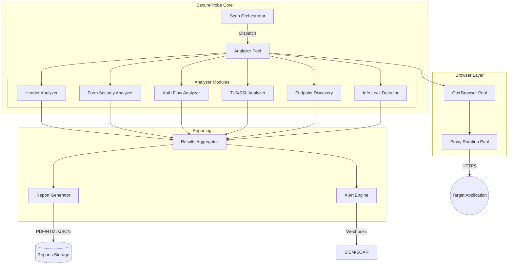

# SecureProbe: Automated Web Application Vulnerability Scanner

## 1. Executive Summary

**SecureProbe** is a production-grade automated web application security scanner that leverages the **Owl Browser SDK** to perform comprehensive vulnerability assessments. Unlike traditional scanners that rely on static analysis or simple HTTP requests, SecureProbe uses a real browser environment to detect vulnerabilities that only manifest in JavaScript-heavy applications, single-page applications (SPAs), and sites with advanced anti-bot protections.

**Key Use Cases:**
*   **Security Audits:** Automated security assessments for web applications before deployment
*   **Continuous Security Monitoring:** Scheduled scans to detect newly introduced vulnerabilities
*   **Penetration Testing Support:** Reconnaissance and passive scanning during authorized assessments
*   **Compliance Verification:** Validate security header compliance (PCI-DSS, OWASP)
*   **Third-Party Risk Assessment:** Evaluate security posture of vendor applications

**Platform Capabilities:**
*   Passive reconnaissance (headers, cookies, exposed information)
*   Form security analysis (CSRF, input validation, XSS vectors)
*   Authentication flow analysis and session management testing
*   SSL/TLS certificate validation and cipher suite analysis
*   Security header compliance checking (CSP, HSTS, X-Frame-Options)
*   Subdomain and endpoint discovery via JavaScript analysis
*   Information disclosure detection (stack traces, debug info, PII)
*   AI-powered vulnerability classification and risk scoring

## 2. System Architecture

SecureProbe is designed as a modular scanning platform where each security check operates as an independent analyzer. The architecture supports both single-target scans and enterprise-scale continuous monitoring.



## 3. Core Features

### 3.1. Passive Reconnaissance

SecureProbe performs non-intrusive reconnaissance to gather security-relevant information without triggering WAF alerts:

*   **HTTP Response Headers:** Analyze security headers, server fingerprinting, technology detection
*   **Cookie Analysis:** Secure/HttpOnly flags, SameSite attributes, session token entropy
*   **HTML Metadata:** Meta tags, CSP policies, exposed API endpoints
*   **JavaScript Analysis:** Embedded credentials, API keys, internal URLs
*   **Certificate Inspection:** Validity, chain of trust, cipher suites, HSTS preload

### 3.2. Form Security Testing

Automated analysis of web forms for common vulnerabilities:

*   **CSRF Protection:** Token presence, token entropy, SameSite cookie correlation
*   **Input Validation:** Client-side vs server-side validation detection
*   **XSS Vectors:** Reflected input detection, DOM-based XSS patterns
*   **Autocomplete Security:** Password and sensitive field autocomplete status
*   **Hidden Field Analysis:** Exposed internal identifiers, predictable values

### 3.3. Authentication Flow Analysis

Comprehensive evaluation of authentication mechanisms:

*   **Login Flow Security:** Form submission method, credential transmission
*   **Session Management:** Token generation, session fixation, concurrent sessions
*   **Password Policy:** Minimum requirements, breach database correlation
*   **Multi-Factor Detection:** MFA implementation presence and type
*   **Account Enumeration:** Differential response analysis

### 3.4. Security Header Compliance

Validation against industry standards and best practices:

| Header | Check | Severity |
|--------|-------|----------|
| Content-Security-Policy | Policy presence and strictness | High |
| Strict-Transport-Security | HSTS with preload, max-age | High |
| X-Frame-Options | Clickjacking protection | Medium |
| X-Content-Type-Options | MIME sniffing prevention | Medium |
| X-XSS-Protection | Legacy XSS filter | Low |
| Referrer-Policy | Information leakage | Medium |
| Permissions-Policy | Feature restrictions | Medium |

## 4. Type Definitions and Configuration

```python
"""
secureprobe/scanner/types.py

Type definitions for the SecureProbe vulnerability scanner.
All types are strict and mypy --strict compliant.
"""
from __future__ import annotations

import enum
from dataclasses import dataclass, field
from datetime import datetime
from typing import TypedDict, NotRequired, Protocol
from collections.abc import Sequence


class ScanStatus(enum.Enum):
    """Status of a security scan operation."""
    PENDING = "pending"
    IN_PROGRESS = "in_progress"
    COMPLETED = "completed"
    FAILED = "failed"
    CANCELLED = "cancelled"
    PARTIAL = "partial"


class VulnerabilitySeverity(enum.Enum):
    """CVSS-aligned vulnerability severity levels."""
    CRITICAL = "critical"  # CVSS 9.0-10.0
    HIGH = "high"          # CVSS 7.0-8.9
    MEDIUM = "medium"      # CVSS 4.0-6.9
    LOW = "low"            # CVSS 0.1-3.9
    INFO = "info"          # Informational findings


class VulnerabilityCategory(enum.Enum):
    """Categories of detected vulnerabilities."""
    SECURITY_HEADER = "security_header"
    COOKIE_SECURITY = "cookie_security"
    FORM_SECURITY = "form_security"
    AUTHENTICATION = "authentication"
    SESSION_MANAGEMENT = "session_management"
    INFORMATION_DISCLOSURE = "information_disclosure"
    TLS_CONFIGURATION = "tls_configuration"
    CSRF = "csrf"
    XSS = "xss"
    MISCONFIGURATION = "misconfiguration"


@dataclass(frozen=True, slots=True)
class ScannerConfig:
    """Configuration for the SecureProbe scanner."""
    server_url: str
    token: str
    max_depth: int = 3
    max_pages: int = 100
    timeout_per_page: int = 30000  # milliseconds
    respect_robots_txt: bool = True
    follow_external_links: bool = False
    enable_passive_only: bool = False
    enable_form_analysis: bool = True
    enable_auth_analysis: bool = True
    custom_headers: dict[str, str] = field(default_factory=dict)
    excluded_paths: list[str] = field(default_factory=list)
    rate_limit_rps: float = 2.0


class HeaderFinding(TypedDict):
    """Structure for a security header finding."""
    header_name: str
    present: bool
    value: NotRequired[str]
    expected: NotRequired[str]
    severity: str
    description: str
    recommendation: str
    references: list[str]


class CookieFinding(TypedDict):
    """Structure for a cookie security finding."""
    cookie_name: str
    domain: str
    secure: bool
    http_only: bool
    same_site: str
    issues: list[str]
    severity: str


class FormFinding(TypedDict):
    """Structure for a form security finding."""
    form_action: str
    form_method: str
    has_csrf_token: bool
    csrf_token_entropy: NotRequired[float]
    sensitive_fields: list[str]
    autocomplete_issues: list[str]
    validation_issues: list[str]
    severity: str


class TLSFinding(TypedDict):
    """Structure for TLS/SSL findings."""
    protocol_version: str
    cipher_suite: str
    certificate_valid: bool
    certificate_expiry: str
    certificate_issuer: str
    hsts_enabled: bool
    hsts_max_age: NotRequired[int]
    hsts_preload: bool
    issues: list[str]
    severity: str


@dataclass(slots=True)
class Vulnerability:
    """A detected vulnerability with full context."""
    id: str
    category: VulnerabilityCategory
    severity: VulnerabilitySeverity
    title: str
    description: str
    affected_url: str
    evidence: str
    recommendation: str
    cwe_id: str | None = None
    cvss_score: float | None = None
    references: list[str] = field(default_factory=list)
    raw_data: dict[str, object] = field(default_factory=dict)
    discovered_at: datetime = field(default_factory=datetime.utcnow)


@dataclass(slots=True)
class ScanResult:
    """Complete result of a security scan."""
    target_url: str
    scan_id: str
    status: ScanStatus
    started_at: datetime
    completed_at: datetime | None
    pages_scanned: int
    vulnerabilities: list[Vulnerability]
    header_findings: list[HeaderFinding]
    cookie_findings: list[CookieFinding]
    form_findings: list[FormFinding]
    tls_findings: list[TLSFinding]
    discovered_endpoints: list[str]
    technologies_detected: list[str]
    error_message: str | None = None

    @property
    def critical_count(self) -> int:
        return sum(1 for v in self.vulnerabilities if v.severity == VulnerabilitySeverity.CRITICAL)

    @property
    def high_count(self) -> int:
        return sum(1 for v in self.vulnerabilities if v.severity == VulnerabilitySeverity.HIGH)

    @property
    def risk_score(self) -> float:
        """Calculate overall risk score (0-100)."""
        weights = {
            VulnerabilitySeverity.CRITICAL: 40,
            VulnerabilitySeverity.HIGH: 25,
            VulnerabilitySeverity.MEDIUM: 10,
            VulnerabilitySeverity.LOW: 3,
            VulnerabilitySeverity.INFO: 0,
        }
        total = sum(weights[v.severity] for v in self.vulnerabilities)
        return min(100.0, total)


class ScannerProtocol(Protocol):
    """Protocol defining the scanner interface."""

    async def scan_url(self, url: str) -> ScanResult:
        """Perform a complete security scan of a URL."""
        ...

    async def scan_headers(self, url: str) -> list[HeaderFinding]:
        """Analyze security headers only."""
        ...

    async def scan_forms(self, url: str) -> list[FormFinding]:
        """Analyze form security only."""
        ...

    async def close(self) -> None:
        """Clean up resources."""
        ...
```

## 5. Exception Hierarchy

```python
"""
secureprobe/scanner/exceptions.py

Custom exception hierarchy for the security scanner.
"""
from __future__ import annotations

from dataclasses import dataclass


class SecureProbeError(Exception):
    """Base exception for all SecureProbe errors."""

    def __init__(self, message: str, url: str | None = None) -> None:
        self.url = url
        super().__init__(message)


class ScanConfigurationError(SecureProbeError):
    """Invalid scanner configuration."""
    pass


class ScanTimeoutError(SecureProbeError):
    """Scan operation timed out."""
    pass


class AccessDeniedError(SecureProbeError):
    """Access to target was denied (403/401)."""
    pass


class TargetUnreachableError(SecureProbeError):
    """Target URL is not reachable."""
    pass


class WAFBlockedError(SecureProbeError):
    """Request was blocked by WAF/firewall."""
    pass


class RateLimitedError(SecureProbeError):
    """Scan was rate limited by target."""
    
    def __init__(
        self,
        message: str,
        url: str | None = None,
        retry_after: int | None = None
    ) -> None:
        super().__init__(message, url)
        self.retry_after = retry_after


class AuthorizationRequiredError(SecureProbeError):
    """Scan requires authorization scope not provided."""
    pass
```

## 6. Core Scanner Implementation

### 6.1. Security Header Analyzer

```python
"""
secureprobe/analyzers/header_analyzer.py

Security header analysis using Owl Browser SDK.
Checks for presence and correctness of security-critical HTTP headers.
"""
from __future__ import annotations

import logging
import re
from dataclasses import dataclass
from typing import Final

from owl_browser import AsyncBrowser, AsyncPage, RemoteConfig

from ..types import HeaderFinding, VulnerabilitySeverity

logger = logging.getLogger(__name__)

# Security header definitions with expected values and severity
SECURITY_HEADERS: Final[dict[str, dict[str, object]]] = {
    "Content-Security-Policy": {
        "severity": VulnerabilitySeverity.HIGH,
        "description": "CSP prevents XSS and data injection attacks",
        "recommendation": "Implement a strict CSP with default-src 'self'",
        "references": ["https://developer.mozilla.org/en-US/docs/Web/HTTP/CSP"],
    },
    "Strict-Transport-Security": {
        "severity": VulnerabilitySeverity.HIGH,
        "description": "HSTS enforces HTTPS connections",
        "recommendation": "Set max-age to at least 31536000 with includeSubDomains",
        "references": ["https://developer.mozilla.org/en-US/docs/Web/HTTP/Headers/Strict-Transport-Security"],
    },
    "X-Frame-Options": {
        "severity": VulnerabilitySeverity.MEDIUM,
        "description": "Prevents clickjacking attacks",
        "recommendation": "Set to DENY or SAMEORIGIN",
        "references": ["https://developer.mozilla.org/en-US/docs/Web/HTTP/Headers/X-Frame-Options"],
    },
    "X-Content-Type-Options": {
        "severity": VulnerabilitySeverity.MEDIUM,
        "description": "Prevents MIME type sniffing",
        "recommendation": "Set to nosniff",
        "references": ["https://developer.mozilla.org/en-US/docs/Web/HTTP/Headers/X-Content-Type-Options"],
    },
    "Referrer-Policy": {
        "severity": VulnerabilitySeverity.MEDIUM,
        "description": "Controls referrer information leakage",
        "recommendation": "Set to strict-origin-when-cross-origin or no-referrer",
        "references": ["https://developer.mozilla.org/en-US/docs/Web/HTTP/Headers/Referrer-Policy"],
    },
    "Permissions-Policy": {
        "severity": VulnerabilitySeverity.LOW,
        "description": "Controls browser feature access",
        "recommendation": "Restrict unnecessary features like geolocation, camera",
        "references": ["https://developer.mozilla.org/en-US/docs/Web/HTTP/Headers/Permissions-Policy"],
    },
    "X-XSS-Protection": {
        "severity": VulnerabilitySeverity.LOW,
        "description": "Legacy XSS filter (deprecated but still checked)",
        "recommendation": "Set to 1; mode=block or rely on CSP",
        "references": ["https://developer.mozilla.org/en-US/docs/Web/HTTP/Headers/X-XSS-Protection"],
    },
}

# Dangerous headers that should not be exposed
SENSITIVE_HEADERS: Final[list[str]] = [
    "Server",
    "X-Powered-By",
    "X-AspNet-Version",
    "X-AspNetMvc-Version",
]


@dataclass
class HeaderAnalyzer:
    """
    Analyzes HTTP security headers using Owl Browser.
    
    Performs comprehensive checks against OWASP recommendations
    and industry best practices.
    """
    
    browser_url: str
    browser_token: str | None = None

    async def analyze(self, target_url: str) -> list[HeaderFinding]:
        """
        Analyze security headers for a target URL.
        
        Args:
            target_url: The URL to analyze
            
        Returns:
            List of header findings with severity and recommendations
        """
        findings: list[HeaderFinding] = []
        
        remote_config = RemoteConfig(
            url=self.browser_url,
            token=self.browser_token,
        )
        
        browser = AsyncBrowser(remote=remote_config)
        await browser.__aenter__()
        
        try:
            page = await browser.new_page()
            
            # Navigate and capture response headers via network interception
            await page.enable_network_logging(True)
            await page.goto(target_url, wait_until="domcontentloaded")
            
            # Get network log to extract response headers
            network_log = await page.get_network_log(limit=10)
            
            # Extract headers from the main document response
            response_headers = await self._extract_response_headers(page, network_log)
            
            # Check required security headers
            for header_name, header_config in SECURITY_HEADERS.items():
                header_value = response_headers.get(header_name.lower())
                
                if header_value is None:
                    findings.append(HeaderFinding(
                        header_name=header_name,
                        present=False,
                        severity=header_config["severity"].value,
                        description=f"Missing {header_name}: {header_config['description']}",
                        recommendation=header_config["recommendation"],
                        references=header_config["references"],
                    ))
                else:
                    # Validate header value
                    validation_result = self._validate_header(header_name, header_value)
                    if validation_result:
                        findings.append(HeaderFinding(
                            header_name=header_name,
                            present=True,
                            value=header_value,
                            expected=validation_result["expected"],
                            severity=validation_result["severity"],
                            description=validation_result["issue"],
                            recommendation=header_config["recommendation"],
                            references=header_config["references"],
                        ))
            
            # Check for sensitive information disclosure headers
            findings.extend(self._check_sensitive_headers(response_headers))
            
            await page.close()
            
        finally:
            await browser.__aexit__(None, None, None)
        
        return findings

    async def _extract_response_headers(
        self,
        page: AsyncPage,
        network_log: list[dict],
    ) -> dict[str, str]:
        """Extract response headers from network log or via JavaScript."""
        headers: dict[str, str] = {}
        
        # Try to get headers from network log
        for entry in network_log:
            if entry.get("type") == "response":
                response_headers = entry.get("headers", {})
                headers.update({k.lower(): v for k, v in response_headers.items()})
                break
        
        # Fallback: Use JavaScript to check certain headers via meta tags
        if not headers:
            meta_headers = await page.expression("""
                (() => {
                    const headers = {};
                    
                    // Check meta http-equiv tags
                    document.querySelectorAll('meta[http-equiv]').forEach(meta => {
                        headers[meta.getAttribute('http-equiv').toLowerCase()] = 
                            meta.getAttribute('content');
                    });
                    
                    // Check CSP meta tag
                    const cspMeta = document.querySelector('meta[http-equiv="Content-Security-Policy"]');
                    if (cspMeta) {
                        headers['content-security-policy'] = cspMeta.content;
                    }
                    
                    return headers;
                })()
            """)
            headers.update(meta_headers)
        
        return headers

    def _validate_header(
        self,
        header_name: str,
        value: str,
    ) -> dict[str, str] | None:
        """Validate a security header value against best practices."""
        match header_name:
            case "Strict-Transport-Security":
                # Check max-age is at least 1 year
                max_age_match = re.search(r"max-age=(\d+)", value)
                if max_age_match:
                    max_age = int(max_age_match.group(1))
                    if max_age < 31536000:
                        return {
                            "issue": f"HSTS max-age is {max_age}, should be at least 31536000",
                            "expected": "max-age=31536000; includeSubDomains; preload",
                            "severity": VulnerabilitySeverity.MEDIUM.value,
                        }
                if "includesubdomains" not in value.lower():
                    return {
                        "issue": "HSTS missing includeSubDomains directive",
                        "expected": "max-age=31536000; includeSubDomains",
                        "severity": VulnerabilitySeverity.LOW.value,
                    }
                    
            case "X-Frame-Options":
                if value.upper() not in ("DENY", "SAMEORIGIN"):
                    return {
                        "issue": f"X-Frame-Options has weak value: {value}",
                        "expected": "DENY or SAMEORIGIN",
                        "severity": VulnerabilitySeverity.MEDIUM.value,
                    }
                    
            case "Content-Security-Policy":
                # Check for unsafe directives
                unsafe_patterns = ["'unsafe-inline'", "'unsafe-eval'", "*"]
                for pattern in unsafe_patterns:
                    if pattern in value:
                        return {
                            "issue": f"CSP contains unsafe directive: {pattern}",
                            "expected": "Strict CSP without unsafe directives",
                            "severity": VulnerabilitySeverity.MEDIUM.value,
                        }
                        
            case "X-Content-Type-Options":
                if value.lower() != "nosniff":
                    return {
                        "issue": f"X-Content-Type-Options should be 'nosniff', got: {value}",
                        "expected": "nosniff",
                        "severity": VulnerabilitySeverity.MEDIUM.value,
                    }
        
        return None

    def _check_sensitive_headers(
        self,
        headers: dict[str, str],
    ) -> list[HeaderFinding]:
        """Check for headers that disclose sensitive information."""
        findings: list[HeaderFinding] = []
        
        for header in SENSITIVE_HEADERS:
            value = headers.get(header.lower())
            if value:
                findings.append(HeaderFinding(
                    header_name=header,
                    present=True,
                    value=value,
                    severity=VulnerabilitySeverity.LOW.value,
                    description=f"Server exposes {header} header: {value}",
                    recommendation=f"Remove or obfuscate the {header} header",
                    references=["https://owasp.org/www-project-secure-headers/"],
                ))
        
        return findings
```

### 6.2. Cookie Security Analyzer

```python
"""
secureprobe/analyzers/cookie_analyzer.py

Cookie security analysis using Owl Browser SDK.
"""
from __future__ import annotations

import logging
import math
from dataclasses import dataclass

from owl_browser import AsyncBrowser, RemoteConfig, Cookie

from ..types import CookieFinding, VulnerabilitySeverity

logger = logging.getLogger(__name__)

# Known session cookie name patterns
SESSION_COOKIE_PATTERNS: list[str] = [
    "session", "sess", "sid", "token", "auth", "jwt",
    "phpsessid", "jsessionid", "asp.net_sessionid", "cfid", "cftoken",
]


@dataclass
class CookieAnalyzer:
    """
    Analyzes cookie security attributes using Owl Browser.
    
    Checks for:
    - Secure flag on HTTPS sites
    - HttpOnly flag for session cookies
    - SameSite attribute
    - Cookie prefix conventions (__Secure-, __Host-)
    - Session token entropy
    """
    
    browser_url: str
    browser_token: str | None = None

    async def analyze(self, target_url: str) -> list[CookieFinding]:
        """
        Analyze all cookies set by the target URL.
        
        Args:
            target_url: The URL to analyze
            
        Returns:
            List of cookie findings with security issues
        """
        findings: list[CookieFinding] = []
        
        remote_config = RemoteConfig(
            url=self.browser_url,
            token=self.browser_token,
        )
        
        browser = AsyncBrowser(remote=remote_config)
        await browser.__aenter__()
        
        try:
            page = await browser.new_page()
            
            # Navigate to set cookies
            await page.goto(target_url, wait_until="networkidle")
            
            # Wait for any deferred cookie setting
            await page.wait_for_network_idle(idle_time=2000, timeout=10000)
            
            # Get all cookies
            cookies = await page.get_cookies(url=target_url)
            
            is_https = target_url.startswith("https://")
            
            for cookie in cookies:
                issues = self._analyze_cookie(cookie, is_https)
                
                if issues:
                    severity = self._determine_severity(cookie, issues)
                    findings.append(CookieFinding(
                        cookie_name=cookie.name,
                        domain=cookie.domain,
                        secure=cookie.secure,
                        http_only=cookie.httpOnly,
                        same_site=cookie.sameSite or "None",
                        issues=issues,
                        severity=severity.value,
                    ))
            
            await page.close()
            
        finally:
            await browser.__aexit__(None, None, None)
        
        return findings

    def _analyze_cookie(self, cookie: Cookie, is_https: bool) -> list[str]:
        """Analyze a single cookie for security issues."""
        issues: list[str] = []
        
        is_session_cookie = self._is_session_cookie(cookie.name)
        
        # Check Secure flag
        if is_https and not cookie.secure:
            issues.append(
                "Cookie lacks Secure flag - can be transmitted over HTTP"
            )
        
        # Check HttpOnly flag for session cookies
        if is_session_cookie and not cookie.httpOnly:
            issues.append(
                "Session cookie lacks HttpOnly flag - vulnerable to XSS theft"
            )
        
        # Check SameSite attribute
        same_site = (cookie.sameSite or "").lower()
        if same_site == "none" and not cookie.secure:
            issues.append(
                "SameSite=None requires Secure flag"
            )
        elif same_site not in ("strict", "lax") and is_session_cookie:
            issues.append(
                f"Session cookie has weak SameSite={same_site or 'missing'} - CSRF risk"
            )
        
        # Check cookie prefixes
        if cookie.name.startswith("__Secure-"):
            if not cookie.secure:
                issues.append(
                    "__Secure- prefix requires Secure flag"
                )
        
        if cookie.name.startswith("__Host-"):
            if not cookie.secure or cookie.path != "/" or cookie.domain:
                issues.append(
                    "__Host- prefix requires Secure flag, path=/, and no Domain"
                )
        
        # Check session token entropy
        if is_session_cookie:
            entropy = self._calculate_entropy(cookie.value)
            if entropy < 4.0:  # Bits per character
                issues.append(
                    f"Session token has low entropy ({entropy:.2f} bits/char) - predictable"
                )
        
        return issues

    def _is_session_cookie(self, name: str) -> bool:
        """Check if cookie name indicates a session cookie."""
        name_lower = name.lower()
        return any(pattern in name_lower for pattern in SESSION_COOKIE_PATTERNS)

    def _calculate_entropy(self, value: str) -> float:
        """Calculate Shannon entropy of a string."""
        if not value:
            return 0.0
        
        # Count character frequencies
        freq: dict[str, int] = {}
        for char in value:
            freq[char] = freq.get(char, 0) + 1
        
        # Calculate entropy
        length = len(value)
        entropy = 0.0
        for count in freq.values():
            p = count / length
            entropy -= p * math.log2(p)
        
        return entropy

    def _determine_severity(
        self,
        cookie: Cookie,
        issues: list[str],
    ) -> VulnerabilitySeverity:
        """Determine overall severity based on cookie issues."""
        is_session = self._is_session_cookie(cookie.name)
        
        for issue in issues:
            if "XSS theft" in issue and is_session:
                return VulnerabilitySeverity.HIGH
            if "CSRF" in issue and is_session:
                return VulnerabilitySeverity.MEDIUM
            if "predictable" in issue:
                return VulnerabilitySeverity.HIGH
        
        return VulnerabilitySeverity.LOW
```

### 6.3. Form Security Analyzer

```python
"""
secureprobe/analyzers/form_analyzer.py

Form security analysis using Owl Browser SDK.
Detects CSRF vulnerabilities, input validation issues, and XSS vectors.
"""
from __future__ import annotations

import logging
import re
import math
from dataclasses import dataclass
from typing import TypedDict

from owl_browser import AsyncBrowser, AsyncPage, RemoteConfig

from ..types import FormFinding, VulnerabilitySeverity

logger = logging.getLogger(__name__)

# Patterns for sensitive input fields
SENSITIVE_FIELD_PATTERNS: list[str] = [
    r"password", r"passwd", r"secret", r"token",
    r"credit.?card", r"ccv", r"cvv", r"ssn",
    r"social.?security", r"bank.?account",
]

# Common CSRF token field names
CSRF_TOKEN_PATTERNS: list[str] = [
    r"csrf", r"xsrf", r"token", r"authenticity",
    r"_token", r"__RequestVerificationToken",
]


class FormData(TypedDict):
    """Structure for extracted form data."""
    action: str
    method: str
    inputs: list[dict[str, str]]
    has_file_upload: bool
    autocomplete: str


@dataclass
class FormAnalyzer:
    """
    Analyzes form security using Owl Browser.
    
    Performs:
    - CSRF token detection and validation
    - Sensitive field analysis (passwords, credit cards)
    - Autocomplete attribute checking
    - Input validation detection
    - Action URL analysis
    """
    
    browser_url: str
    browser_token: str | None = None

    async def analyze(self, target_url: str) -> list[FormFinding]:
        """
        Analyze all forms on a page for security issues.
        
        Args:
            target_url: The URL to analyze
            
        Returns:
            List of form findings with security issues
        """
        findings: list[FormFinding] = []
        
        remote_config = RemoteConfig(
            url=self.browser_url,
            token=self.browser_token,
        )
        
        browser = AsyncBrowser(remote=remote_config)
        await browser.__aenter__()
        
        try:
            page = await browser.new_page()
            
            # Navigate and wait for dynamic content
            await page.goto(target_url, wait_until="networkidle")
            await page.wait_for_network_idle(idle_time=2000, timeout=15000)
            
            # Extract all forms using JavaScript
            forms = await self._extract_forms(page)
            
            for form in forms:
                finding = await self._analyze_form(page, form)
                if finding:
                    findings.append(finding)
            
            await page.close()
            
        finally:
            await browser.__aexit__(None, None, None)
        
        return findings

    async def _extract_forms(self, page: AsyncPage) -> list[FormData]:
        """Extract all forms and their inputs from the page."""
        forms_script = """
        Array.from(document.querySelectorAll('form')).map(form => ({
            action: form.action || window.location.href,
            method: (form.method || 'GET').toUpperCase(),
            autocomplete: form.getAttribute('autocomplete') || 'on',
            has_file_upload: !!form.querySelector('input[type="file"]'),
            inputs: Array.from(form.querySelectorAll('input, select, textarea')).map(input => ({
                name: input.name || '',
                type: input.type || 'text',
                id: input.id || '',
                autocomplete: input.getAttribute('autocomplete') || '',
                required: input.required,
                pattern: input.pattern || '',
                value: input.type === 'hidden' ? input.value : '',
            }))
        }))
        """
        
        raw_forms = await page.expression(forms_script)
        return [FormData(**form) for form in raw_forms]

    async def _analyze_form(
        self,
        page: AsyncPage,
        form: FormData,
    ) -> FormFinding | None:
        """Analyze a single form for security issues."""
        issues_found = False
        
        # Check for CSRF protection
        csrf_token = self._find_csrf_token(form)
        has_csrf = csrf_token is not None
        csrf_entropy: float | None = None
        
        if csrf_token:
            csrf_entropy = self._calculate_entropy(csrf_token.get("value", ""))
        
        # Identify sensitive fields
        sensitive_fields = self._find_sensitive_fields(form)
        
        # Check autocomplete issues
        autocomplete_issues = self._check_autocomplete(form)
        
        # Check validation issues
        validation_issues = await self._check_validation(page, form)
        
        # Determine if this form has security concerns
        csrf_issue = False
        if form["method"] == "POST" and not has_csrf:
            csrf_issue = True
            issues_found = True
        
        if sensitive_fields:
            issues_found = True
            
        if autocomplete_issues:
            issues_found = True
            
        if validation_issues:
            issues_found = True
        
        if not issues_found:
            return None
        
        # Determine severity
        severity = self._determine_severity(
            csrf_issue, sensitive_fields, autocomplete_issues
        )
        
        return FormFinding(
            form_action=form["action"],
            form_method=form["method"],
            has_csrf_token=has_csrf,
            csrf_token_entropy=csrf_entropy,
            sensitive_fields=sensitive_fields,
            autocomplete_issues=autocomplete_issues,
            validation_issues=validation_issues,
            severity=severity.value,
        )

    def _find_csrf_token(self, form: FormData) -> dict[str, str] | None:
        """Find CSRF token in form inputs."""
        for input_field in form["inputs"]:
            name = input_field.get("name", "").lower()
            input_type = input_field.get("type", "")
            
            if input_type == "hidden":
                for pattern in CSRF_TOKEN_PATTERNS:
                    if re.search(pattern, name, re.IGNORECASE):
                        return input_field
        
        return None

    def _find_sensitive_fields(self, form: FormData) -> list[str]:
        """Identify sensitive input fields."""
        sensitive: list[str] = []
        
        for input_field in form["inputs"]:
            name = input_field.get("name", "")
            input_type = input_field.get("type", "")
            
            # Password fields
            if input_type == "password":
                sensitive.append(f"password:{name}")
                continue
            
            # Check name against sensitive patterns
            for pattern in SENSITIVE_FIELD_PATTERNS:
                if re.search(pattern, name, re.IGNORECASE):
                    sensitive.append(f"{pattern}:{name}")
                    break
        
        return sensitive

    def _check_autocomplete(self, form: FormData) -> list[str]:
        """Check for autocomplete issues on sensitive fields."""
        issues: list[str] = []
        
        for input_field in form["inputs"]:
            name = input_field.get("name", "")
            input_type = input_field.get("type", "")
            autocomplete = input_field.get("autocomplete", "")
            
            # Password fields should have autocomplete="new-password" or "off"
            if input_type == "password":
                if autocomplete not in ("off", "new-password", "current-password"):
                    issues.append(
                        f"Password field '{name}' allows autocomplete"
                    )
            
            # Credit card fields should disable autocomplete
            if any(re.search(p, name, re.I) for p in [r"credit", r"card", r"ccv"]):
                if autocomplete not in ("off", "cc-number", "cc-csc"):
                    issues.append(
                        f"Payment field '{name}' may allow autocomplete"
                    )
        
        return issues

    async def _check_validation(
        self,
        page: AsyncPage,
        form: FormData,
    ) -> list[str]:
        """Check for client-side vs server-side validation."""
        issues: list[str] = []
        
        for input_field in form["inputs"]:
            name = input_field.get("name", "")
            pattern = input_field.get("pattern", "")
            required = input_field.get("required", False)
            
            # Check for client-side only validation (risky)
            if pattern and not required:
                issues.append(
                    f"Field '{name}' has pattern validation but is not required"
                )
        
        return issues

    def _calculate_entropy(self, value: str) -> float:
        """Calculate Shannon entropy."""
        if not value:
            return 0.0
        
        freq: dict[str, int] = {}
        for char in value:
            freq[char] = freq.get(char, 0) + 1
        
        length = len(value)
        entropy = 0.0
        for count in freq.values():
            p = count / length
            entropy -= p * math.log2(p)
        
        return entropy

    def _determine_severity(
        self,
        csrf_issue: bool,
        sensitive_fields: list[str],
        autocomplete_issues: list[str],
    ) -> VulnerabilitySeverity:
        """Determine severity based on findings."""
        if csrf_issue and any("password" in f for f in sensitive_fields):
            return VulnerabilitySeverity.HIGH
        
        if csrf_issue:
            return VulnerabilitySeverity.MEDIUM
        
        if autocomplete_issues and sensitive_fields:
            return VulnerabilitySeverity.MEDIUM
        
        return VulnerabilitySeverity.LOW
```

### 6.4. Information Disclosure Analyzer

```python
"""
secureprobe/analyzers/info_disclosure.py

Information disclosure detection using Owl Browser SDK.
Detects exposed secrets, debug information, and sensitive data.
"""
from __future__ import annotations

import logging
import re
from dataclasses import dataclass, field
from typing import Final

from owl_browser import AsyncBrowser, AsyncPage, RemoteConfig

from ..types import Vulnerability, VulnerabilityCategory, VulnerabilitySeverity

logger = logging.getLogger(__name__)

# Patterns for detecting exposed secrets
SECRET_PATTERNS: Final[dict[str, dict[str, str | VulnerabilitySeverity]]] = {
    "aws_access_key": {
        "pattern": r"AKIA[0-9A-Z]{16}",
        "description": "AWS Access Key ID exposed",
        "severity": VulnerabilitySeverity.CRITICAL,
        "cwe": "CWE-798",
    },
    "aws_secret_key": {
        "pattern": r"(?<![A-Za-z0-9/+=])[A-Za-z0-9/+=]{40}(?![A-Za-z0-9/+=])",
        "description": "Potential AWS Secret Key exposed",
        "severity": VulnerabilitySeverity.CRITICAL,
        "cwe": "CWE-798",
    },
    "github_token": {
        "pattern": r"ghp_[A-Za-z0-9]{36}|github_pat_[A-Za-z0-9]{22}_[A-Za-z0-9]{59}",
        "description": "GitHub Personal Access Token exposed",
        "severity": VulnerabilitySeverity.CRITICAL,
        "cwe": "CWE-798",
    },
    "stripe_key": {
        "pattern": r"sk_live_[A-Za-z0-9]{24,}",
        "description": "Stripe Live Secret Key exposed",
        "severity": VulnerabilitySeverity.CRITICAL,
        "cwe": "CWE-798",
    },
    "jwt_token": {
        "pattern": r"eyJ[A-Za-z0-9-_]+\.eyJ[A-Za-z0-9-_]+\.[A-Za-z0-9-_]+",
        "description": "JWT token exposed in page content",
        "severity": VulnerabilitySeverity.HIGH,
        "cwe": "CWE-200",
    },
    "api_key_generic": {
        "pattern": r"api[_-]?key['\"]?\s*[:=]\s*['\"]?[A-Za-z0-9]{20,}",
        "description": "Generic API key pattern detected",
        "severity": VulnerabilitySeverity.HIGH,
        "cwe": "CWE-798",
    },
    "private_key": {
        "pattern": r"-----BEGIN (RSA |EC |DSA |OPENSSH )?PRIVATE KEY-----",
        "description": "Private key exposed in page content",
        "severity": VulnerabilitySeverity.CRITICAL,
        "cwe": "CWE-321",
    },
    "database_url": {
        "pattern": r"(postgres|mysql|mongodb)://[^'\"\s]+",
        "description": "Database connection string exposed",
        "severity": VulnerabilitySeverity.CRITICAL,
        "cwe": "CWE-200",
    },
    "email_pattern": {
        "pattern": r"[a-zA-Z0-9._%+-]+@[a-zA-Z0-9.-]+\.[a-zA-Z]{2,}",
        "description": "Email addresses exposed",
        "severity": VulnerabilitySeverity.LOW,
        "cwe": "CWE-200",
    },
    "internal_ip": {
        "pattern": r"\b(10\.\d{1,3}\.\d{1,3}\.\d{1,3}|172\.(1[6-9]|2\d|3[01])\.\d{1,3}\.\d{1,3}|192\.168\.\d{1,3}\.\d{1,3})\b",
        "description": "Internal IP address exposed",
        "severity": VulnerabilitySeverity.MEDIUM,
        "cwe": "CWE-200",
    },
}

# Patterns for debug/error information
DEBUG_PATTERNS: Final[dict[str, dict[str, str | VulnerabilitySeverity]]] = {
    "stack_trace_python": {
        "pattern": r"Traceback \(most recent call last\):",
        "description": "Python stack trace exposed",
        "severity": VulnerabilitySeverity.MEDIUM,
        "cwe": "CWE-209",
    },
    "stack_trace_java": {
        "pattern": r"at\s+[\w.$]+\([\w.]+:\d+\)",
        "description": "Java stack trace exposed",
        "severity": VulnerabilitySeverity.MEDIUM,
        "cwe": "CWE-209",
    },
    "stack_trace_php": {
        "pattern": r"Fatal error:.*on line \d+",
        "description": "PHP error exposed",
        "severity": VulnerabilitySeverity.MEDIUM,
        "cwe": "CWE-209",
    },
    "sql_error": {
        "pattern": r"(SQL syntax|mysql_|ORA-\d+|PostgreSQL|SQLITE_ERROR)",
        "description": "SQL error message exposed",
        "severity": VulnerabilitySeverity.HIGH,
        "cwe": "CWE-209",
    },
    "debug_mode": {
        "pattern": r"(DEBUG\s*=\s*True|debug_mode|FLASK_DEBUG)",
        "description": "Debug mode indicator found",
        "severity": VulnerabilitySeverity.MEDIUM,
        "cwe": "CWE-489",
    },
    "source_map": {
        "pattern": r"//# sourceMappingURL=",
        "description": "JavaScript source map reference found",
        "severity": VulnerabilitySeverity.LOW,
        "cwe": "CWE-540",
    },
}


@dataclass
class InfoDisclosureAnalyzer:
    """
    Analyzes pages for information disclosure vulnerabilities.
    
    Scans:
    - HTML content for exposed secrets
    - JavaScript files for hardcoded credentials
    - Comments for sensitive information
    - Error messages and stack traces
    """
    
    browser_url: str
    browser_token: str | None = None
    patterns: dict[str, dict] = field(default_factory=lambda: {
        **SECRET_PATTERNS,
        **DEBUG_PATTERNS,
    })

    async def analyze(self, target_url: str) -> list[Vulnerability]:
        """
        Scan a page for information disclosure vulnerabilities.
        
        Args:
            target_url: The URL to analyze
            
        Returns:
            List of detected vulnerabilities
        """
        vulnerabilities: list[Vulnerability] = []
        
        remote_config = RemoteConfig(
            url=self.browser_url,
            token=self.browser_token,
        )
        
        browser = AsyncBrowser(remote=remote_config)
        await browser.__aenter__()
        
        try:
            page = await browser.new_page()
            
            # Navigate and wait for all content
            await page.goto(target_url, wait_until="networkidle")
            await page.wait_for_network_idle(idle_time=2000, timeout=15000)
            
            # Get full HTML content
            html_content = await page.get_html(clean_level="none")
            
            # Scan HTML for patterns
            html_findings = self._scan_content(html_content, target_url)
            vulnerabilities.extend(html_findings)
            
            # Extract and scan inline JavaScript
            js_content = await self._extract_inline_scripts(page)
            js_findings = self._scan_content(js_content, target_url)
            vulnerabilities.extend(js_findings)
            
            # Extract and scan HTML comments
            comments = await self._extract_comments(page)
            comment_findings = self._scan_content(comments, target_url)
            vulnerabilities.extend(comment_findings)
            
            # Use AI to detect additional disclosure patterns
            ai_findings = await self._ai_scan(page, target_url)
            vulnerabilities.extend(ai_findings)
            
            await page.close()
            
        finally:
            await browser.__aexit__(None, None, None)
        
        # Deduplicate findings
        return self._deduplicate(vulnerabilities)

    def _scan_content(
        self,
        content: str,
        url: str,
    ) -> list[Vulnerability]:
        """Scan content for secret patterns."""
        findings: list[Vulnerability] = []
        
        for pattern_name, config in self.patterns.items():
            pattern = config["pattern"]
            matches = re.findall(pattern, content, re.IGNORECASE)
            
            if matches:
                # Limit evidence to avoid exposing full secrets
                evidence = self._sanitize_evidence(matches[0])
                
                findings.append(Vulnerability(
                    id=f"{pattern_name}_{hash(url)}",
                    category=VulnerabilityCategory.INFORMATION_DISCLOSURE,
                    severity=config["severity"],
                    title=config["description"],
                    description=f"Found {len(matches)} instance(s) of {pattern_name}",
                    affected_url=url,
                    evidence=evidence,
                    recommendation=f"Remove or protect exposed {pattern_name}",
                    cwe_id=config.get("cwe"),
                ))
        
        return findings

    async def _extract_inline_scripts(self, page: AsyncPage) -> str:
        """Extract all inline JavaScript from the page."""
        script = """
        Array.from(document.querySelectorAll('script:not([src])'))
            .map(s => s.textContent)
            .join('\\n')
        """
        return await page.expression(script)

    async def _extract_comments(self, page: AsyncPage) -> str:
        """Extract HTML comments from the page."""
        script = """
        (() => {
            const comments = [];
            const walker = document.createTreeWalker(
                document,
                NodeFilter.SHOW_COMMENT,
                null,
                false
            );
            while (walker.nextNode()) {
                comments.push(walker.currentNode.textContent);
            }
            return comments.join('\\n');
        })()
        """
        return await page.expression(script)

    async def _ai_scan(
        self,
        page: AsyncPage,
        url: str,
    ) -> list[Vulnerability]:
        """Use Owl Browser's AI to detect disclosure patterns."""
        findings: list[Vulnerability] = []
        
        try:
            # Query the page for potential secrets using AI
            ai_response = await page.query_page(
                "Identify any exposed secrets, API keys, credentials, "
                "debug information, or sensitive data visible on this page. "
                "List each finding on a separate line."
            )
            
            if ai_response and "no " not in ai_response.lower():
                findings.append(Vulnerability(
                    id=f"ai_disclosure_{hash(url)}",
                    category=VulnerabilityCategory.INFORMATION_DISCLOSURE,
                    severity=VulnerabilitySeverity.MEDIUM,
                    title="AI-detected potential information disclosure",
                    description=ai_response[:500],
                    affected_url=url,
                    evidence="Detected via AI analysis",
                    recommendation="Review AI findings manually",
                ))
                
        except Exception as e:
            logger.warning("AI scan failed: %s", e)
        
        return findings

    def _sanitize_evidence(self, match: str) -> str:
        """Sanitize evidence to avoid exposing full secrets."""
        if len(match) > 20:
            return f"{match[:8]}...{match[-4:]}"
        return match

    def _deduplicate(
        self,
        vulnerabilities: list[Vulnerability],
    ) -> list[Vulnerability]:
        """Remove duplicate findings."""
        seen: set[str] = set()
        unique: list[Vulnerability] = []
        
        for vuln in vulnerabilities:
            key = f"{vuln.category}:{vuln.title}:{vuln.evidence}"
            if key not in seen:
                seen.add(key)
                unique.append(vuln)
        
        return unique
```

## 7. Complete Scanner Orchestrator

```python
"""
secureprobe/scanner/orchestrator.py

Main scanner orchestrator that coordinates all analyzers.
"""
from __future__ import annotations

import asyncio
import logging
import uuid
from dataclasses import dataclass, field
from datetime import datetime, timezone
from typing import Final
from urllib.parse import urlparse, urljoin

from owl_browser import AsyncBrowser, AsyncPage, RemoteConfig

from .types import (
    ScannerConfig,
    ScanResult,
    ScanStatus,
    Vulnerability,
    VulnerabilityCategory,
    VulnerabilitySeverity,
)
from .exceptions import (
    SecureProbeError,
    TargetUnreachableError,
    AccessDeniedError,
)
from ..analyzers.header_analyzer import HeaderAnalyzer
from ..analyzers.cookie_analyzer import CookieAnalyzer
from ..analyzers.form_analyzer import FormAnalyzer
from ..analyzers.info_disclosure import InfoDisclosureAnalyzer

logger = logging.getLogger(__name__)


@dataclass
class SecureProbeScanner:
    """
    Main scanner orchestrator for SecureProbe.
    
    Coordinates all security analyzers and generates comprehensive
    vulnerability reports.
    
    Usage:
        async with SecureProbeScanner(config) as scanner:
            result = await scanner.scan_url("https://example.com")
            print(f"Found {len(result.vulnerabilities)} issues")
    """
    
    config: ScannerConfig
    _browser: AsyncBrowser | None = field(default=None, init=False)
    _header_analyzer: HeaderAnalyzer | None = field(default=None, init=False)
    _cookie_analyzer: CookieAnalyzer | None = field(default=None, init=False)
    _form_analyzer: FormAnalyzer | None = field(default=None, init=False)
    _info_analyzer: InfoDisclosureAnalyzer | None = field(default=None, init=False)

    async def __aenter__(self) -> SecureProbeScanner:
        """Initialize browser and analyzers."""
        remote_config = RemoteConfig(
            url=self.config.server_url,
            token=self.config.token,
        )
        
        self._browser = AsyncBrowser(remote=remote_config)
        await self._browser.__aenter__()
        
        # Initialize analyzers
        self._header_analyzer = HeaderAnalyzer(
            browser_url=self.config.server_url,
            browser_token=self.config.token,
        )
        self._cookie_analyzer = CookieAnalyzer(
            browser_url=self.config.server_url,
            browser_token=self.config.token,
        )
        self._form_analyzer = FormAnalyzer(
            browser_url=self.config.server_url,
            browser_token=self.config.token,
        )
        self._info_analyzer = InfoDisclosureAnalyzer(
            browser_url=self.config.server_url,
            browser_token=self.config.token,
        )
        
        return self

    async def __aexit__(self, *args: object) -> None:
        """Cleanup resources."""
        if self._browser:
            await self._browser.__aexit__(*args)

    async def scan_url(self, url: str) -> ScanResult:
        """
        Perform a complete security scan of a URL.
        
        Args:
            url: Target URL to scan
            
        Returns:
            Comprehensive scan result with all findings
        """
        scan_id = str(uuid.uuid4())
        started_at = datetime.now(timezone.utc)
        
        logger.info("Starting scan %s for %s", scan_id, url)
        
        try:
            # Validate target is reachable
            await self._validate_target(url)
            
            # Run all analyzers concurrently
            results = await asyncio.gather(
                self._header_analyzer.analyze(url),
                self._cookie_analyzer.analyze(url),
                self._form_analyzer.analyze(url),
                self._info_analyzer.analyze(url),
                self._discover_endpoints(url),
                self._detect_technologies(url),
                return_exceptions=True,
            )
            
            # Process results
            header_findings = results[0] if not isinstance(results[0], Exception) else []
            cookie_findings = results[1] if not isinstance(results[1], Exception) else []
            form_findings = results[2] if not isinstance(results[2], Exception) else []
            vulnerabilities = results[3] if not isinstance(results[3], Exception) else []
            discovered_endpoints = results[4] if not isinstance(results[4], Exception) else []
            technologies = results[5] if not isinstance(results[5], Exception) else []
            
            # Convert findings to vulnerabilities
            all_vulnerabilities = list(vulnerabilities)
            all_vulnerabilities.extend(
                self._findings_to_vulnerabilities(header_findings, url)
            )
            all_vulnerabilities.extend(
                self._cookie_findings_to_vulnerabilities(cookie_findings, url)
            )
            all_vulnerabilities.extend(
                self._form_findings_to_vulnerabilities(form_findings, url)
            )
            
            return ScanResult(
                target_url=url,
                scan_id=scan_id,
                status=ScanStatus.COMPLETED,
                started_at=started_at,
                completed_at=datetime.now(timezone.utc),
                pages_scanned=1,
                vulnerabilities=all_vulnerabilities,
                header_findings=header_findings,
                cookie_findings=cookie_findings,
                form_findings=form_findings,
                tls_findings=[],  # TLS analyzer would add these
                discovered_endpoints=discovered_endpoints,
                technologies_detected=technologies,
            )
            
        except Exception as e:
            logger.error("Scan failed: %s", e, exc_info=True)
            return ScanResult(
                target_url=url,
                scan_id=scan_id,
                status=ScanStatus.FAILED,
                started_at=started_at,
                completed_at=datetime.now(timezone.utc),
                pages_scanned=0,
                vulnerabilities=[],
                header_findings=[],
                cookie_findings=[],
                form_findings=[],
                tls_findings=[],
                discovered_endpoints=[],
                technologies_detected=[],
                error_message=str(e),
            )

    async def _validate_target(self, url: str) -> None:
        """Validate target URL is reachable."""
        if not self._browser:
            raise SecureProbeError("Scanner not initialized")
        
        page = await self._browser.new_page()
        
        try:
            await page.goto(url, wait_until="domcontentloaded", timeout=30000)
            current_url = await page.get_current_url()
            
            # Check for error pages
            title = await page.get_title()
            if "403" in title or "forbidden" in title.lower():
                raise AccessDeniedError(f"Access denied to {url}")
            if "404" in title or "not found" in title.lower():
                raise TargetUnreachableError(f"Target not found: {url}")
                
        except Exception as e:
            if "timeout" in str(e).lower():
                raise TargetUnreachableError(f"Target unreachable: {url}")
            raise
        finally:
            await page.close()

    async def _discover_endpoints(self, url: str) -> list[str]:
        """Discover endpoints via JavaScript analysis."""
        if not self._browser:
            return []
        
        page = await self._browser.new_page()
        endpoints: list[str] = []
        
        try:
            await page.goto(url, wait_until="networkidle")
            
            # Extract URLs from JavaScript
            script = """
            (() => {
                const urls = new Set();
                const scripts = document.querySelectorAll('script');
                const urlPattern = /["']((?:\\/|https?:\\/\\/)[^"'\\s]+)["']/g;
                
                scripts.forEach(s => {
                    let match;
                    const content = s.textContent || '';
                    while ((match = urlPattern.exec(content)) !== null) {
                        urls.add(match[1]);
                    }
                });
                
                // Also get links
                document.querySelectorAll('a[href]').forEach(a => {
                    if (a.href.startsWith('http')) {
                        urls.add(a.href);
                    }
                });
                
                return Array.from(urls);
            })()
            """
            
            raw_urls = await page.expression(script)
            
            # Filter to same domain
            parsed_base = urlparse(url)
            for endpoint in raw_urls:
                try:
                    parsed = urlparse(endpoint)
                    if parsed.netloc == parsed_base.netloc or not parsed.netloc:
                        endpoints.append(endpoint)
                except Exception:
                    continue
                    
        finally:
            await page.close()
        
        return list(set(endpoints))[:100]

    async def _detect_technologies(self, url: str) -> list[str]:
        """Detect technologies using page analysis."""
        if not self._browser:
            return []
        
        page = await self._browser.new_page()
        technologies: list[str] = []
        
        try:
            await page.goto(url, wait_until="networkidle")
            
            # Use AI for technology detection
            ai_response = await page.query_page(
                "What web technologies, frameworks, and libraries are used on this page? "
                "List them as a comma-separated list."
            )
            
            if ai_response:
                technologies = [t.strip() for t in ai_response.split(",")]
            
            # Also check common patterns
            tech_script = """
            (() => {
                const tech = [];
                if (window.React) tech.push('React');
                if (window.Vue) tech.push('Vue.js');
                if (window.angular) tech.push('Angular');
                if (window.jQuery) tech.push('jQuery');
                if (window.bootstrap) tech.push('Bootstrap');
                if (document.querySelector('[data-reactroot]')) tech.push('React');
                if (document.querySelector('[ng-app]')) tech.push('AngularJS');
                return tech;
            })()
            """
            
            detected = await page.expression(tech_script)
            technologies.extend(detected)
            
        finally:
            await page.close()
        
        return list(set(technologies))

    def _findings_to_vulnerabilities(
        self,
        findings: list,
        url: str,
    ) -> list[Vulnerability]:
        """Convert header findings to vulnerability objects."""
        vulnerabilities: list[Vulnerability] = []
        
        for finding in findings:
            if not finding.get("present", True):
                vulnerabilities.append(Vulnerability(
                    id=f"header_{finding['header_name']}_{hash(url)}",
                    category=VulnerabilityCategory.SECURITY_HEADER,
                    severity=VulnerabilitySeverity(finding["severity"]),
                    title=f"Missing {finding['header_name']} Header",
                    description=finding["description"],
                    affected_url=url,
                    evidence="Header not present in response",
                    recommendation=finding["recommendation"],
                    references=finding.get("references", []),
                ))
        
        return vulnerabilities

    def _cookie_findings_to_vulnerabilities(
        self,
        findings: list,
        url: str,
    ) -> list[Vulnerability]:
        """Convert cookie findings to vulnerability objects."""
        vulnerabilities: list[Vulnerability] = []
        
        for finding in findings:
            vulnerabilities.append(Vulnerability(
                id=f"cookie_{finding['cookie_name']}_{hash(url)}",
                category=VulnerabilityCategory.COOKIE_SECURITY,
                severity=VulnerabilitySeverity(finding["severity"]),
                title=f"Cookie Security Issue: {finding['cookie_name']}",
                description="; ".join(finding["issues"]),
                affected_url=url,
                evidence=f"Cookie: {finding['cookie_name']} Domain: {finding['domain']}",
                recommendation="Set Secure, HttpOnly, and SameSite=Strict flags",
            ))
        
        return vulnerabilities

    def _form_findings_to_vulnerabilities(
        self,
        findings: list,
        url: str,
    ) -> list[Vulnerability]:
        """Convert form findings to vulnerability objects."""
        vulnerabilities: list[Vulnerability] = []
        
        for finding in findings:
            issues = []
            if not finding.get("has_csrf_token"):
                issues.append("Missing CSRF token")
            issues.extend(finding.get("autocomplete_issues", []))
            issues.extend(finding.get("validation_issues", []))
            
            if issues:
                vulnerabilities.append(Vulnerability(
                    id=f"form_{hash(finding['form_action'])}_{hash(url)}",
                    category=VulnerabilityCategory.FORM_SECURITY,
                    severity=VulnerabilitySeverity(finding["severity"]),
                    title=f"Form Security Issue: {finding['form_action'][:50]}",
                    description="; ".join(issues),
                    affected_url=url,
                    evidence=f"Form action: {finding['form_action']}",
                    recommendation="Implement CSRF protection and proper input validation",
                    cwe_id="CWE-352" if not finding.get("has_csrf_token") else None,
                ))
        
        return vulnerabilities
```

## 8. Usage Examples

### 8.1. Basic Scan

```python
"""
Example: Basic security scan of a single URL.
"""
import asyncio
from secureprobe.scanner.types import ScannerConfig
from secureprobe.scanner.orchestrator import SecureProbeScanner


async def basic_scan() -> None:
    """Run a basic security scan."""
    config = ScannerConfig(
        server_url="http://10.0.0.43:8080",
        token="your-secure-token",
        enable_passive_only=True,
    )
    
    async with SecureProbeScanner(config) as scanner:
        result = await scanner.scan_url("https://example.com")
        
        print(f"Scan ID: {result.scan_id}")
        print(f"Status: {result.status.value}")
        print(f"Risk Score: {result.risk_score:.1f}/100")
        print(f"Critical: {result.critical_count}")
        print(f"High: {result.high_count}")
        print()
        
        for vuln in result.vulnerabilities:
            print(f"[{vuln.severity.value.upper()}] {vuln.title}")
            print(f"  URL: {vuln.affected_url}")
            print(f"  {vuln.description}")
            print()


if __name__ == "__main__":
    asyncio.run(basic_scan())
```

### 8.2. Comprehensive Audit

```python
"""
Example: Comprehensive security audit with multiple URLs.
"""
import asyncio
from datetime import datetime
from secureprobe.scanner.types import ScannerConfig, ScanResult
from secureprobe.scanner.orchestrator import SecureProbeScanner


async def comprehensive_audit(urls: list[str]) -> dict[str, ScanResult]:
    """Run comprehensive security audit on multiple URLs."""
    config = ScannerConfig(
        server_url="http://10.0.0.43:8080",
        token="your-secure-token",
        max_depth=3,
        max_pages=50,
        enable_form_analysis=True,
        enable_auth_analysis=True,
        rate_limit_rps=1.0,
    )
    
    results: dict[str, ScanResult] = {}
    
    async with SecureProbeScanner(config) as scanner:
        for url in urls:
            print(f"Scanning: {url}")
            results[url] = await scanner.scan_url(url)
            
            # Rate limiting between scans
            await asyncio.sleep(1.0)
    
    return results


def generate_summary(results: dict[str, ScanResult]) -> str:
    """Generate a summary report."""
    lines = [
        "=" * 60,
        f"SecureProbe Security Audit Report",
        f"Generated: {datetime.utcnow().isoformat()}",
        "=" * 60,
        "",
    ]
    
    total_critical = 0
    total_high = 0
    
    for url, result in results.items():
        total_critical += result.critical_count
        total_high += result.high_count
        
        lines.append(f"Target: {url}")
        lines.append(f"  Status: {result.status.value}")
        lines.append(f"  Risk Score: {result.risk_score:.1f}/100")
        lines.append(f"  Vulnerabilities: {len(result.vulnerabilities)}")
        lines.append(f"  Technologies: {', '.join(result.technologies_detected)}")
        lines.append("")
    
    lines.append("=" * 60)
    lines.append(f"TOTAL CRITICAL: {total_critical}")
    lines.append(f"TOTAL HIGH: {total_high}")
    lines.append("=" * 60)
    
    return "\n".join(lines)


async def main() -> None:
    urls = [
        "https://example.com",
        "https://staging.example.com",
    ]
    
    results = await comprehensive_audit(urls)
    print(generate_summary(results))


if __name__ == "__main__":
    asyncio.run(main())
```

### 8.3. CI/CD Integration

```python
"""
Example: CI/CD pipeline integration with exit codes.
"""
import asyncio
import sys
from secureprobe.scanner.types import ScannerConfig, VulnerabilitySeverity
from secureprobe.scanner.orchestrator import SecureProbeScanner


async def ci_security_check(
    url: str,
    fail_on_high: bool = True,
    fail_on_critical: bool = True,
) -> int:
    """
    Run security check suitable for CI/CD pipelines.
    
    Returns:
        Exit code (0 = pass, 1 = warnings, 2 = critical issues)
    """
    config = ScannerConfig(
        server_url="http://10.0.0.43:8080",
        token="your-secure-token",
        enable_passive_only=True,
        timeout_per_page=60000,
    )
    
    async with SecureProbeScanner(config) as scanner:
        result = await scanner.scan_url(url)
        
        # Output in machine-readable format
        print(f"::set-output name=scan_id::{result.scan_id}")
        print(f"::set-output name=risk_score::{result.risk_score}")
        print(f"::set-output name=critical_count::{result.critical_count}")
        print(f"::set-output name=high_count::{result.high_count}")
        
        # Log vulnerabilities
        for vuln in result.vulnerabilities:
            level = "error" if vuln.severity in (
                VulnerabilitySeverity.CRITICAL,
                VulnerabilitySeverity.HIGH
            ) else "warning"
            print(f"::{level}::{vuln.title} - {vuln.affected_url}")
        
        # Determine exit code
        if fail_on_critical and result.critical_count > 0:
            return 2
        if fail_on_high and result.high_count > 0:
            return 1
        
        return 0


if __name__ == "__main__":
    target_url = sys.argv[1] if len(sys.argv) > 1 else "https://example.com"
    exit_code = asyncio.run(ci_security_check(target_url))
    sys.exit(exit_code)
```

## 9. Report Generation

### 9.1. HTML Report Template

```python
"""
secureprobe/reports/html_report.py

HTML report generation for scan results.
"""
from __future__ import annotations

from datetime import datetime
from pathlib import Path

from ..scanner.types import ScanResult, VulnerabilitySeverity


def generate_html_report(result: ScanResult, output_path: str | None = None) -> str:
    """Generate an HTML security report."""
    
    severity_colors = {
        VulnerabilitySeverity.CRITICAL: "#dc3545",
        VulnerabilitySeverity.HIGH: "#fd7e14",
        VulnerabilitySeverity.MEDIUM: "#ffc107",
        VulnerabilitySeverity.LOW: "#28a745",
        VulnerabilitySeverity.INFO: "#17a2b8",
    }
    
    vuln_rows = ""
    for vuln in sorted(result.vulnerabilities, key=lambda v: v.severity.value):
        color = severity_colors.get(vuln.severity, "#6c757d")
        vuln_rows += f"""
        <tr>
            <td><span style="color: {color}; font-weight: bold;">
                {vuln.severity.value.upper()}
            </span></td>
            <td>{vuln.title}</td>
            <td>{vuln.category.value}</td>
            <td><code>{vuln.affected_url}</code></td>
            <td>{vuln.recommendation}</td>
        </tr>
        """
    
    html = f"""
    <!DOCTYPE html>
    <html>
    <head>
        <title>SecureProbe Security Report - {result.target_url}</title>
        <style>
            body {{ font-family: -apple-system, BlinkMacSystemFont, 'Segoe UI', Roboto, sans-serif; margin: 40px; }}
            h1 {{ color: #333; }}
            .summary {{ display: flex; gap: 20px; margin: 20px 0; }}
            .metric {{ background: #f8f9fa; padding: 20px; border-radius: 8px; text-align: center; }}
            .metric-value {{ font-size: 2em; font-weight: bold; }}
            .critical {{ color: #dc3545; }}
            .high {{ color: #fd7e14; }}
            table {{ width: 100%; border-collapse: collapse; margin-top: 20px; }}
            th, td {{ padding: 12px; text-align: left; border-bottom: 1px solid #dee2e6; }}
            th {{ background: #f8f9fa; font-weight: 600; }}
            code {{ background: #f8f9fa; padding: 2px 6px; border-radius: 4px; }}
        </style>
    </head>
    <body>
        <h1>SecureProbe Security Report</h1>
        <p><strong>Target:</strong> {result.target_url}</p>
        <p><strong>Scan ID:</strong> {result.scan_id}</p>
        <p><strong>Date:</strong> {result.started_at.isoformat()}</p>
        
        <div class="summary">
            <div class="metric">
                <div class="metric-value">{result.risk_score:.0f}</div>
                <div>Risk Score</div>
            </div>
            <div class="metric">
                <div class="metric-value critical">{result.critical_count}</div>
                <div>Critical</div>
            </div>
            <div class="metric">
                <div class="metric-value high">{result.high_count}</div>
                <div>High</div>
            </div>
            <div class="metric">
                <div class="metric-value">{len(result.vulnerabilities)}</div>
                <div>Total Issues</div>
            </div>
        </div>
        
        <h2>Vulnerabilities</h2>
        <table>
            <thead>
                <tr>
                    <th>Severity</th>
                    <th>Title</th>
                    <th>Category</th>
                    <th>URL</th>
                    <th>Recommendation</th>
                </tr>
            </thead>
            <tbody>
                {vuln_rows}
            </tbody>
        </table>
        
        <h2>Technologies Detected</h2>
        <p>{', '.join(result.technologies_detected) or 'None detected'}</p>
        
        <footer style="margin-top: 40px; color: #6c757d; font-size: 0.9em;">
            Generated by SecureProbe powered by Owl Browser SDK
        </footer>
    </body>
    </html>
    """
    
    if output_path:
        Path(output_path).write_text(html)
    
    return html
```

## 10. Ethical Considerations and Legal Requirements

### 10.1. Authorization Requirements

**CRITICAL:** SecureProbe is designed for authorized security testing only. Before scanning any target:

1. **Written Authorization:** Obtain explicit written permission from the target owner
2. **Scope Definition:** Clearly define which URLs/domains are in scope
3. **Rules of Engagement:** Agree on testing windows, rate limits, and escalation procedures
4. **Data Handling:** Define how discovered vulnerabilities will be reported and handled

### 10.2. Built-in Safety Controls

```python
"""
secureprobe/safety/authorization.py

Authorization verification and safety controls.
"""
from __future__ import annotations

import hashlib
from dataclasses import dataclass
from datetime import datetime, timezone


@dataclass(frozen=True)
class AuthorizationScope:
    """Defines authorized scanning scope."""
    organization: str
    authorized_domains: frozenset[str]
    authorized_by: str
    valid_from: datetime
    valid_until: datetime
    scope_hash: str  # SHA-256 of signed authorization document
    
    def is_valid(self) -> bool:
        """Check if authorization is currently valid."""
        now = datetime.now(timezone.utc)
        return self.valid_from <= now <= self.valid_until
    
    def is_domain_authorized(self, domain: str) -> bool:
        """Check if a domain is within authorized scope."""
        for authorized in self.authorized_domains:
            if domain == authorized or domain.endswith(f".{authorized}"):
                return True
        return False


def verify_authorization(url: str, scope: AuthorizationScope) -> bool:
    """
    Verify scanning is authorized before proceeding.
    
    Raises:
        AuthorizationRequiredError: If scanning is not authorized
    """
    from urllib.parse import urlparse
    from ..scanner.exceptions import AuthorizationRequiredError
    
    if not scope.is_valid():
        raise AuthorizationRequiredError(
            f"Authorization expired on {scope.valid_until.isoformat()}"
        )
    
    domain = urlparse(url).netloc
    if not scope.is_domain_authorized(domain):
        raise AuthorizationRequiredError(
            f"Domain {domain} is not in authorized scope"
        )
    
    return True
```

### 10.3. Responsible Disclosure

When vulnerabilities are discovered:

1. **Do Not Exploit:** Never attempt to exploit discovered vulnerabilities
2. **Confidential Reporting:** Report findings only to authorized personnel
3. **Remediation Window:** Allow reasonable time for fixes before any disclosure
4. **No Data Exfiltration:** Do not access, copy, or store sensitive data discovered

### 10.4. Rate Limiting and Stealth

```python
"""
secureprobe/safety/rate_limiter.py

Rate limiting to prevent denial of service.
"""
import asyncio
import time
from dataclasses import dataclass, field


@dataclass
class RateLimiter:
    """Token bucket rate limiter for scan requests."""
    
    requests_per_second: float = 2.0
    burst_size: int = 5
    _tokens: float = field(default=5.0, init=False)
    _last_update: float = field(default_factory=time.monotonic, init=False)
    _lock: asyncio.Lock = field(default_factory=asyncio.Lock, init=False)
    
    async def acquire(self) -> None:
        """Acquire a token, waiting if necessary."""
        async with self._lock:
            now = time.monotonic()
            elapsed = now - self._last_update
            self._last_update = now
            
            # Add tokens based on elapsed time
            self._tokens = min(
                self.burst_size,
                self._tokens + elapsed * self.requests_per_second
            )
            
            if self._tokens < 1:
                # Wait for token to become available
                wait_time = (1 - self._tokens) / self.requests_per_second
                await asyncio.sleep(wait_time)
                self._tokens = 0
            else:
                self._tokens -= 1
```

## 11. Deployment Considerations

### 11.1. Docker Deployment

```dockerfile
# Dockerfile for SecureProbe
FROM python:3.12-slim

WORKDIR /app

# Install dependencies
COPY pyproject.toml poetry.lock ./
RUN pip install poetry && poetry install --no-dev

# Copy application
COPY secureprobe/ ./secureprobe/

# Security: Run as non-root user
RUN useradd -m scanner
USER scanner

ENTRYPOINT ["python", "-m", "secureprobe"]
```

### 11.2. Kubernetes Job

```yaml
# secureprobe-job.yaml
apiVersion: batch/v1
kind: Job
metadata:
  name: security-scan
spec:
  template:
    spec:
      containers:
      - name: scanner
        image: secureprobe:latest
        env:
        - name: OWL_BROWSER_URL
          value: "http://owl-browser:8080"
        - name: OWL_BROWSER_TOKEN
          valueFrom:
            secretKeyRef:
              name: owl-browser-secret
              key: token
        args:
        - scan
        - --url=https://target.example.com
        - --output=/reports/scan-$(date +%Y%m%d).html
        volumeMounts:
        - name: reports
          mountPath: /reports
      restartPolicy: Never
      volumes:
      - name: reports
        persistentVolumeClaim:
          claimName: scan-reports
```

## 12. References

*   OWASP Testing Guide: https://owasp.org/www-project-web-security-testing-guide/
*   OWASP Secure Headers Project: https://owasp.org/www-project-secure-headers/
*   CWE (Common Weakness Enumeration): https://cwe.mitre.org/
*   CVSS Calculator: https://www.first.org/cvss/calculator/3.1
*   Mozilla Web Security Guidelines: https://infosec.mozilla.org/guidelines/web_security
*   Owl Browser SDK Documentation: https://github.com/Olib-AI/owl-browser

---

**Disclaimer:** SecureProbe is intended for authorized security testing and educational purposes only. Unauthorized scanning of systems you do not own or have explicit permission to test is illegal and unethical. Always obtain proper authorization before conducting security assessments.
