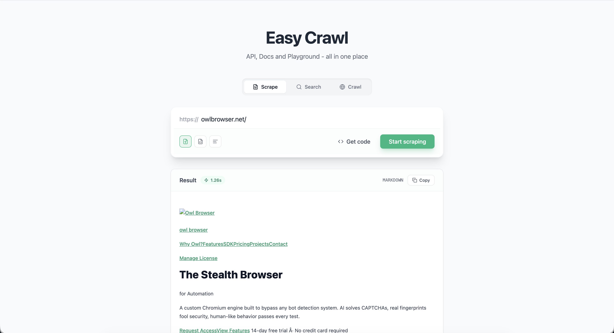
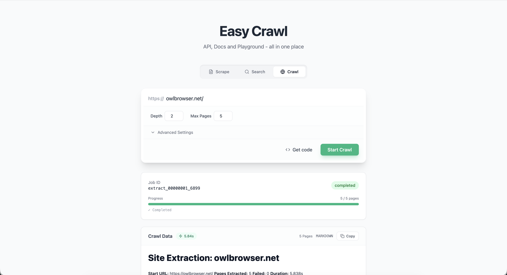
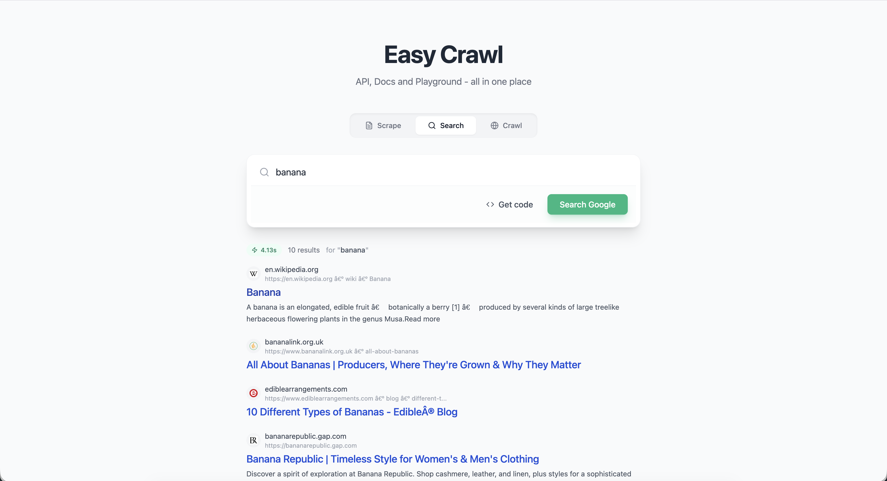

# Easy Crawl

### The AI-Native Web Data Platform

**Access the chaotic web as clean, structured data. Powered by Owl Browser.**

---

Easy Crawl is a production-grade web scraping, searching, and crawling solution. It transforms complex, dynamic websites into LLM-ready formats (Markdown, JSON) with zero friction.

### ⚡ The "200 Lines" Engineering Marvel

We built this entire platform to prove a point. 

Handling modern web challenges usually requires massive infrastructure: headless browser clusters, proxy rotation networks, CAPTCHA solving services, and complex DOM parsers.

**Easy Crawl does it all with a backend of less than 200 lines of Python.**

How? It runs on **Owl Browser**, the world's first AI-native browser engine. The intelligence isn't in our application code—it's in the browser itself.

---

## 🚀 Capabilities

### 1. Universal Scraper
**"If you can see it, you can scrape it."**
Stop fighting with `beautifulsoup` or broken selectors. Easy Crawl renders pages in a real browser, executes all JavaScript, waits for hydration, and uses on-device AI to extract the *actual* content.
- **Perfect for RAG:** Outputs clean, semantic Markdown optimized for Vector Databases.
- **SPA Ready:** Handles React, Vue, Angular, and dynamic content effortlessly.



### 2. Intelligent Crawler
**Map the unknown.**
Give Easy Crawl a starting point and watch it map out a website. It autonomously navigates links, respecting your depth and page limits, to build comprehensive knowledge bases.
- **Smart Navigation:** Follows links like a human user.
- **Context Aware:** Maintains session state across the crawl.



### 3. Live Search API
**Real-time knowledge for AI Agents.**
Perform live web searches and receive parsed, structured results instantly. Bypass the noise of search engine results pages and get straight to the data.



---

## 🛠️ Architecture

This project demonstrates the **"Browser-as-Backend"** architecture:

*   **Engine:** [Owl Browser SDK](https://github.com/olib-ai/owl-browser) (Handles rendering, AI extraction, Anti-bot)
*   **Backend:** Python FastAPI (Lightweight orchestration)
*   **Frontend:** React + Tailwind CSS (Modern, responsive UI)

## 📦 Quick Start

Run the entire stack with a single command:

```bash
./start.sh
```

This will:
1.  Launch the **Python FastAPI** backend on port `8000`.
2.  Launch the **React Frontend** on port `5173`.
3.  Open `http://localhost:5173` to start crawling.